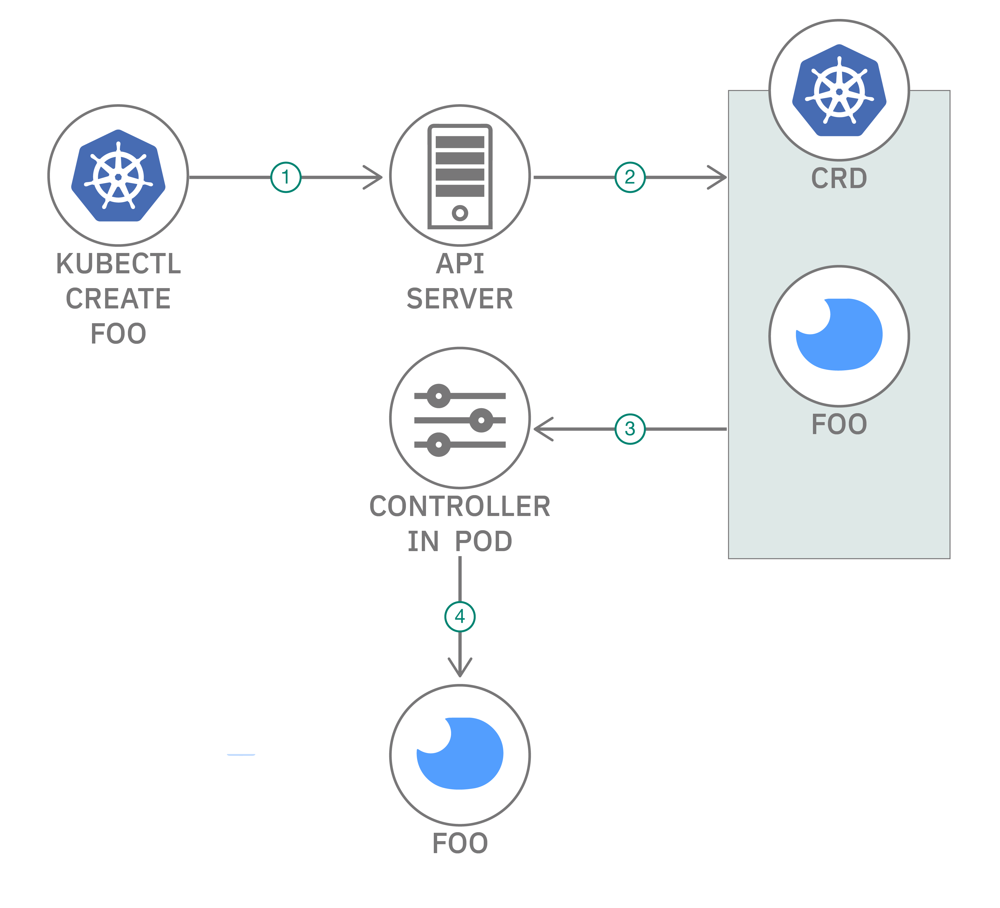
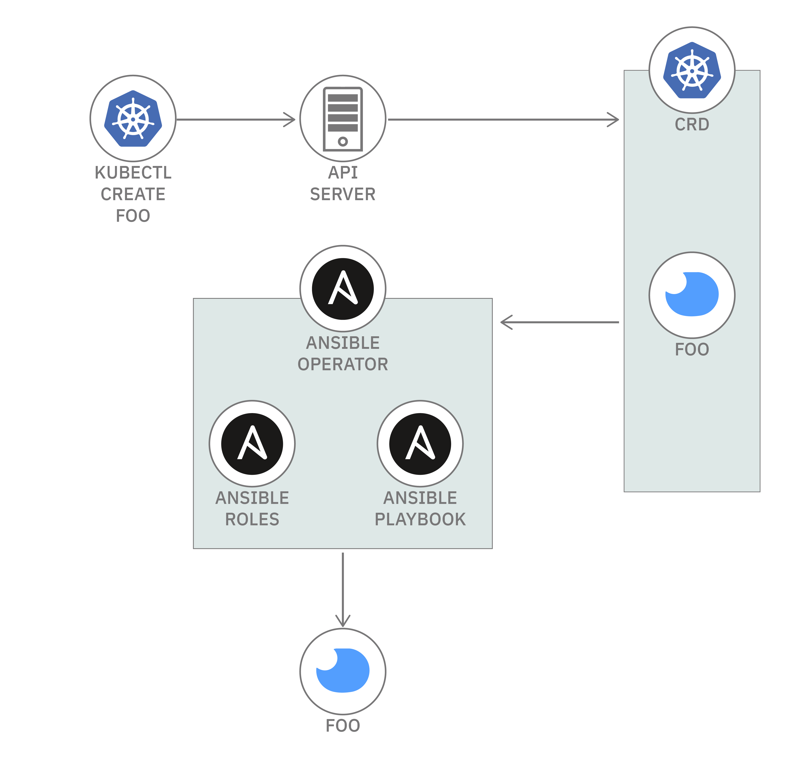
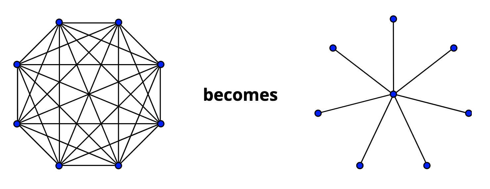
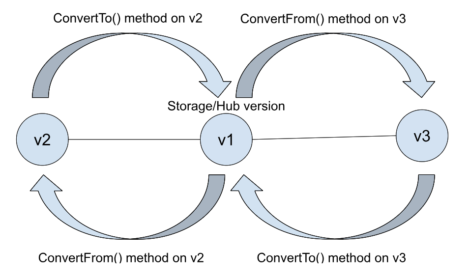

## Kubernetes Operators

[Link to course](https://apps.cognitiveclass.ai/learning/course/course-v1:IBM+CO0302EN+v1/home)

<a name="link-top"></a>

---

### Table of Contents

<ol>
    <li>
        <a href="#basic-modules">
            Basic Modules
        </a>
        <ul>
            <li>
                <a href="#introduction-to-operators">Module 1 - Introduction to Operators</a>
            </li>
            <li>
                <a href="#helm-operators">Module 2 - Helm Operators</a>
            </li>
            <li>
                <a href="#ansible-operators">Module 3 - Ansible Operators</a>
            </li>
        </ul>
    </li>
    <li>
        <a href="#advanced-modules">
            Advanced Modules
        </a>
        <ul>
            <li>
                <a href="#reconciliation-loops">Module 1 - Reconciliation Loops</a>
            </li>
            <li>
                <a href="#operator-lifecycle-manager">Module 2 - Operator Lifecycle Manager</a>
            </li>
            <li>
                <a href="#scorecard">Module 3 - Scorecard</a>
            </li>
            <li>
                <a href="#final-exam">Final Exam</a>
            </li>
        </ul>
    </li>
</ol>

---

### Basic Modules

#### Module 1

#### Introduction to Operators

#### Practice Question 1

**How does an operator add functionality to a Kubernetes cluster?**

1. [ ] It increases the performance of the cluster
2. [x] It extends the API of the cluster
3. [ ] It provisions additional static resources on the cluster
4. [ ] It creates more Deployments on the cluster

#### Explanation:

Operators in Kubernetes are a way to extend the functionality of the cluster by defining custom resources and
controllers. They add new behaviors to the system, allowing you to automate tasks and manage applications more
effectively.

By extending the API, operators can define custom resources and controllers that enable the cluster to
understand and manage new types of workloads or services. This helps in automating complex application deployments and
lifecycle management.

---

#### Practice Question 2

**Operators always consist of a Custom Resource Definition and a controller.**

1. [x] True
2. [ ] False

#### Explanation:

Operators in Kubernetes typically consist of a Custom Resource Definition (CRD) and a controller.

The CRD defines a new custom resource (an extension of the Kubernetes API), and the controller is responsible for
managing the lifecycle of instances of that custom resource. The controller watches for changes to resources, takes
appropriate actions, and ensures that the desired state specified in the CRD is maintained.

This combination allows operators to automate the management of applications and services in a Kubernetes cluster.

---

#### Practice Question 3

**Which of the following commands creates the scaffolding for a Custom Resource Definition?**

1. [ ] operator-sdk generate bundle
2. [x] operator-sdk create api
3. [ ] operator-sdk create crd
4. [ ] operator-sdk init

#### Explanation:

The `operator-sdk create api` command is used to generate the scaffolding for a Custom Resource Definition (CRD) when
developing a Kubernetes Operator using the Operator SDK.

---

#### Practice Question 4

**Which component is responsible for the reconciliation of an operator?**

1. [ ] RBAC rules
2. [x] Controller
3. [ ] Custom Resource
4. [ ] Custom Resource Definition

#### Explanation:

The reconciliation process in a Kubernetes Operator is typically handled by the controller.

The controller watches for changes to Custom Resources (CRs) and ensures that the current state of the cluster matches
the desired state specified in the CR. When there is a difference between the current state and the desired state, the
controller takes the necessary actions to reconcile the state, bringing the cluster into the desired configuration.

The controller is responsible for managing the lifecycle of the resources defined by the Custom Resource Definition (
CRD).

---

#### Practice Question 5

**For a Golang operator, the Custom Resource Definition is generated based on a types.go file.**

1. [x] True
2. [ ] False

#### Explanation:

When developing a Golang-based Kubernetes Operator using the Operator SDK, `the types.go` file defines the custom
resource structure and specifications. The Operator SDK uses this file to generate the corresponding Custom Resource
Definition (CRD) YAML file, which is then applied to the Kubernetes cluster.

#### Review Question 1

**How does a user interact with an operator?**

1. [ ] By accessing the operator directly
2. [x] By using `kubectl` or whatever tool they use to interact with the normal Kubernetes API
3. [ ] By using the operator-sdk CLI
4. [ ] By using an operator-specific CLI

#### Explanation:

Operators in Kubernetes are typically implemented as custom resources and controllers. Users interact with operators by
creating or modifying custom resources using `kubectl` or any other tool that interacts with the Kubernetes API.

Operators watch for changes to these custom resources and take actions accordingly to manage and automate the lifecycle
of applications or services.

In the context of Kubernetes and operators, the interaction loop typically involves the following components:

1. **API Server:** This component handles incoming requests from users or external systems. In the case of Kubernetes,
   the API server is responsible for receiving and processing requests related to the desired state of the system.

2. **Data Store:** The data store is where the desired and actual state of the system is stored. In Kubernetes, this is
   often represented by the etcd database, which stores the configuration and runtime state of the cluster.

3. **Controller:** The controller is a component that watches the data store for changes and reacts to those changes to
   ensure that the actual state matches the desired state. In the context of operators, the controller is responsible
   for managing the lifecycle of specific applications or services.

<div style="text-align: center;">
  
</div>

So, the interaction loop can be described as follows:

1. Users or external systems interact with the system by sending requests to the API server.
2. The API server processes these requests and updates the desired state in the data store.
3. The controller watches for changes in the data store.
4. When the controller detects a change in the desired state, it takes actions to reconcile the actual state with the
   desired state.
5. The controller may perform actions such as deploying or scaling applications, updating configurations, or handling
   other aspects of the system's lifecycle.

This loop ensures that the system continuously works towards maintaining the desired state specified by the users or
external systems. The use of operators in Kubernetes is one way to automate and manage complex applications by extending
this loop with custom resources and controllers.

---

#### Review Question 2

**What does the command "operator-sdk init" do?**

1. [ ] Initializes a new controller image for an operator
2. [x] Initializes the basic scaffolding for a brand-new operator
3. [ ] Initializes a new controller for an operator
4. [ ] Initializes a new Custom Resource Definition for an operator

#### Explanation:

The `operator-sdk init` command is used to initialize the basic scaffolding for a new operator project. This command
sets up the directory structure and necessary files for building and managing a Kubernetes operator. It is typically one
of the first commands you run when starting a new operator development project.

---

#### Review Question 3

**There is one architecture pattern that all operators follow.**

1. [ ] True
2. [x] False

#### Explanation:

While operators in Kubernetes share some common patterns and best practices, there is no single architecture pattern
that all operators must strictly follow. The architecture of an operator can vary based on the specific requirements and
functionalities it needs to manage.

---

#### Review Question 4

**How was the Memcached operator added to the cluster?**

1. [ ] By altering the core Kubernetes images to include our additional components
2. [x] By creating normal Kubernetes resources such as Deployments and Cluster Role Bindings
3. [ ] By deploying components external to Kubernetes and connecting them to the cluster
4. [ ] By modifying the behavior of core Kubernetes components

#### Explanation:

Memcached operators are added to Kubernetes clusters by deploying them as ordinary Kubernetes resources. This means that
they are managed by the same control plane as all other Kubernetes resources and can be monitored, scaled, and updated
using the same tools.

Here are the steps involved in adding a Memcached operator to a Kubernetes cluster:

1. **Create a custom resource definition (CRD)**: The CRD defines the schema for the Memcached resources that the
   operator will manage. It specifies the fields that will be used to describe Memcached instances and the resources
   that the operator will create and manage on the behalf of those instances.

2. **Build the Memcached operator code**: The operator code is typically written in Go and uses the Operator SDK
   framework to interact with the Kubernetes API. It includes logic for watching for changes to Memcached resources,
   creating and managing the necessary Kubernetes resources to manage the Memcached instances, and handling events such
   as pods starting and stopping.

3. **Package the operator**: The operator code and its dependencies are packaged into a deployment and a service
   manifest. The deployment manifest specifies how to run the operator as a pod in the Kubernetes cluster, and the
   service manifest defines how to expose the operator's API.

4. **Deploy the operator to the cluster**: The operator is deployed to the cluster using the kubectl command-line tool.
   This will create the deployment and service manifests and make the operator available to manage Memcached resources
   in the cluster.

By deploying the Memcached operator as a normal Kubernetes resource, it is integrated into the cluster's existing
infrastructure and can leverage the same control plane and management tools as other Kubernetes resources. This makes it
easy to deploy, manage, and monitor Memcached operators in a consistent and scalable manner.

---

#### Review Question 5

**What is the controller of our Memcached operator responsible for?**

1. [x] The reconciliation of the desired state in the `etcd` store with the actual state running on the cluster
2. [ ] Creating the new Memcached type on our Kubernetes cluster
3. [ ] Storing data about requested Memcached objects
4. [ ] Receiving and validating incoming API requests from users

#### Explanation:

The controller is the central component of the Memcached operator. It is responsible for ensuring that the desired state
of the Memcached instances in the etcd store is reflected in the actual state of the pods running on the cluster. This
process is known as reconciliation.

The controller continuously monitors the etcd store for changes to Memcached resources. When it detects a change, it
triggers a reconciliation process. The reconciliation process involves the following steps:

1. **Fetch the latest version of the Memcached resource from the etcd store.**
2. **Compare the desired state of the resource with the actual state of the pods running on the cluster.**
3. **If there is a mismatch between the desired and actual states, the controller takes corrective actions to bring the
   actual state in line with the desired state.**

The corrective actions that the controller can take include:

* Creating new pods
* Scaling existing pods
* Restoring failed pods
* Updating pod configurations
* Deleting pods

The controller ensures that the Memcached instances in the cluster are always in the desired state, even in the face of
changes to the environment or to the Memcached resources themselves. This is what makes the Memcached operator an
essential tool for managing Memcached deployments in Kubernetes clusters.

<p align="right">(<a href="#table-of-contents">back to top</a>)</p>

---

#### Module 2

#### Helm Operators

### Practice Question 1

**What takes the place of the controller in the architecture of a Helm operator?**

- [ ] The core Kubernetes controllers, once we've deployed our Helm chart
- [x] A controller based on the community 'helm-operator' image configured with our Helm chart
- [ ] A Helm chart
- [ ] A Golang controller configured with our Helm chart

#### Explanation:

The Helm operator is intended to quickly build out an operator from existing Helm charts. The operator creates a custom
resource definition (CRD) based on an existing Helm chart.

The resulting custom resource (CR) is watched by a controller that is based on a generic `helm-operator` controller
image which is maintained by the Operator SDK open source community.

With Help operators, you configure the controller image with information about your specific Helm chart. When an
instance of the (CR) is created, the controller deploys an instance of the Helm chart to the cluster, configured with
the information specified in the CR object’s spec.


---

### Practice Question 2

**How do we create the Custom Resource for our Helm operator?**

- [ ] By configuring etcd with our Helm chart
- [ ] By creating a Custom Resource Definition based on the Helm chart
- [x] By creating a Custom Resource based on the Helm chart
- [ ] By deploying our Helm chart

#### Explanation:

When you're working with Helm operators in Kubernetes, you create a Custom Resource Definition (CRD) that defines the
structure of the custom resources you'll use to manage Helm releases. Once the CRD is defined, you create instances of
it, which are the actual Custom Resources (CRs) representing your Helm releases.

---

### Practice Question 3

**Question**

A Helm operator controller reconciles instances of the Custom Resource by creating instances of the Helm chart as the
backend.

- [x] True
- [ ] False

#### Explanation:

A Helm operator controller reconciles instances of the Custom Resource by creating instances of the Helm chart as the
backend. This means that the Helm operator will read the Custom Resource definition and then use the Helm chart to
create the necessary Kubernetes resources, such as deployments, services, and pods.

Here are the steps on how a Helm operator controller reconciles instances of the Custom Resource:

1. **Reads the Custom Resource definition**: The Helm operator controller reads the Custom Resource definition from the
   Kubernetes API server. This definition includes the desired state of the resource, such as the number of replicas for
   a deployment or the port for a service.
2. **Creates instances of the Helm chart**: The Helm operator controller uses the Helm chart to create instances of the
   Kubernetes resources. The Helm chart contains the instructions for how to create the resources, including the
   templates for the resources and the values for the resource fields.
3. **Reconciles the current state of the resources to the desired state**: The Helm operator controller compares the
   current state of the resources to the desired state as defined by the Custom Resource definition. If the current
   state does not match the desired state, the Helm operator controller will take corrective action to bring the current
   state into line with the desired state.

---

### Practice Question 4

**Using a Helm operator requires the Helm chart to already be installed on your cluster.**

- [ ] True
- [x] False

#### Explanation:

A Helm operator does not require the Helm chart to already be installed on your cluster. The Helm operator can install
and manage the Helm chart

---

### Practice Question 5

**When is a Helm operator a good choice over other operator types?**

- [ ] You have a preexisting Helm chart for your resource.
- [ ] You want to get something running as quickly as possible.
- [ ] You're unfamiliar with reconciliation loops and want to try writing an operator.
- [x] All of the above.

#### Explanation:

All options are correct as each of these scenarios represents a situation where a Helm operator
could be a suitable and efficient choice.

Here's an explanation for each option:

1. **You have a preexisting Helm chart for your resource:** If you already have a Helm chart for deploying your
   application or service, using a Helm operator can be a good choice. Helm operators allow you to manage the lifecycle
   of Helm releases using Kubernetes Custom Resources (CRs), providing a way to define and control your applications
   using the Helm chart.

2. **You want to get something running as quickly as possible:** Helm operators can streamline the process of deploying
   and managing applications on Kubernetes. If you're familiar with Helm charts and want a quick way to manage them
   using Kubernetes resources, a Helm operator can be a good choice.

3. **You're unfamiliar with reconciliation loops and want to try writing an operator:** Helm operators abstract away
   some of the complexity involved in writing a custom Kubernetes operator, especially if you're new to the concept of
   reconciliation loops. Helm operators simplify the process by leveraging Helm charts and providing a higher-level
   abstraction for managing applications.

<p align="right">(<a href="#table-of-contents">back to top</a>)</p>

---

### Review Question 1

**The Spec fields of our Custom Resource directly correlate to what part of the original Helm chart?**

- [x] Values.yaml
- [ ] The template files
- [ ] Chart.yaml

#### Explanation:

The `Spec` fields of a Custom Resource define the desired state of the resource, while `Values.yaml` contains the
configurable parameters that can be used to customize the behavior of the Helm chart. As a result, the Spec fields
directly correlate to the values defined in Values.yaml.

---

### Review Question 2

**Helm operators allow a fine degree of control over the reconciliation of your operator.**

- [ ] True
- [x] False

#### Explanation:

Helm operators provide a basic level of control over reconciliation, but they do not offer the same level of
fine-grained control as other types of operators, such as custom resource operators. This is because Helm operators rely
on the Helm chart to define the desired state of the application, and the Helm chart itself may not be able to capture
all the nuances of the application's behavior.

---

### Review Question 3

**What sets the suffix for any API groups the Helm operator will create or use?**

- [ ] The range
- [x] The domain
- [ ] The subset
- [ ] The group

#### Explanation:

The suffix for any API groups that the Helm operator will create or use is determined by the `--domain` flag that is
passed to the `operator-sdk init` command. This flag specifies the domain that will be used to prefix the names of all
the API groups that are generated by the operator.

---

### Review Question 4

**In the Kubernetes API, what is an API group?**

- [ ] A collection of endpoints that contain related functionality.
- [ ] Any resource that consists of multiple dependent resources.
- [ ] An endpoint that contains related functionality.
- [x] A group of related resources.

#### Explanation:

An API group in Kubernetes is a collection of related resources that share the same group name. Each API group has a
unique version, which allows for the evolution of the API over time without breaking compatibility.

API groups are used to organize the Kubernetes API into a hierarchical structure that makes it easier to find and
understand the resources that are available. They also provide a mechanism for extending the Kubernetes API with custom
resources.

Here is a simplified diagram of the Kubernetes API structure:

```
Kubernetes API
├── core
│   ├── v1
│   │   ├── Pod
│   │   ├── Deployment
│   │   ├── Service
│   │   │   ...
│   │   ...
│   └── v1beta1
│       ├── Pod
│       ├── Deployment
│       ├── Service
│       │   ...
│       ...
└── custom-resources
    ├── my.domain
    │   ├── v1beta1
    │   │   ├── MyCustomResource
    │   │   └── AnotherCustomResource
    │   └── v2beta1
    │       ├── MyCustomResource
    │       └── AnotherCustomResource
    └── another.domain
        ├── v1alpha1
        │   ├── MyCustomResource
        │   └── AnotherCustomResource
        └── v2alpha1
            ├── MyCustomResource
            └── AnotherCustomResource
```

As you can see, the core API group contains the most fundamental resources for managing Kubernetes workloads. The
custom-resources API group is used to define custom resources, which can be used to extend the Kubernetes API with new
types of resources.

Each API group is identified by a URL path. For example, the URL path for the core API group is `/apis/core/v1`, and the
URL path for the custom-resources API group is `/apis/apiextensions.k8s.io/v1beta1`.

The URL path is used to identify the API group and version when you are creating, reading, updating, or deleting
resources. For example, the following command creates a new Pod resource in the core API group version v1:

```bash
kubectl create -f pod.yaml
```

---

### Review Question 5

**The Helm operator controller we used was an off-the-shelf image that required no additional configuration.**

- [ ] True
- [x] False

#### Explanation:

Helm operator controllers are typically custom built and require configuration to work with your specific application or
environment. They are not off-the-shelf images that can be used out of the box. This is because each Helm operator
controller needs to be tailored to the specific needs of the application or environment it is managing.

<p align="right">(<a href="#table-of-contents">back to top</a>)</p>

---

#### Module 3

#### Ansible Operators

### Practice Question 1

**What Ansible resources are used to configure the ansible-operator controller?**

- [ ] Scripts and Blocks
- [x] Roles and Playbooks
- [ ] Custom Resource Definitions and Namespaces
- [ ] Classes and Plans

#### Explanation:

The ansible-operator controller can be configured using a variety of Ansible resources, including:

* **Playbooks**: Playbooks are the primary building block of Ansible automation. They are YAML files that define a
  series of tasks that should be executed on target hosts. Playbooks can be used to perform a wide range of tasks, such
  as installing software, configuring systems, and managing services.
* **Roles**: Roles are reusable collections of Ansible tasks and configuration files that can be used to automate common
  IT tasks.

<div style="text-align: center;">
  
</div>

---

### Practice Question 2

**The Custom Resource Definition is the source of truth for the working fields of an Ansible operator resource type.**

- [ ] True
- [x] False

#### Explanation:

The statement is not accurate in the context of Ansible operators. In the context of Kubernetes and Ansible operators,
the Custom Resource Definition (CRD) is not the source of truth for the working fields of an Ansible operator resource
type.

In the context of Ansible operators, the Ansible Role and associated Ansible Playbooks define the desired state of the
system. The CRD, on the other hand, is a Kubernetes concept that allows you to define custom resources and their
properties.

In summary, the CRD defines the structure of the custom resources that an Ansible operator manages, but the Ansible Role
and Playbooks are where you define the desired configuration and behavior of the resources.

---

### Practice Question 3

**How does the ansible-operator controller provision Kubernetes resources?**

- [ ] By accessing the Kubernetes etcd directly
- [x] By using the Kubernetes Ansible collection
- [ ] By using kubectl

#### Explanation:

The Ansible Operator is a concept in the context of Kubernetes that leverages Ansible, a configuration management and
automation tool, to manage and provision resources within a Kubernetes cluster. Ansible Operators use custom controllers
to extend the functionality of Kubernetes by defining custom resources and handling their lifecycle events.

When the Ansible Operator controller provisions Kubernetes resources, it typically uses Ansible playbooks. Ansible
playbooks are sets of instructions written in YAML that describe a series of tasks to be executed on target machines, in
this case, the Kubernetes cluster.

---

### Practice Question 4

**The controller used in an Ansible operator is based on an image maintained by the Operator-sdk open source community.
**

- [x] True
- [ ] False

#### Explanation:

The controller used in an Ansible operator is based on an image maintained by the Operator-sdk open source community.
This image provides the necessary tools and libraries for the controller to interact with the Kubernetes API server and
execute Ansible playbooks. The image is maintained by the Operator-sdk community to ensure that it is compatible with
the latest versions of Kubernetes and the Operator-sdk framework.

For Operator-SDK versions > v1.30.0 the `quay.io/operator-framework/ansible-operator` base image has been updated to use
Ansible 2.15. The Ansible 2.11 preview base image has been removed and will no longer be built/supported past
Operator-SDK v1.30.

Link: [Ansible Operator Base Images](https://sdk.operatorframework.io/docs/building-operators/ansible/reference/ansible-base-images/)

---

### Practice Question 5

**What argument do you pass to "operator-sdk create api" to generate an Ansible Role?**

- [ ] --generate-ansible-files
- [x] --generate-role
- [ ] --role=true
- [ ] --role=ansible

#### Explanation:

The `--generate-role` flag is used with the `operator-sdk create api` command to instruct the operator-sdk to generate
an Ansible Role for the Custom Resource Definition (CRD) that is being created. This option will create an Ansible Role
that can be used to manage the CRD resources.

Example of command:

```
$ operator-sdk create api --group cache --version v1alpha1 --kind Memcached --generate-role
```

This command creates a new API by creating a new CRD in the `cache` API group where `--generate-role` causes Operator
SDK to also generate an Ansible role that serves as the backing for your custom resource type.

<p align="right">(<a href="#table-of-contents">back to top</a>)</p>

---

### Review Question 1

**What does an Ansible Role consist of?**

- [ ] A collection of Kubernetes Custom Resources
- [x] A collection of tasks and related scaffolding such as scripts, environment variables, etc.
- [ ] A collection of Ansible Playbooks
- [ ] A collection of scripts to run in order

#### Explanation:

An Ansible Role is a modular and reusable collection of tasks and related scaffolding that can be applied to any target
host. It encapsulates a specific task or group of tasks that can be used to automate various tasks on a system.

**An Ansible Role consists of:**

1. **Tasks:** The core of an Ansible Role is a set of tasks that define the specific actions to be performed on the
   target system. These tasks can range from simple configuration management tasks to more complex application
   deployments.

2. **Scaffolding:** An Ansible Role provides additional scaffolding to support and enhance the tasks. This includes
   files, templates, and configuration files that are used by the tasks to perform their operations.

3. **Variables:** Ansible Roles also utilize variables to make their tasks more dynamic and configurable. These
   variables can be defined within the Role itself or can be passed from the Ansible playbook or the command line.

---

### Review Question 2

**Why should you fill out the Custom Resource Definition in an Ansible operator?**

- [ ] So that Kubernetes users will be able to use the Custom Resource
- [ ] So that Kubernetes users will be able to see what fields the Custom Resource should have
- [ ] So that Kubernetes admins will be able to allow access to the CRD
- [x] So that the resulting Custom Resource will work

#### Explanation:

The Custom Resource Definition (CRD) is the blueprint for the custom resource that the Ansible operator will create and
manage. It defines the structure of the resource, including its fields, types, and relationships to other resources. If
the CRD is not filled out correctly, the operator will not be able to create or manage the resource correctly.

---

### Review Question 3

**The ansible-operator controller automatically populates the Kubernetes status of Custom Resource objects with the
Ansible status of the Ansible object.**

- [x] True
- [ ] False

#### Explanation:

The ansible-operator controller does automatically populate the Kubernetes status of Custom Resource objects with the
Ansible status of the Ansible object. This is done by using the `k8s_status` Ansible module, which is part of
the `operator_sdk.util` collection.

The `k8s_status` module retrieves the Ansible status from the Ansible object and then updates the Kubernetes status
accordingly. This allows the operator to maintain a consistent view of the state of the custom resource.

---

### Review Question 4

**What is the name of the file that configures the Ansible Role?**

- [ ] ansible.yml
- [ ] main.yml
- [ ] crd.yml
- [x] role.yml

#### Explanation:

In an Ansible Role, the `main.yml` file is a common convention for configuring the tasks, handlers, and other elements
of the role. This file is where you define the main execution flow for the role.

A simple example of an Ansible Role directory structure and the contents of the `main.yml` file:

```
my_role/
└── memcached
    ├── README.md
    ├── defaults
    │   └── main.yml
    ├── files
    ├── handlers
    │   └── main.yml
    ├── meta
    │   └── main.yml
    ├── tasks
    │   └── main.yml
    ├── templates
    └── vars
        └── main.yml
```

---

### Review Question 5

**Which of the following commands can be used to generate an Ansible Role?**

- [ ] operator-sdk generate bundle
- [ ] operator-sdk create api
- [ ] operator-sdk create role
- [x] operator-sdk init

#### Explanation:

The `operator-sdk init` command can be used to generate an Ansible Role.

<p align="right">(<a href="#table-of-contents">back to top</a>)</p>

---

### Advanced Modules

#### Module 1

#### Reconciliation Loops

#### Practice Question 1

**Users interact with a Kubernetes cluster by issuing commands to controllers to create resources.**

1. [ ] True
2. [x] False

#### Explanation:

In Kubernetes, users typically interact with a cluster using the kubectl command-line tool or other Kubernetes API
clients. While controllers are an essential part of Kubernetes and play a role in managing the desired state of
resources, users don't directly issue commands to controllers. Instead, they define the desired state of the cluster by
creating resource manifests (YAML or JSON files) and then use kubectl apply or similar commands to apply those manifests
to the cluster.

#### Practice Question 2

**What is the first thing you should always do when entering a reconciliation loop?**

1. [ ] Exit and requeue the request
2. [x] Fetch the object you're reconciling
3. [ ] Start iterating on reconciling the object
4. [ ] Check for errors in the reconciliation request unanswered

#### Explanation:

When entering a reconciliation loop in a Kubernetes controller, the first step is typically to fetch the current state
of the object that needs to be reconciled. This ensures that the controller has the most up-to-date information about
the object before proceeding with any reconciliation logic.

#### Practice Question 3

**Many controllers are often involved in the reconciliation of a single object.**

1. [x] True
2. [ ] False

#### Explanation:

In Kubernetes, it's common for multiple controllers to be involved in the reconciliation of a single object. Each
controller is responsible for managing specific aspects or resources associated with an object. This concept is known
as "control loops" or "controllers working together."

For example, consider a scenario where you have a custom resource that is managed by different controllers. One
controller might be responsible for handling networking aspects, another for storage, and another for security. These
controllers work together to ensure that the overall desired state of the custom resource is achieved.

#### Review Question 1

**What are the results that can be returned from a single iteration of a reconcile loop?**

1. [ ] Requeue, Exit without requeuing
2. [x] Return and requeue, Return an error and requeue, Exit without requeuing
3. [ ] Exit, Exit with error
4. [ ] Return and requeue, Return an error, Exit without requeuing

#### Explanation:

In a reconciliation loop, after processing the current iteration, you may decide to return and requeue the request for
further reconciliation, return an error and requeue if there was an issue that might be resolved later, or exit without
requeuing if the reconciliation was successful or there's no need to retry.

#### Review Question 2

**The reconciliation loop is where the actual behavior of an operator is defined.**

1. [x] True
2. [ ] False

#### Explanation:

The reconciliation loop is a central component of a Kubernetes operator and is where much of the operator's control
logic and behavior are implemented.

However, it's important to note that the overall behavior of an operator is not limited to the reconciliation loop
alone. The operator's behavior is indeed defined by its code, which includes not only the reconciliation logic but also
other components such as event handling, resource management, and interactions with the Kubernetes API.

#### Review Question 3

**Why is it a good idea to build a reconciliation loop out of small, iterative steps?**

1. [ ] The desired state of the cluster can change during reconciliation
2. [ ] The actual state of the cluster can change during reconciliation
3. [ ] The reconciliation request might be picked up by multiple controllers
4. [x] All of the above

#### Explanation:

Building the reconciliation loop with small, iterative steps helps to accommodate changes in the desired or actual state
of the cluster during reconciliation. It also helps handle scenarios where multiple controllers might be working on the
same object, ensuring a more resilient and adaptive reconciliation process.

#### Review Question 4

**What do the Kube-builder markers we put above the Reconcile method declaration do?**

1. [ ] The reconciliation request might be picked up by multiple controllers
2. [x] Create the RBAC for the controller to access the specified resources
3. [ ] Scaffold the custom resource types for the operator
4. [ ] Scaffold the reconcile loops for the specified resources

#### Explanation:

Kube-builder relies on the controller-gen tool to generate various artifacts like RBAC (Role-Based Access Control)
manifests. Annotations are often used in the comments of the code to guide the controller-gen tool on how to generate
these artifacts.

For example, you might see comments like the following above your Reconcile method declaration:

```
// +kubebuilder:rbac:groups=mygroup,resources=myresources,verbs=get;list;watch;create;update;patch;delete
```

This annotation tells controller-gen to generate RBAC rules that grant the necessary permissions for the controller to
perform operations (get, list, watch, create, update, patch, delete) on resources of the specified API group and
resource type.

#### Review Question 5

**It is possible for the object you are reconciling to no longer exist by the time the request is being processed.**

1. [x] True
2. [ ] False

#### Explanation:

Yes, it is possible for the object being reconciled to no longer exist by the time the reconciliation request is being
processed. This is an important consideration when designing controllers, and operators need to handle such scenarios
gracefully, possibly by checking for the existence of the object before attempting any operations on it.

<p align="right">(<a href="#table-of-contents">back to top</a>)</p>

---

#### Module 2

#### Operator Lifecycle Manager

#### Practice Question 1

**Operator developers are expected to understand how OLM works to install their own operator bundles.**

- [ ] True
- [x] False

#### Explanation

Operator developers are not necessarily required to understand how OLM (Operator Lifecycle Manager) works; OLM is
responsible for installing and managing operators, and developers typically focus on creating the operator itself.

---

### Practice Question 2

**What information is contained in the bundle's manifests?**

- [ ] Kubernetes yaml files for installing OLM
- [x] Kubernetes yaml files that contain the resources that make up the operator
- [ ] Manifests for creating the operator container image
- [ ] Manifests for creating the bundle container image

#### Explanation

The bundle's manifests include Kubernetes yaml files that define the resources making up the operator,
such as CustomResourceDefinitions (CRDs) and other necessary components.

---

### Practice Question 3

**Multiple API versions of a resource can exist in a cluster simultaneously.**

- [x] True
- [ ] False

#### Explanation

In Kubernetes, multiple API versions of a resource can coexist in a cluster simultaneously. This allows
for gradual updates and compatibility with different versions of controllers or clients.

---

### Review Question 1

**What are the three main components of a bundle?**

1. [ ] Sample, Config, and Image
2. [x] Manifests, Metadata, and a Dockerfile
3. [ ] Config, an Operator image, and a bundle image
4. [ ] Data, Metadata, and a Dockerfile

#### Explanation

A bundle is a package that includes all the necessary components and metadata required to deploy and manage an operator.
This might include Kubernetes Custom Resource Definitions (CRDs), RBAC (Role-Based Access Control) configurations,
service accounts, deployment descriptors, and other resources.

A bundle typically consists of:

1. Manifests (Kubernetes yaml files defining resources),
2. Metadata (information about the bundle),
3. A Dockerfile (specifying how to build the operator image).

---

### Review Question 2

**A conversion webhook is a special kind of admission webhook.**

- [x] True
- [ ] False

#### Explanation

A conversion webhook is a specific type of admission webhook used for converting
resources between different versions. It plays a role in ensuring compatibility during API version upgrades.

---

### Review Question 3

**Why is it important to include a conversion webhook when upgrading the API version of an operator?**

1. [ ] To convert running instances to the new version of Memcached
2. [x] To migrate requests from users and controllers to the new version
3. [ ] To migrate the database records to the new version
4. [ ] To convert pre-existing instances of the resource to the new version

#### Explanation

When upgrading the API version of an operator, a conversion webhook is essential to handle the transition of requests
from users and controllers to the new version seamlessly.

This ensures that existing requests and configurations are correctly interpreted and processed by the updated API
version. While the conversion webhook may also play a role in converting pre-existing instances of the resource (option
4), the primary purpose, especially during upgrades, is to manage the incoming requests effectively.

---

### Review Question 4

**Kubernetes' conversion logic is based on what kind of model?**

1. [ ] Many to Many
2. [x] Hub and Spoke
3. [ ] Up and Down
4. [ ] Wheel and Deal

#### Explanation

Since we now have two different versions, and users can request either version, we’ll have to define a way to convert
between our version. For CRDs, this is done using a webhook, similar to the defaulting and validating webhooks. Like
before, controller-runtime will help us wire together the nitty-gritty bits, we just have to implement the actual
conversion.

A simple approach to defining conversion might be to define conversion functions to convert between each of our
versions. Then, whenever we need to convert, we’d look up the appropriate function, and call it to run the conversion.

This works fine when we just have two versions, but what if we had 4 types? 8 types? That’d be a lot of conversion
functions.

Instead, controller-runtime models conversion in terms of a “hub and spoke” model – we mark one version as the “hub”,
and all other versions just define conversion to and from the hub:

<div style="text-align: center;">
  
</div>

Then, if we have to convert between two non-hub versions, we first convert to the hub version, and then to our desired
version:

<div style="text-align: center;">
  
</div>

This cuts down on the number of conversion functions that we have to define, and is modeled off of what Kubernetes does
internally.

---

### Review Question 5

**Although the underlying custom resources that OLM uses may change, the format of an operator bundle should stay the
same moving forward.**

- [x] True
- [ ] False

#### Explanation

While the custom resources (CRs) used by the Operator Lifecycle Manager may undergo changes, the format of an
operator bundle should remain consistent in the future. This is typically true due to several reasons:

1. **Compatibility:** Maintaining a consistent format for operator bundles ensures backward compatibility. Applications
   and systems that rely on these bundles can continue to work seamlessly even as the underlying custom resources
   evolve.

2. **Interoperability:** A consistent format promotes interoperability between different versions of the Operator
   Lifecycle Manager. Operators are designed to work within specific environments, and having a stable bundle format
   helps ensure that operators developed for a particular version of OLM can still be used with future versions.

3. **Developer Experience:** Developers who create operators and bundles benefit from a stable format. It allows them to
   focus on improving the functionality of their operators without constantly adjusting to changes in the bundle
   structure.

4. **Upgradability:** With a consistent format, the upgrade process for operators becomes smoother. If the bundle format
   remains the same, upgrading an operator doesn't require extensive modifications to the operator bundle itself,
   simplifying the update process.

<p align="right">(<a href="#table-of-contents">back to top</a>)</p>

---

#### Module 3

#### Scorecard

#### Practice Question 1

**Custom Scorecard test suites are provided as container images.**

1. [x] True
2. [ ] False

#### Explanation

While the Operator SDK bundle validate subcommand can validate local bundle directories and remote bundle images for
content and structure, you can use the scorecard command to run tests on your Operator based on a configuration file and
test images. These tests are implemented within test images that are configured and constructed to be executed by the
scorecard.

Link: [Validating Operators using the scorecard tool](https://docs.openshift.com/container-platform/4.8/operators/operator_sdk/osdk-scorecard.html)

---

#### Practice Question 2

**Your bundle starts with some automatically generated Scorecard tests that test what features of your operator?**

1. [ ] Regression tests to test upgrading your operator
2. [x] Basic best practices like descriptors and validators for your custom resource types
3. [ ] Benchmarks to stress-test your operator
4. [ ] Basic unit tests that test your custom resource types

#### Explanation

When your bundle starts with automatically generated Scorecard tests, these tests are designed to assess fundamental
aspects of your operator's implementation and adherence to best practices. Specifically, they focus on:

These tests examine whether your operator follows recommended practices, such as using appropriate descriptors and
validators for your custom resource types. This ensures that your operator aligns with established conventions and
guidelines.

---

#### Practice Question 3

**Custom Scorecard test suites can contain multiple tests.**

1. [x] True
2. [ ] False

#### Explanation

Custom Scorecard test suites can indeed contain multiple tests to evaluate various aspects of your operator.

---

#### Review Questions 1

**In the config file, each Scorecard test consists of what three components?**

1. [ ] Operator image, Test image, Test command
2. [x] Image, Entrypoint, Labels
3. [ ] Test file, Commands, Bundle
4. [ ] Dockerfile, Entrypoint, Name

#### Explanation

Scorecard test consists of the following components:

1. **Image:** This component refers to the container image that contains the Scorecard test. It specifies the
   environment in which the test will be executed.
2. **Entrypoint:** The entrypoint is the command or script that will be executed when the container starts. It defines
   how the Scorecard test should be run within the container.
3. **Labels:** Labels are metadata that can be associated with the Scorecard test. They provide additional information
   about the test, such as its purpose or any specific requirements.

These three components collectively define the configuration of a Scorecard test within the configuration file. The
image determines the environment, the entrypoint specifies how the test should be executed, and labels provide
additional context or information.

---

#### Review Questions 2

**Scorecard tests execute from your local machine targeting the cluster.**

1. [ ] True
2. [x] False

#### Explanation

Scorecard tests are executed within a container on the cluster, not from your local machine.

---

#### Review Questions 3

**Why did we have to cross-compile our Scorecard test?**

1. [ ] To include our Scorecard config
2. [x] It’s executed in a container on the cluster, which is a 64-bit Linux environment
3. [ ] To include our operator’s bundle
4. [ ] To ensure all the dependencies were included

#### Explanation

Cross-compilation refers to the process of compiling code on one platform (architecture or operating system) to run on a
different platform.

In the context of the Scorecard test, the need for cross-compilation arises because the test is executed within a
container on the Kubernetes cluster, and this cluster typically operates in a 64-bit Linux environment.

---

#### Review Questions 4

**Why did we run our Scorecard test with our operator’s Service Account?**

1. [ ] To give Scorecard the RBAC permissions to run the test container
2. [x] To give it the RBAC permissions needed to manipulate the Memcached and dependent types
3. [ ] To give it the RBAC permissions to manipulate our operator’s controller
4. [ ] To tell it which operator to test

#### Explanation

The Scorecard test may need to interact with resources such as Memcached or other dependent types during the evaluation.
Running the test with the operator’s Service Account ensures that it has the necessary RBAC permissions to perform these
interactions.

---

#### Review Questions 5

**The Scorecard config is part of your operator’s bundle.**

1. [x] True
2. [ ] False

#### Explanation

The scorecard tool uses a configuration that allows you to configure internal plugins, as well as several global
configuration options. Tests are driven by a configuration file named config.yaml, which is generated by the make bundle
command, located in your `bundle/` directory:

```
./bundle
...
└── tests
    └── scorecard
        └── config.yaml
```

Example scorecard configuration file:

```yaml
kind: Configuration
apiversion: scorecard.operatorframework.io/v1alpha3
metadata:
  name: config
stages:
  - parallel: true
    tests:
      - image: quay.io/operator-framework/scorecard-test:v1.8.0
        entrypoint:
          - scorecard-test
          - basic-check-spec
        labels:
          suite: basic
          test: basic-check-spec-test
      - image: quay.io/operator-framework/scorecard-test:v1.8.0
        entrypoint:
          - scorecard-test
          - olm-bundle-validation
        labels:
          suite: olm
          test: olm-bundle-validation-test
```

Link: [Scorecard configuration](https://docs.openshift.com/container-platform/4.8/operators/operator_sdk/osdk-scorecard.html#osdk-scorecard-config_osdk-scorecard)

<p align="right">(<a href="#table-of-contents">back to top</a>)</p>

---

#### Final Exam

#### Question 1

**Your Scorecard config is automatically generated as part of your operator’s bundle.**

1. [x] True
2. [ ] False

#### Explanation

A default set of Kustomize files are generated by the Operator SDK after running the `init` command. The default
`bundle/tests/scorecard/config.yaml` file that is generated can be immediately used to run the scorecard tool against
your Operator, or you can modify this file to your test specifications.

Example of `config.yaml`:

```yaml
apiVersion: scorecard.operatorframework.io/v1alpha3
kind: Configuration
metadata:
  name: config
stages:
  - parallel: true
    tests:
      - entrypoint:
          - scorecard-test
          - basic-check-spec
        image: quay.io/operator-framework/scorecard-test:v1.32.0
        labels:
          suite: basic
          test: basic-check-spec-test
        storage:
          spec:
            mountPath: { }
      - entrypoint:
          - scorecard-test
          - olm-bundle-validation
        image: quay.io/operator-framework/scorecard-test:v1.32.0
        labels:
          suite: olm
          test: olm-bundle-validation-test
        storage:
          spec:
            mountPath: { }
      - entrypoint:
          - scorecard-test
          - olm-crds-have-validation
        image: quay.io/operator-framework/scorecard-test:v1.32.0
        labels:
          suite: olm
          test: olm-crds-have-validation-test
        storage:
          spec:
            mountPath: { }
      - entrypoint:
          - scorecard-test
          - olm-crds-have-resources
        image: quay.io/operator-framework/scorecard-test:v1.32.0
        labels:
          suite: olm
          test: olm-crds-have-resources-test
        storage:
          spec:
            mountPath: { }
      - entrypoint:
          - scorecard-test
          - olm-spec-descriptors
        image: quay.io/operator-framework/scorecard-test:v1.32.0
        labels:
          suite: olm
          test: olm-spec-descriptors-test
        storage:
          spec:
            mountPath: { }
      - entrypoint:
          - scorecard-test
          - olm-status-descriptors
        image: quay.io/operator-framework/scorecard-test:v1.32.0
        labels:
          suite: olm
          test: olm-status-descriptors-test
        storage:
          spec:
            mountPath: { }
storage:
  spec:
    mountPath: { }
```

---

#### Question 2

**Why is it important to include a conversion webhook when upgrading the API version of an operator?**

1. [ ] To convert running instances to the new version of Memcached
2. [x] To migrate requests from users and controllers to the new version
3. [ ] To migrate the database records to the new version
4. [ ] To convert pre-existing instances of the resource to the new version

#### Explanation

The conversion webhook facilitates the transformation of incoming requests made by users and controllers to the new API
version. It ensures that the requests conform to the updated structure and schema of the new version, allowing for a
smooth transition without breaking existing functionality.

---

#### Question 3

**Your bundle starts with some automatically generated Scorecard tests that test what features of your operator?**

1. [ ] Regression tests to test upgrading your operator
2. [x] Basic best practices like descriptors and validators for your custom resource types
3. [ ] Benchmarks to stress-test your operator
4. [ ] Basic unit tests that test your custom resource types

#### Explanation

The automatically generated Scorecard tests for your bundle focus on basic best practices, such as descriptors and
validators for your custom resource types.

---

#### Question 4

**What are the results that can be returned from a single iteration of a reconcile loop?**

1. [ ] Requeue, Exit without requeuing
2. [x] Return and requeue, Return an error and requeue, Exit without requeuing
3. [ ] Exit, Exit with error
4. [ ] Return and requeue, Return an error, Exit without requeuing

#### Explanation:

In a reconciliation loop, after processing the current iteration, you may decide to return and requeue the request for
further reconciliation, return an error and requeue if there was an issue that might be resolved later, or exit without
requeuing if the reconciliation was successful or there's no need to retry.

---

#### Question 5

**Conversion between different API versions of the same resource is based on a Hub-and-Spoke model.**

1. [x] True
2. [ ] False

#### Explanation

controller-runtime models conversion in terms of a “hub and spoke” model – we mark one version as the “hub”,
and all other versions just define conversion to and from the hub:

<div style="text-align: center;">
  
</div>

Then, if we have to convert between two non-hub versions, we first convert to the hub version, and then to our desired
version:

<div style="text-align: center;">
  
</div>

This cuts down on the number of conversion functions that we have to define, and is modeled off of what Kubernetes does
internally.

---

#### Question 6

**Why should you start a reconciliation loop by fetching the object you’re reconciling?**

1. [ ] To get the most recent API version of the object
2. [x] The object may have been deleted, updated, or otherwise invalidated in the meantime
3. [ ] To fetch the object’s schema
4. [ ] The object isn’t included in the reconciliation request

#### Explanation

One of the primary reasons for fetching the object is to account for changes that might have occurred since the last
reconciliation iteration. The object may have been deleted, updated, or invalidated by external factors, and fetching it
allows the operator to reconcile based on the most recent state.

---

#### Question 7

**A conversion webhook is a special type of which kind of default Kubernetes resource?**

1. [ ] Controller webhook
2. [x] Mutating webhook
3. [ ] Upgrade webhook
4. [ ] Admission webhook

#### Explanation

In Kubernetes, a mutating webhook is a special type of admission webhook. Admission webhooks are HTTP callbacks that
receive admission requests and do something with them. They can be used to intercept and potentially modify admission
requests to the Kubernetes API server.

A mutating webhook, specifically, is designed to modify the objects being admitted. It allows you to intercept an
admission request, make changes to the object being created or updated, and then admit the modified object to the
Kubernetes API server. This provides a way to dynamically mutate resources before they are persisted in the cluster.

---

#### Question 8

**Why is it a good idea to build a reconciliation loop out of small, iterative steps?**

1. [ ] The desired state of the cluster can change during reconciliation
2. [ ] The actual state of the cluster can change during reconciliation
3. [ ] The reconciliation request might be picked up by multiple controllers
4. [x] All of the above

#### Explanation

Building a reconciliation loop out of small, iterative steps is a good idea because all the mentioned options are true.
The desired state, actual state, and the possibility of multiple controllers handling the reconciliation request are
factors to consider.

---

#### Question 9

**What are the three main components of a bundle?**

1. [ ] Sample, Config, and Image
2. [x] Manifests, Metadata, and a Dockerfile
3. [ ] Config, an Operator image, and a bundle image
4. [ ] Data, Metadata, and a Dockerfile

#### Explanation

A bundle is a package that includes all the necessary components and metadata required to deploy and manage an operator.
This might include Kubernetes Custom Resource Definitions (CRDs), RBAC (Role-Based Access Control) configurations,
service accounts, deployment descriptors, and other resources.

A bundle typically consists of:

1. Manifests (Kubernetes yaml files defining resources),
2. Metadata (information about the bundle),
3. A Dockerfile (specifying how to build the operator image).

---

#### Question 10

**A Scorecard test requires a Service Account with permissions to access your custom resource types.**

1. [x] True
2. [ ] False

#### Explanation

A Scorecard test requires a Service Account with permissions to access your custom resource types to evaluate and test
your Kubernetes operator.

<p align="right">(<a href="#table-of-contents">back to top</a>)</p>
