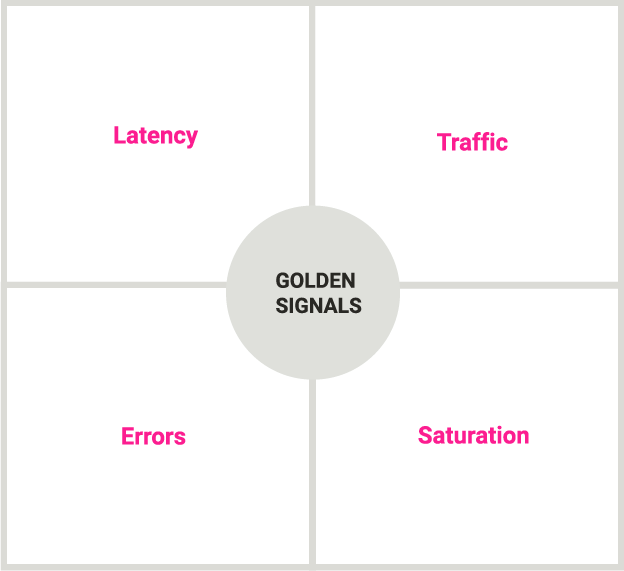
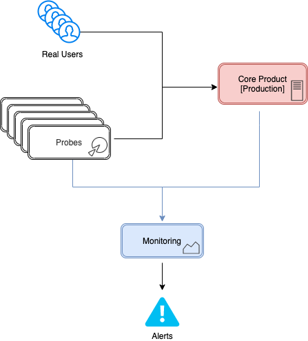
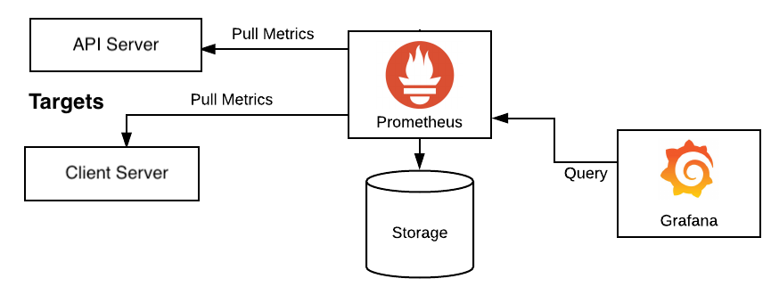

## Monitoring and Observability for Development and DevOps

[Link to course](https://www.coursera.org/learn/monitoring-and-observability-for-development-and-devops)

### Table of Contents

<ol>
  <li>
    <a href="#module-1">Introduction to Monitoring for Applications</a>
      <ul>
        <li>
          <a href="#monitoring-basics">Monitoring Basics</a>
        </li>
        <li>
          <a href="#objectives-of-monitoring">Objectives of Monitoring</a>
        </li>
        <li>
          <a href="#introduction-to-monitoring-for-applications">Summary</a>
        </li>
      </ul>
  </li>
  <li>
    <a href="#module-2">Monitoring Systems and Techniques</a>
      <ul>
        <li>
          <a href="#implementing-monitoring">Implementing Monitoring</a>
        </li>
      </ul>
  </li>
  <li>
    <a href="#module-3">Module 3</a>
  </li>
  <li>
    <a href="#module-4">Module 4</a>
  </li>
  <li>
    <a href="#module-5">Module 5</a>
  </li>
</ol>

---

#### Module 1

#### Monitoring Basics

#### Q1. Which one of the following statements is an accurate definition of monitoring?

1. [ ] Monitoring will tell you if an application is open source or proprietary.
2. [ ] Monitoring is only performed by disinterested parties, who have no vested interest in an application.
3. [ ] Monitoring is done by a single person who observes and logs all activities performed by an application.
4. [x] Monitoring is the tracking of important data.

#### Explanation

Monitoring refers to the continuous tracking of important data to identify trends, potential issues, or ensure
everything is functioning as intended.

#### Q2. What is the benefit of using different types of monitoring?

1. [ ] Using different types of monitoring offers continuous monitoring and user-specific operating system (OS) options.
2. [ ] Using different types of monitoring allows developers to try out different tools in order to be familiar with the
   maximum number of options.
3. [ ] Using different types of monitoring benefits developers by providing options if one type of monitoring tool is
   unavailable or too expensive.
4. [x] Using different types of monitoring allows you to gain maximum visibility into your application and connected IT
   systems.

#### Explanation

Using a variety of monitoring types provides comprehensive visibility into various aspects of an application and its
related IT infrastructure. Different monitoring tools and methods can capture diverse metrics and performance
indicators, such as system resource usage, application performance, network traffic, security events, and user
interactions

#### Q3. Which of the following are the four Golden Signals that provide important metrics for measuring the health of your service or systems?

1. [ ] Server errors, Client errors, Incorrect content, and Identified errors
2. [x] Saturation, Errors, Traffic, and Latency
3. [ ] Saturation, Marination, Sanitation, and Colorization
4. [ ] Earth, Wind, Water, and Fire

#### Explanation

The concept of the Four Golden Signals comes from Google's Site Reliability Engineering (SRE) practices.

  

These metrics are crucial for monitoring the health and performance of a service:

1. **Saturation**: This measures the workload on your system, such as CPU, memory usage, or disk space, indicating how "
   full" your resources are.
2. **Errors**: This tracks the rate of requests that fail, providing insight into the reliability and correctness of
   your service.
3. **Traffic**: This measures the demand on your system, often in terms of the number of requests or the amount of data
   being processed.
4. **Latency**: This measures the time it takes to service a request, reflecting the responsiveness of your system.

These four metrics collectively give a comprehensive view of a system's health and performance.

(<a href="#table-of-contents">back to top</a>)

---

#### Objectives of Monitoring

### Q1. Who usually performs evaluation?

1. [x] External independent parties who have no connection with the application usually perform evaluation.
2. [ ] Elected officials who regulate computing technology and cloud systems usually perform evaluation.
3. [ ] Customers who are responsible for reviewing products and providing feedback usually perform evaluation.
4. [ ] Monitors who collect data during programming, testing, and the post-development lifecycle usually perform
   evaluation.

#### Explanation

Evaluation is typically carried out by external independent parties to ensure objectivity and impartiality, as they do
not have a vested interest in the application being evaluated.

### Q2. Which component of monitoring provides alerts for metrics outside expected ranges?

1. [ ] Metrics
2. [ ] Objectives
3. [ ] Observability
4. [x] Alerting

#### Explanation

Alerting is the component that notifies administrators when certain metrics exceed predefined
thresholds, indicating potential issues that need attention.

### Q3. Which type of metrics is, in many ways, just a higher-level extrapolation of application and server metrics?

1. [ ] Application metrics
2. [ ] Host-based
3. [x] Server pool
4. [ ] External dependencies

#### Explanation

Server pool metrics provide a broader view of the performance and health of a group of servers,
aggregating individual server metrics to give an overall picture of the infrastructure's status.

### Q4. How does data collected through the monitoring process help the development process of applications?

1. [ ] The data proves to developers that monitoring needs to be performed regularly to ensure optimal performance of
   applications and services.
2. [x] Using this data, administrators and developers can identify and solve problems in the development process of
   applications.
3. [ ] The data collected during the development process minimizes the time your service is down or running slowly.
4. [ ] The data helps decision-makers to develop profitable applications and increase the popularity of their apps.

#### Explanation

The primary benefit of monitoring data is to help developers and administrators detect and troubleshoot
issues, ensuring the development process is smooth and the application performs well.

(<a href="#table-of-contents">back to top</a>)

---

#### Introduction to Monitoring for Applications

#### Q1. Which one of the following statements is the most appropriate definition of application monitoring?

1. [ ] Application monitoring prevents all errors, issues, and problems within applications.
2. [x] Application monitoring is how application developers ensure that their applications are working as intended and
   are delivering the best user experience.
3. [ ] Application monitoring is a wholly automated process, using monitoring tools that observe applications, fix
   issues, and then deliver updated applications to customers.
4. [ ] Application monitoring is performed solely by a team of technical support specialists who manually watch and
   maintain applications in order to optimize the user experience.

#### Explanation

This definition highlights the proactive and ongoing nature of application monitoring, emphasizing its importance in
maintaining the quality and reliability of applications.

#### Q2. Which of the following statements most accurately summarizes the importance of the monitoring process?

1. [x] Monitoring ensures that an application is healthy, alerts developers and their teams of outages and problems, and
   helps developers deliver a useful and safe application.
2. [ ] Monitoring is an assessment of whether a solution meets its stated goals, which were determined at the design
   stage or when the solution was implemented.
3. [ ] Monitoring allows developers and operations teams to observe applications on your device and also on servers,
   databases, message queues, and other similar online programs.
4. [ ] Monitoring provides visualizations, alerts, tracing, and dependencies tracking in order to maximize the
   profitability of an application and reputation of the developer.

#### Explanation

This statement emphasizes the key aspects of monitoring: ensuring the health and functionality of an application,
alerting developers to issues, and ultimately contributing to the delivery of a reliable and effective application.

#### Q3. Which one of the following statements identifies a monitoring type that allows application developers to map resources that an application depends on?

1. [ ] Hall monitoring
2. [x] Dependency monitoring
3. [ ] Metric monitoring
4. [ ] User tracking and monitoring

#### Explanation

Dependency monitoring involves mapping the resources that an application depends on, such as external services,
databases, APIs, and other components. This type of monitoring helps developers understand the dependencies of their
application and identify any potential points of failure or performance bottlenecks.

#### Q4. What is the benefit of using different types of monitoring?

1. [ ] Different monitoring types offer continuous monitoring and user-specific operating system (OS) options.
2. [ ] Using different monitoring types allows developers to try out different tools in order to be familiar with the
   maximum number of options.
3. [ ] Different types of monitoring benefits developers by providing options if one type of monitoring tool is
   unavailable or too expensive.
4. [x] Using multiple types of monitoring allows you to gain maximum visibility into your application and connected IT
   systems.

#### Explanation

This highlights the overarching benefit of using multiple monitoring types, which is to achieve comprehensive visibility
into the application and associated IT infrastructure, enabling better insights and decision-making.

#### Q5. Which one of the following statements explains the importance of using the Golden Signals in Monitoring?

1. [ ] The Golden Signals are the only four metrics that are important to monitor.
2. [ ] By using the Golden Signals, you reveal to customers how serious you are about your monitoring solutions.
3. [x] Using the Golden Signals, you can focus on your application’s most critical performance indicators and
   proactively
   monitor your application.
4. [ ] The Golden Signals include all the metrics, logs, and information about applications and systems.

#### Explanation

  

Golden Signals are a set of key performance indicators (KPIs) crucial for monitoring the health and performance of
applications and systems. These signals provide essential insights into the overall performance, reliability, and user
experience of an
application or system, helping teams proactively identify and address issues before they impact users.

#### Q6. Which one of the four Golden Signals of Monitoring indicates service demand and helps developers fine-tune user experiences?

1. [ ] Latency
2. [ ] Errors
3. [ ] Saturation
4. [x] Traffic

#### Explanation

All four of the Golden Signals of Monitoring (Latency, Errors, Saturation, Traffic) can indicate service demand and help
developers fine-tune user experiences, although some provide a stronger indication than others.

Traffic directly measures the volume of requests your service is receiving, giving a clear picture of user demand.

#### Q7. Which of the following statements identifies a key difference between monitoring and evaluation?

1. [ ] Monitoring and evaluation are the same process, and the terms are used interchangeably.
2. [x] Monitoring is a routine ongoing process, and evaluations are long-term processes that may happen only a few
   times.
3. [ ] Monitoring is a process performed by one person, and evaluation is performed by a whole team.
4. [ ] Monitoring is only done once at the beginning of application development, and evaluation is only performed at the
   end of application development.

#### Explanation

* **Monitoring is continuous**: It tracks progress and identifies issues throughout a project's lifecycle, providing
  real-time data for adjustments.
* **Evaluation is periodic**: It assesses the overall effectiveness and impact of a project at specific points, often at
  the end of a phase or the entire project.

#### Q8. Which one of the following answers describes the three main components of a monitoring system?

1. [ ] Dashboards, Historical Data, and Timelines
2. [x] Metrics, Observability, and Alerting
3. [ ] Visibility, Trends, and Awareness
4. [ ] Usage, Behavior, and Summaries

#### Explanation

Three components represent the core elements of a monitoring system:

1. **Metrics**: These are quantitative measurements that provide data about the performance, health, and behavior of a
   system or application.
2. **Observability**: This refers to the ability to understand the internal state of a system based on its external
   outputs. It involves collecting and analyzing logs, traces, and other data to gain insights into system behavior.
3. **Alerting**: This involves setting up notifications or alerts based on predefined thresholds or conditions to
   promptly notify stakeholders of any issues or anomalies detected within the system.

  

#### Q9. Which one of the following answers lists the important metrics you should track in a monitoring system?

1. [x] Important metrics you should track are host-based, application, network and connectivity, and server pool.
2. [ ] Important metrics to track are stability, resources, project maturity, and level of service that you require.
3. [ ] All metrics are important to track, regardless of your resources available and the purpose of your application.
4. [ ] You should track the complexity and purpose of your application.

#### Explanation

A brief explanation of each of the mentioned important metrics:

| Metric Category          | Explanation                                                                                                                                                                                                                                              |
|--------------------------|----------------------------------------------------------------------------------------------------------------------------------------------------------------------------------------------------------------------------------------------------------|
| Host-based               | Metrics related to individual hosts or machines, such as CPU usage, memory utilization, disk space, and network activity. Monitoring these metrics helps assess the health and performance of each host.                                                 |
| Application              | Metrics specific to the application, including response time, throughput, error rates, and transaction rates. Monitoring application metrics provides insights into the application's performance and user experience.                                   |
| Network and Connectivity | Metrics pertaining to network infrastructure and connectivity, such as bandwidth usage, latency, packet loss, and network errors. Monitoring network metrics helps ensure optimal network performance and reliability.                                   |
| Server Pool              | Metrics related to server pools or clusters, including load balancing, server health, and resource distribution across servers. Monitoring server pool metrics aids in optimizing resource allocation and maintaining high availability and scalability. |

Tracking these metrics provides comprehensive visibility into various aspects of your infrastructure and application,
enabling effective monitoring, troubleshooting, and performance optimization.

#### Q10. How does data collected through the monitoring process help the development process of applications?

1. [ ] The data helps decision-makers develop profitable applications and increase the popularity of their apps.
2. [ ] The data collected during the development process minimizes the time your service is down or running slowly.
3. [x] Using this data, administrators can identify and solve problems in the development process of applications.
4. [ ] The data proves to developers that monitoring needs to be performed regularly to ensure optimal performance of
   applications and services.

#### Explanation

Data collected through monitoring provides valuable insights into the performance, behavior, and usage patterns of
applications and infrastructure. By analyzing this data, administrators and developers can identify potential issues,
optimize performance, prioritize development efforts, and enhance the overall quality of applications during the
development process.

(<a href="#table-of-contents">back to top</a>)

---

#### Module 2

#### Monitoring Systems and Techniques

---

#### Implementing Monitoring

#### Q1. Which of the following behaviors is used by synthetic monitoring to improve a website or an application performance?

1. [ ] Inferential
2. [ ] Predictive
3. [ ] Associative
4. [x] Prescriptive

#### Explanation

Synthetic monitoring simulates user traffic and behavior to proactively identify performance issues in websites and
applications. Prescriptive analytics goes beyond identifying problems; it suggests specific actions to address them.

  

Synthetic monitoring focuses on simulating real user scenarios to uncover performance bottlenecks and pinpoint areas for
improvement. Prescriptive analytics aligns with the proactive nature of synthetic monitoring by
recommending solutions to the performance issues identified.

#### Q2. Which of the following statements is true regarding scripting in synthetic monitoring?

1. [ ] Scripting is a way to identify outages or availability issues.
2. [x] Scripting enables you to walk through important application flows.
3. [ ] It is the ability to test out various “What If” scenarios.
4. [ ] Scripting measures an industry or competitors’ performance.

#### Explanation

In the context of synthetic monitoring, scripting refers to the creation of automated sequences that mimic user
interactions with a website or application. These scripts are used to simulate real user behavior, allowing for
continuous monitoring and testing of specific functionalities and workflows.

#### Q3. Which of the following statements is the most appropriate summary of application monitoring?

1. [ ] Application monitoring increases your sales and drives the growth of your business.
2. [ ] Application monitoring only provides visualization and alerts to detect anomalies and target security issues.
3. [ ] Application monitoring allows you to decrease your application’s productivity and reduce the quality of the user
   experience.
4. [x] Application monitoring allows developers to fine-tune and maintain apps for increased performance and user
   satisfaction by providing a better understanding of app usage.

### Explanation:

Application monitoring involves tracking and analyzing the performance and behavior of software applications. This
process is essential for maintaining and improving the application's reliability, performance, and user experience.

Here's why the correct answer is the most appropriate summary:

- **Fine-Tuning and Maintenance:** Application monitoring provides detailed insights into how an application is
  performing. Developers can use this information to identify bottlenecks, optimize code, and make necessary adjustments
  to enhance performance.
- **Increased Performance:** By monitoring key metrics such as response times, error rates, and resource usage,
  developers can ensure that the application runs smoothly and efficiently. This proactive approach helps in
  preemptively addressing issues before they affect users.
- **User Satisfaction:** Understanding how users interact with the application helps developers to improve the user
  experience. By resolving issues quickly and optimizing performance, application monitoring contributes to higher user
  satisfaction and retention.
- **Better Understanding of App Usage:** Monitoring tools provide valuable data on how the application is used, which
  features are most popular, and where users may encounter problems. This insight helps in making informed decisions for
  future development and enhancements.

#### Q4. Which of the following statements best describes using Prometheus for monitoring and alerting?

1. [x] Prometheus can collect millions of metrics every second.
2. [ ] Prometheus works best with simple workloads, limited metrics, and simplified databases.
3. [ ] Prometheus does not include official libraries for Go, Python, Ruby, and third-party libraries, mandating that
   developers create their own.
4. [ ] Prometheus only works with Linux.

#### Explanation

The correct answer is:

1. [x] Prometheus can collect millions of metrics every second.

### Explanation:

Prometheus is a powerful and widely-used open-source system for monitoring and alerting, particularly well-suited for
time-series data.

Prometheus is designed to handle high volumes of data efficiently, capable of collecting millions of metrics every
second. This scalability makes it suitable for monitoring large and complex environments.

#### Q5. Which of the following best describes the primary function of application monitoring (APM) tools?

1. [ ] APM tools follow collective tracing to detect the origins of errors.
2. [x] APM tools visually depict the event’s dependency and flow mapping connection.
3. [ ] APM tools provide insights and overviews without focusing on specific problems.
4. [ ] APM tools observe app components instead of visually depicting the events.

#### Explanation

APM tools go beyond simple application observation. Their core function lies in providing a comprehensive view of how
different parts of your application interact and flow together. This includes:

* **Dependency Mapping**: Visually showing how various components rely on each other.
* **Event Flow Mapping**: Tracing the journey of a user action through the application, highlighting interactions
  between components at each step.

By visualizing these connections, APM tools empower developers to pinpoint bottlenecks, identify performance issues, and
understand how changes in one part of the application might impact others.

#### Q6. Which one of the following statements describes Grafana?**

1. [ ] Grafana is an error alerting tool that manages your databases and systems based on defined metrics and
   thresholds.
2. [ ] Grafana is a proprietary charting and dashboard tool.
3. [x] Grafana is a professional cross-platform, open-source data visualization and metrics analysis tool.
4. [ ] Grafana is a data visualization tool that only works on Linux and Unix machines.

#### Explanation

The correct answer is:

3. [x] Grafana is a professional cross-platform, open-source data visualization and metrics analysis tool.

### Explanation:

Grafana is widely recognized as a powerful and flexible tool for visualizing and analyzing data from various sources.
Here’s why the correct answer best describes Grafana:

  

- **Professional and Cross-Platform:** Grafana is used by professionals across different industries to create detailed
  and interactive dashboards. It is cross-platform, meaning it can run on various operating systems including Linux,
  Windows, and macOS.
- **Open-Source:** Grafana is open-source, allowing users to modify, extend, and share the software freely. This
  contributes to a large community of users and contributors who enhance its capabilities.
- **Data Visualization and Metrics Analysis:** Grafana excels at creating visual representations of data, enabling users
  to analyze metrics and gain insights into their systems and applications. It supports a wide range of data sources,
  including time-series databases like Prometheus, InfluxDB, and more.

(<a href="#table-of-contents">back to top</a>)

---
