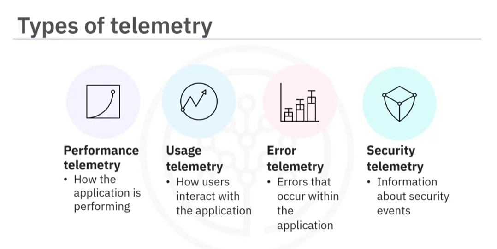
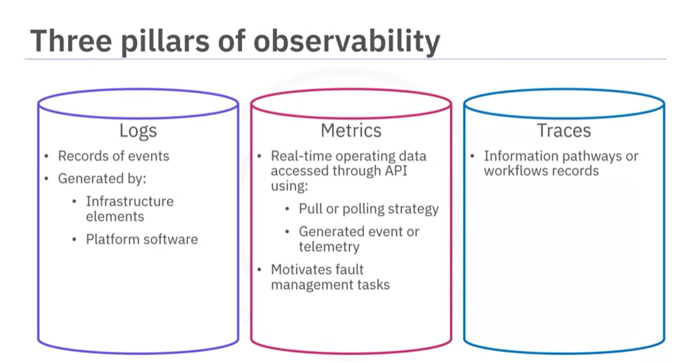
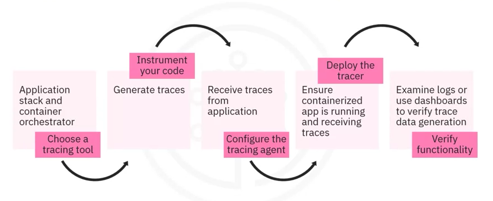

## Monitoring and Observability for Development and DevOps

[Link to course](https://www.coursera.org/learn/monitoring-and-observability-for-development-and-devops)

### Table of Contents

<ol>
  <li>
    <a href="#module-1">Introduction to Monitoring for Applications</a>
      <ul>
        <li>
          <a href="#monitoring-basics">Monitoring Basics</a>
        </li>
        <li>
          <a href="#objectives-of-monitoring">Objectives of Monitoring</a>
        </li>
        <li>
          <a href="#introduction-to-monitoring-for-applications">Summary</a>
        </li>
      </ul>
  </li>
  <li>
    <a href="#module-2">Monitoring Systems and Techniques</a>
      <ul>
        <li>
          <a href="#implementing-monitoring">Implementing Monitoring</a>
        </li>
        <li>
          <a href="#monitoring-techniques">Monitoring Techniques</a>
        </li>
        <li>
          <a href="#monitoring-systems-and-techniques">Summary</a>
        </li>
      </ul>
  </li>
  <li>
    <a href="#module-3">Methodologies and Tools in Logging</a>
      <ul>
        <li>
          <a href="#introduction-to-logging">Introduction to Logging</a>
        </li>
        <li>
          <a href="#logging-implementation">Logging Implementation</a>
        </li>
        <li>
          <a href="#introduction-to-mezmo">Introduction to Mezmo</a>
        </li>
        <li>
          <a href="#methodologies-and-tools-in-logging">Summary</a>
        </li>
      </ul>
  </li>
  <li>
    <a href="#module-4">Observability and Concepts</a>
      <ul>
        <li>
          <a href="#introduction-to-observability">Introduction to Observability</a>
        </li>
        <li>
          <a href="#tracing-using-open-telemetry">Tracing using Open Telemetry</a>
        </li>
        <li>
          <a href="#monitoring-containers">Monitoring Containers</a>
        </li>
        <li>
          <a href="#observability-and-concepts">Summary</a>
        </li>
      </ul>
  </li>
  <li>
    <a href="#module-5">Module 5</a>
  </li>
</ol>

---

#### Module 1

#### Monitoring Basics

#### Q1. Which one of the following statements is an accurate definition of monitoring?

1. [ ] Monitoring will tell you if an application is open source or proprietary.
2. [ ] Monitoring is only performed by disinterested parties, who have no vested interest in an application.
3. [ ] Monitoring is done by a single person who observes and logs all activities performed by an application.
4. [x] Monitoring is the tracking of important data.

#### Explanation

Monitoring refers to the continuous tracking of important data to identify trends, potential issues, or ensure
everything is functioning as intended.

#### Q2. What is the benefit of using different types of monitoring?

1. [ ] Using different types of monitoring offers continuous monitoring and user-specific operating system (OS) options.
2. [ ] Using different types of monitoring allows developers to try out different tools in order to be familiar with the
   maximum number of options.
3. [ ] Using different types of monitoring benefits developers by providing options if one type of monitoring tool is
   unavailable or too expensive.
4. [x] Using different types of monitoring allows you to gain maximum visibility into your application and connected IT
   systems.

#### Explanation

Using a variety of monitoring types provides comprehensive visibility into various aspects of an application and its
related IT infrastructure. Different monitoring tools and methods can capture diverse metrics and performance
indicators, such as system resource usage, application performance, network traffic, security events, and user
interactions

#### Q3. Which of the following are the four Golden Signals that provide important metrics for measuring the health of your service or systems?

1. [ ] Server errors, Client errors, Incorrect content, and Identified errors
2. [x] Saturation, Errors, Traffic, and Latency
3. [ ] Saturation, Marination, Sanitation, and Colorization
4. [ ] Earth, Wind, Water, and Fire

#### Explanation

The concept of the Four Golden Signals comes from Google's Site Reliability Engineering (SRE) practices.

  

These metrics are crucial for monitoring the health and performance of a service:

1. **Saturation**: This measures the workload on your system, such as CPU, memory usage, or disk space, indicating how "
   full" your resources are.
2. **Errors**: This tracks the rate of requests that fail, providing insight into the reliability and correctness of
   your service.
3. **Traffic**: This measures the demand on your system, often in terms of the number of requests or the amount of data
   being processed.
4. **Latency**: This measures the time it takes to service a request, reflecting the responsiveness of your system.

These four metrics collectively give a comprehensive view of a system's health and performance.

(<a href="#table-of-contents">back to top</a>)

---

#### Objectives of Monitoring

### Q1. Who usually performs evaluation?

1. [x] External independent parties who have no connection with the application usually perform evaluation.
2. [ ] Elected officials who regulate computing technology and cloud systems usually perform evaluation.
3. [ ] Customers who are responsible for reviewing products and providing feedback usually perform evaluation.
4. [ ] Monitors who collect data during programming, testing, and the post-development lifecycle usually perform
   evaluation.

#### Explanation

Evaluation is typically carried out by external independent parties to ensure objectivity and impartiality, as they do
not have a vested interest in the application being evaluated.

### Q2. Which component of monitoring provides alerts for metrics outside expected ranges?

1. [ ] Metrics
2. [ ] Objectives
3. [ ] Observability
4. [x] Alerting

#### Explanation

Alerting is the component that notifies administrators when certain metrics exceed predefined
thresholds, indicating potential issues that need attention.

### Q3. Which type of metrics is, in many ways, just a higher-level extrapolation of application and server metrics?

1. [ ] Application metrics
2. [ ] Host-based
3. [x] Server pool
4. [ ] External dependencies

#### Explanation

Server pool metrics provide a broader view of the performance and health of a group of servers,
aggregating individual server metrics to give an overall picture of the infrastructure's status.

### Q4. How does data collected through the monitoring process help the development process of applications?

1. [ ] The data proves to developers that monitoring needs to be performed regularly to ensure optimal performance of
   applications and services.
2. [x] Using this data, administrators and developers can identify and solve problems in the development process of
   applications.
3. [ ] The data collected during the development process minimizes the time your service is down or running slowly.
4. [ ] The data helps decision-makers to develop profitable applications and increase the popularity of their apps.

#### Explanation

The primary benefit of monitoring data is to help developers and administrators detect and troubleshoot
issues, ensuring the development process is smooth and the application performs well.

(<a href="#table-of-contents">back to top</a>)

---

#### Module 1 - Summary

#### Introduction to Monitoring for Applications

#### Q1. Which one of the following statements is the most appropriate definition of application monitoring?

1. [ ] Application monitoring prevents all errors, issues, and problems within applications.
2. [x] Application monitoring is how application developers ensure that their applications are working as intended and
   are delivering the best user experience.
3. [ ] Application monitoring is a wholly automated process, using monitoring tools that observe applications, fix
   issues, and then deliver updated applications to customers.
4. [ ] Application monitoring is performed solely by a team of technical support specialists who manually watch and
   maintain applications in order to optimize the user experience.

#### Explanation

This definition highlights the proactive and ongoing nature of application monitoring, emphasizing its importance in
maintaining the quality and reliability of applications.

#### Q2. Which of the following statements most accurately summarizes the importance of the monitoring process?

1. [x] Monitoring ensures that an application is healthy, alerts developers and their teams of outages and problems, and
   helps developers deliver a useful and safe application.
2. [ ] Monitoring is an assessment of whether a solution meets its stated goals, which were determined at the design
   stage or when the solution was implemented.
3. [ ] Monitoring allows developers and operations teams to observe applications on your device and also on servers,
   databases, message queues, and other similar online programs.
4. [ ] Monitoring provides visualizations, alerts, tracing, and dependencies tracking in order to maximize the
   profitability of an application and reputation of the developer.

#### Explanation

This statement emphasizes the key aspects of monitoring: ensuring the health and functionality of an application,
alerting developers to issues, and ultimately contributing to the delivery of a reliable and effective application.

#### Q3. Which one of the following statements identifies a monitoring type that allows application developers to map resources that an application depends on?

1. [ ] Hall monitoring
2. [x] Dependency monitoring
3. [ ] Metric monitoring
4. [ ] User tracking and monitoring

#### Explanation

Dependency monitoring involves mapping the resources that an application depends on, such as external services,
databases, APIs, and other components. This type of monitoring helps developers understand the dependencies of their
application and identify any potential points of failure or performance bottlenecks.

#### Q4. What is the benefit of using different types of monitoring?

1. [ ] Different monitoring types offer continuous monitoring and user-specific operating system (OS) options.
2. [ ] Using different monitoring types allows developers to try out different tools in order to be familiar with the
   maximum number of options.
3. [ ] Different types of monitoring benefits developers by providing options if one type of monitoring tool is
   unavailable or too expensive.
4. [x] Using multiple types of monitoring allows you to gain maximum visibility into your application and connected IT
   systems.

#### Explanation

This highlights the overarching benefit of using multiple monitoring types, which is to achieve comprehensive visibility
into the application and associated IT infrastructure, enabling better insights and decision-making.

#### Q5. Which one of the following statements explains the importance of using the Golden Signals in Monitoring?

1. [ ] The Golden Signals are the only four metrics that are important to monitor.
2. [ ] By using the Golden Signals, you reveal to customers how serious you are about your monitoring solutions.
3. [x] Using the Golden Signals, you can focus on your application’s most critical performance indicators and
   proactively
   monitor your application.
4. [ ] The Golden Signals include all the metrics, logs, and information about applications and systems.

#### Explanation

  

Golden Signals are a set of key performance indicators (KPIs) crucial for monitoring the health and performance of
applications and systems. These signals provide essential insights into the overall performance, reliability, and user
experience of an
application or system, helping teams proactively identify and address issues before they impact users.

#### Q6. Which one of the four Golden Signals of Monitoring indicates service demand and helps developers fine-tune user experiences?

1. [ ] Latency
2. [ ] Errors
3. [ ] Saturation
4. [x] Traffic

#### Explanation

All four of the Golden Signals of Monitoring (Latency, Errors, Saturation, Traffic) can indicate service demand and help
developers fine-tune user experiences, although some provide a stronger indication than others.

Traffic directly measures the volume of requests your service is receiving, giving a clear picture of user demand.

#### Q7. Which of the following statements identifies a key difference between monitoring and evaluation?

1. [ ] Monitoring and evaluation are the same process, and the terms are used interchangeably.
2. [x] Monitoring is a routine ongoing process, and evaluations are long-term processes that may happen only a few
   times.
3. [ ] Monitoring is a process performed by one person, and evaluation is performed by a whole team.
4. [ ] Monitoring is only done once at the beginning of application development, and evaluation is only performed at the
   end of application development.

#### Explanation

* **Monitoring is continuous**: It tracks progress and identifies issues throughout a project's lifecycle, providing
  real-time data for adjustments.
* **Evaluation is periodic**: It assesses the overall effectiveness and impact of a project at specific points, often at
  the end of a phase or the entire project.

#### Q8. Which one of the following answers describes the three main components of a monitoring system?

1. [ ] Dashboards, Historical Data, and Timelines
2. [x] Metrics, Observability, and Alerting
3. [ ] Visibility, Trends, and Awareness
4. [ ] Usage, Behavior, and Summaries

#### Explanation

Three components represent the core elements of a monitoring system:

1. **Metrics**: These are quantitative measurements that provide data about the performance, health, and behavior of a
   system or application.
2. **Observability**: This refers to the ability to understand the internal state of a system based on its external
   outputs. It involves collecting and analyzing logs, traces, and other data to gain insights into system behavior.
3. **Alerting**: This involves setting up notifications or alerts based on predefined thresholds or conditions to
   promptly notify stakeholders of any issues or anomalies detected within the system.

  

#### Q9. Which one of the following answers lists the important metrics you should track in a monitoring system?

1. [x] Important metrics you should track are host-based, application, network and connectivity, and server pool.
2. [ ] Important metrics to track are stability, resources, project maturity, and level of service that you require.
3. [ ] All metrics are important to track, regardless of your resources available and the purpose of your application.
4. [ ] You should track the complexity and purpose of your application.

#### Explanation

A brief explanation of each of the mentioned important metrics:

| Metric Category          | Explanation                                                                                                                                                                                                                                              |
|--------------------------|----------------------------------------------------------------------------------------------------------------------------------------------------------------------------------------------------------------------------------------------------------|
| Host-based               | Metrics related to individual hosts or machines, such as CPU usage, memory utilization, disk space, and network activity. Monitoring these metrics helps assess the health and performance of each host.                                                 |
| Application              | Metrics specific to the application, including response time, throughput, error rates, and transaction rates. Monitoring application metrics provides insights into the application's performance and user experience.                                   |
| Network and Connectivity | Metrics pertaining to network infrastructure and connectivity, such as bandwidth usage, latency, packet loss, and network errors. Monitoring network metrics helps ensure optimal network performance and reliability.                                   |
| Server Pool              | Metrics related to server pools or clusters, including load balancing, server health, and resource distribution across servers. Monitoring server pool metrics aids in optimizing resource allocation and maintaining high availability and scalability. |

Tracking these metrics provides comprehensive visibility into various aspects of your infrastructure and application,
enabling effective monitoring, troubleshooting, and performance optimization.

#### Q10. How does data collected through the monitoring process help the development process of applications?

1. [ ] The data helps decision-makers develop profitable applications and increase the popularity of their apps.
2. [ ] The data collected during the development process minimizes the time your service is down or running slowly.
3. [x] Using this data, administrators can identify and solve problems in the development process of applications.
4. [ ] The data proves to developers that monitoring needs to be performed regularly to ensure optimal performance of
   applications and services.

#### Explanation

Data collected through monitoring provides valuable insights into the performance, behavior, and usage patterns of
applications and infrastructure. By analyzing this data, administrators and developers can identify potential issues,
optimize performance, prioritize development efforts, and enhance the overall quality of applications during the
development process.

(<a href="#table-of-contents">back to top</a>)

---

#### Module 2

#### Implementing Monitoring

#### Q1. Which of the following behaviors is used by synthetic monitoring to improve a website or an application performance?

1. [ ] Inferential
2. [ ] Predictive
3. [ ] Associative
4. [x] Prescriptive

#### Explanation

Synthetic monitoring simulates user traffic and behavior to proactively identify performance issues in websites and
applications. Prescriptive analytics goes beyond identifying problems; it suggests specific actions to address them.

  

Synthetic monitoring focuses on simulating real user scenarios to uncover performance bottlenecks and pinpoint areas for
improvement. Prescriptive analytics aligns with the proactive nature of synthetic monitoring by
recommending solutions to the performance issues identified.

#### Q2. Which of the following statements is true regarding scripting in synthetic monitoring?

1. [ ] Scripting is a way to identify outages or availability issues.
2. [x] Scripting enables you to walk through important application flows.
3. [ ] It is the ability to test out various “What If” scenarios.
4. [ ] Scripting measures an industry or competitors’ performance.

#### Explanation

In the context of synthetic monitoring, scripting refers to the creation of automated sequences that mimic user
interactions with a website or application. These scripts are used to simulate real user behavior, allowing for
continuous monitoring and testing of specific functionalities and workflows.

#### Q3. Which of the following statements is the most appropriate summary of application monitoring?

1. [ ] Application monitoring increases your sales and drives the growth of your business.
2. [ ] Application monitoring only provides visualization and alerts to detect anomalies and target security issues.
3. [ ] Application monitoring allows you to decrease your application’s productivity and reduce the quality of the user
   experience.
4. [x] Application monitoring allows developers to fine-tune and maintain apps for increased performance and user
   satisfaction by providing a better understanding of app usage.

### Explanation:

Application monitoring involves tracking and analyzing the performance and behavior of software applications. This
process is essential for maintaining and improving the application's reliability, performance, and user experience.

Here's why the correct answer is the most appropriate summary:

- **Fine-Tuning and Maintenance:** Application monitoring provides detailed insights into how an application is
  performing. Developers can use this information to identify bottlenecks, optimize code, and make necessary adjustments
  to enhance performance.
- **Increased Performance:** By monitoring key metrics such as response times, error rates, and resource usage,
  developers can ensure that the application runs smoothly and efficiently. This proactive approach helps in
  preemptively addressing issues before they affect users.
- **User Satisfaction:** Understanding how users interact with the application helps developers to improve the user
  experience. By resolving issues quickly and optimizing performance, application monitoring contributes to higher user
  satisfaction and retention.
- **Better Understanding of App Usage:** Monitoring tools provide valuable data on how the application is used, which
  features are most popular, and where users may encounter problems. This insight helps in making informed decisions for
  future development and enhancements.

#### Q4. Which of the following statements best describes using Prometheus for monitoring and alerting?

1. [x] Prometheus can collect millions of metrics every second.
2. [ ] Prometheus works best with simple workloads, limited metrics, and simplified databases.
3. [ ] Prometheus does not include official libraries for Go, Python, Ruby, and third-party libraries, mandating that
   developers create their own.
4. [ ] Prometheus only works with Linux.

#### Explanation

The correct answer is:

1. [x] Prometheus can collect millions of metrics every second.

### Explanation:

Prometheus is a powerful and widely-used open-source system for monitoring and alerting, particularly well-suited for
time-series data.

Prometheus is designed to handle high volumes of data efficiently, capable of collecting millions of metrics every
second. This scalability makes it suitable for monitoring large and complex environments.

#### Q5. Which of the following best describes the primary function of application monitoring (APM) tools?

1. [ ] APM tools follow collective tracing to detect the origins of errors.
2. [x] APM tools visually depict the event’s dependency and flow mapping connection.
3. [ ] APM tools provide insights and overviews without focusing on specific problems.
4. [ ] APM tools observe app components instead of visually depicting the events.

#### Explanation

APM tools go beyond simple application observation. Their core function lies in providing a comprehensive view of how
different parts of your application interact and flow together. This includes:

* **Dependency Mapping**: Visually showing how various components rely on each other.
* **Event Flow Mapping**: Tracing the journey of a user action through the application, highlighting interactions
  between components at each step.

By visualizing these connections, APM tools empower developers to pinpoint bottlenecks, identify performance issues, and
understand how changes in one part of the application might impact others.

#### Q6. Which one of the following statements describes Grafana?**

1. [ ] Grafana is an error alerting tool that manages your databases and systems based on defined metrics and
   thresholds.
2. [ ] Grafana is a proprietary charting and dashboard tool.
3. [x] Grafana is a professional cross-platform, open-source data visualization and metrics analysis tool.
4. [ ] Grafana is a data visualization tool that only works on Linux and Unix machines.

#### Explanation

The correct answer is:

3. [x] Grafana is a professional cross-platform, open-source data visualization and metrics analysis tool.

### Explanation:

Grafana is widely recognized as a powerful and flexible tool for visualizing and analyzing data from various sources.
Here’s why the correct answer best describes Grafana:

  

- **Professional and Cross-Platform:** Grafana is used by professionals across different industries to create detailed
  and interactive dashboards. It is cross-platform, meaning it can run on various operating systems including Linux,
  Windows, and macOS.
- **Open-Source:** Grafana is open-source, allowing users to modify, extend, and share the software freely. This
  contributes to a large community of users and contributors who enhance its capabilities.
- **Data Visualization and Metrics Analysis:** Grafana excels at creating visual representations of data, enabling users
  to analyze metrics and gain insights into their systems and applications. It supports a wide range of data sources,
  including time-series databases like Prometheus, InfluxDB, and more.

(<a href="#table-of-contents">back to top</a>)

---

#### Monitoring Techniques

#### Q1. Which of the following is an important reason for using data visualization to help developers understand the data their monitoring tools have collected?

- [ ] Visualization helps developers understand the benefits and components of monitoring.
- [ ] Data visualization eliminates the need for metrics, numbers, and data by presenting information in stories and
  pictures.
- [x] Data visualization is important because it can present massive amounts of data, allowing an operator to spot any
  trends or problems quickly.
- [ ] Visualization helps developers use illustrator programs that create graphically stunning and aesthetically
  pleasing art.

#### Explanation

Data visualization is crucial because it enables developers to quickly identify trends, patterns, and anomalies in large
datasets, facilitating faster and more effective decision-making.

#### Q2. Which one of the four types of alerts analyzes telemetry sent by your application to warn of potential failure anomalies?

- [ ] Log alerts
- [x] Smart detection
- [ ] Activity log alerts
- [ ] Metric alerts

#### Explanation

  

Smart detection alerts analyze telemetry data from your application to detect potential failure anomalies. This type of
alert use advanced algorithms to identify issues that might not be immediately obvious through standard metric or log
monitoring.

(<a href="#table-of-contents">back to top</a>)

---

#### Module 2 - Summary

#### Monitoring Systems and Techniques

#### Q1. Which one of the following statements is the most appropriate summary of application monitoring?

- [ ] Application monitoring increases your sales and drives the growth of your business.
- [ ] Application monitoring allows you to decrease your application’s productivity and reduce the user experience.
- [ ] Application monitoring only provides visualization and alerts to detect anomalies and target security issues.
- [x] Application monitoring provides a better understanding of app usage, allowing developers to fine-tune and
  maintain apps for increased performance and user satisfaction.

#### Explanation

Application monitoring involves tracking and analyzing the performance and behavior of software applications. This
process is essential for maintaining and improving the application's reliability, performance, and user experience.

Here's why the correct answer is the most appropriate summary:

- **Fine-Tuning and Maintenance:** Application monitoring provides detailed insights into how an application is
  performing. Developers can use this information to identify bottlenecks, optimize code, and make necessary adjustments
  to enhance performance.
- **Increased Performance:** By monitoring key metrics such as response times, error rates, and resource usage,
  developers can ensure that the application runs smoothly and efficiently. This proactive approach helps in
  preemptively addressing issues before they affect users.
- **User Satisfaction:** Understanding how users interact with the application helps developers to improve the user
  experience. By resolving issues quickly and optimizing performance, application monitoring contributes to higher user
  satisfaction and retention.
- **Better Understanding of App Usage:** Monitoring tools provide valuable data on how the application is used, which
  features are most popular, and where users may encounter problems. This insight helps in making informed decisions for
  future development and enhancements.

#### Q2. Which one of the following statements most accurately describes the application monitoring tool Prometheus?

- [ ] Prometheus provides data visualization, is customizable, and allows you to manage and explore logs and data
  more effectively.
- [ ] Prometheus is a text-based spreadsheet application that only collects data and requires a developer to
  interpret the data to make software updates and changes.
- [x] Prometheus is a powerful analytics tool that collects and evaluates metrics for numeric time-series data.
- [ ] Prometheus is a social network for professionals to connect, share, and learn.

#### Explanation

  

Prometheus is specifically designed to collect and analyze time-series data, making it a powerful tool for monitoring
applications.

#### Q3. What is one of the benefits of using Prometheus for monitoring and alerting?

- [ ] Prometheus does not include official libraries for Go, Python, Ruby, or third-party libraries and mandates
  that developers create their own.
- [ ] Prometheus only works with Linux.
- [ ] Prometheus handles alerts and sends alert notifications using email, on-call notification systems, and chat
  platforms.
- [x] Prometheus can collect millions of metrics every second.

#### Explanation

Prometheus is known for its ability to handle a high volume of metrics efficiently, making it suitable for
large-scale monitoring.

#### Q4. Which of the following is true for error monitoring, one of the essential aspects of application monitoring?

- [ ] It includes tracking user actions, session durations, conversion rates, and other relevant metrics to measure
  customer satisfaction.
- [ ] It checks the uptime and downtime of your application by periodically sending requests to verify its
  responsiveness.
- [x] It identifies bugs or other issues in the code, helps you capture stack traces, and provides detailed
  information about the root cause of errors, enabling efficient debugging.
- [ ] It involves tracking metrics like response time, throughput, error rates, and resource utilization to ensure
  optimal performance.

#### Explanation

Error monitoring focuses on detecting and diagnosing bugs and issues within the application code to facilitate
effective debugging and resolution.

#### Q5. Which one of the following statements explains an important benefit of using Grafana?

- [ ] Grafana is a simple, text-only visualization tool.
- [ ] Grafana is exclusively for developers who have reached the highest rank in Six Sigma.
- [ ] Grafana not only works on data stored in databases but also performs data collection to help you focus on just
  the data that is important to you.
- [x] Grafana transforms your data into graphs and visualizations that help you make sense of massive amounts of
  monitored data.

#### Explanation

Grafana is a powerful visualization tool that turns complex data into understandable graphs and charts, aiding in
data analysis and decision-making.

  

#### Q6. Which one of the following statements defines Grafana?

- [ ] Grafana is a data visualization tool that only works on Linux and Unix machines.
- [ ] Grafana is a proprietary charting and dashboard tool.
- [x] Grafana is a professional cross-platform, open-source data visualization and metrics analysis tool.
- [ ] Grafana is an error alerting tool that manages your databases and systems based on defined metrics and
  thresholds.

#### Explanation

Grafana is an open-source tool that is widely used across various platforms for data visualization and metrics
analysis.

#### Q7. When choosing a visualization tool, what is a key factor to consider? Select one answer.

- [ ] Popularity
- [x] Storytelling
- [ ] Widgets
- [ ] Color palette

#### Explanation

When selecting a visualization tool, storytelling is a key factor to consider. Effective data visualization goes beyond
just presenting raw data; it should tell a compelling story that helps the audience understand the insights and trends
hidden within the data.

#### Q8. Which one of the following answers summarizes one of the benefits of using visualization in monitoring?

- [x] Visualization is the graphical representation of data collected from a business infrastructure and is used to
  help a business maintain its applications.
- [ ] Visualization is a program used for creating animations and graphics for non-profit government organizations (
  NGOs).
- [ ] Visualization is used in monitoring to help developers create newer programs that users want to purchase.
- [ ] Visualization eliminates the need for metrics, numbers, and data by presenting information in stories and
  pictures.

#### Explanation

Visualization in monitoring refers to the use of graphical representations to display the data collected from a
business's infrastructure. This helps in understanding the performance, health, and status of applications and systems.

The benefits of using visualization in monitoring:

* **Graphical Representation of Data**: Visualization converts complex data into visual formats like charts, graphs, and
  dashboards, making it easier to comprehend and analyze.
* **Helps Maintain Applications**: By visualizing metrics and performance data, businesses can quickly identify issues,
  monitor trends, and make informed decisions to maintain and improve their applications.: By visualizing metrics and
  performance data, businesses can quickly identify issues, monitor trends, and make informed decisions to maintain and
  improve their applications.

#### Q9. What is the most common reason for alerting in application monitoring?

- [ ] The best reason for using alerting in monitoring is to fix problems before they are noticed by users, hence
  improving the user experience.
- [x] The most common reason to use alerting is to notify those responsible for that system, service, or
  application.
- [ ] The most common reason is to explain different types of alerts to developers and their teams.
- [ ] A common reason for alerting is the continuation of monitoring.

#### Explanation

The primary purpose of alerting is to quickly inform the people responsible for maintaining the system when there is an
issue. This enables a prompt response to potential problems, helping to minimize downtime and mitigate the impact on
users.

#### Q10. Which one of the four types of alerts uncovers trends in usage and behavior to help you understand the effects of any changes made to your applications or infrastructure?

- [ ] Activity log alerts
- [ ] Log alerts
- [ ] Metric alerts
- [x] Smart detection

#### Explanation

  

Metric alerts are the type of alerts that uncover trends in usage and behavior to help you understand the effects of any
changes made to your applications or infrastructure.

By monitoring metrics and setting up metric alerts, you can proactively notify yourself when important conditions are
found in your monitoring data. So, if you're looking to gain insight into how your systems are performing and understand
the impact of changes, metric alerts are the way to go!

(<a href="#table-of-contents">back to top</a>)

---

#### Module 3

#### Introduction to Logging

#### Q1. Which of the following is typically included in logged events?

1. [x] Completed operations
2. [ ] Proprietary information
3. [ ] Solutions for debugging operations
4. [ ] Unlogged events

#### Explanation

Logged events typically include completed operations. These logs record the details of actions that have been executed,
which is essential for monitoring, auditing, and debugging purposes.

#### Q2. Which of the following is one of the many important reasons to use application logs?

1. [x] Logs can be used for auditing purposes.
2. [ ] Logs contain the program code kernel that the application runs on.
3. [ ] Logs can automatically fix message flow issues and resolve application problems.
4. [ ] Logs are a security issue and should never be used in applications.

#### Explanation

Application logs are essential for various reasons, and one important reason is that they can be used for auditing
purposes. Logs help track and record significant events within an application, making it possible to review and analyze
these events for security, compliance, and troubleshooting.

#### Q3. Which of the following tools shape log data to make it more actionable by using automatic and custom parsing?

1. [ ] Sumo Logic
2. [ ] IBM Instana Observability (Instana)
3. [ ] Datadog
4. [x] Mezmo

#### Explanation

The tool that shapes log data to make it more actionable by using automatic and custom parsing is
Mezmo.

Mezmo makes it easy to centralize log data with support for a broad range of ingestion options. Its Automatic and Custom
Parsing feature allows you to shape log data, making it more valuable and actionable.

#### Q4.  __________ involves adding code to applications or services to generate traces and spans.

1. [ ] Context propagation
2. [ ] Distributed logging
3. [ ] Distributed tracing
4. [x] Instrumentation

#### Explanation

  

Instrumentation involves adding code to applications or services to generate traces and spans. This process is crucial
in distributed tracing, where instrumentation allows the collection of detailed performance and diagnostic data, which
is essential for monitoring and troubleshooting complex, distributed systems.

(<a href="#table-of-contents">back to top</a>)

---

#### Logging Implementation

#### Q1. Which type of application log is useful for troubleshooting issues, detecting security breaches, and recording user actions?

1. [ ] Access Logs
2. [ ] Error Logs
3. [ ] Performance Logs
4. [x] Event Logs

#### Explanation:

  

The type of application log that is useful for troubleshooting issues, detecting security breaches, and recording user
actions is Event Logs.

These logs capture information about events that occur on a system, including application-specific events,
security-related events, and user actions. Event logs are essential for monitoring and diagnosing problems in software
applications and systems. They provide valuable insights into system behavior, errors, and potential security threats.

#### Q2. Which of the following statements about log storage is correct?

1. [ ] Storing logs for a minimum of one year is not recommended
2. [ ] Compliance mandates do not have log storage and retention requirements
3. [ ] Storing logs in the cloud can impact retrieval speed
4. [x] AES-256 encryption is used for data at rest when storing logs in the cloud

#### Explanation:

AES-256 encryption is commonly used for securing data at rest, including logs stored in the cloud. This ensures that
sensitive log data is protected against unauthorized access. Other statements are incorrect because storing logs for a
certain period is often required for compliance, compliance mandates do have storage requirements, and cloud storage can
offer efficient retrieval mechanisms.

(<a href="#table-of-contents">back to top</a>)

---

#### Introduction to Mezmo

#### Q1. What is the primary purpose of Mezmo?

1. [x] Mezmo is a robust observability platform to manage and take action on your telemetry data.
2. [ ] Mezmo is a cloud storage platform to manage, store, and retrieve telemetry data.
3. [ ] Mezmo is a security platform with analytics and troubleshooting features.
4. [ ] Mezmo is a network analytics tool to manage and secure data networks.

#### Explanation:

Mezmo, previously known as LogDNA, is a robust observability platform for managing and taking action on your telemetry
data. Mezmo Log analysis gives operations teams control over their data flow and empowers developers to quickly find
value from their logs.

#### Q2. Which of the following statements about log storage is correct?

1. [ ] Storing logs for a minimum of one year is not recommended
2. [ ] Compliance mandates do not have log storage and retention requirements
3. [ ] Storing logs in the cloud can impact retrieval speed
4. [x] AES-256 encryption is used for data at rest when storing logs in the cloud

#### Explanation:

AES-256 encryption is commonly used for securing data at rest, including logs stored in the cloud. This ensures that
sensitive log data is protected against unauthorized access. Other statements are incorrect because storing logs for a
certain period is often required for compliance, compliance mandates do have storage requirements, and cloud storage can
offer efficient retrieval mechanisms.

(<a href="#table-of-contents">back to top</a>)

---

#### Module 3 - Summary

#### Methodologies and tools in logging

#### Q1. Which one of the following statements is the most appropriate definition of application logging?

1. [ ] Logging contains developer notes about how the application works, how it was designed, when the last update was
   made, and whom to contact if there’s an issue.
2. [x] Logging is a recording of a series of messages containing information about events within an application.
3. [ ] Logging is a pre-emptive activity performed by professional arborists to prevent destructive wildfires in
   forests.
4. [ ] Logging is how developers identify information, design applications based on that information, and then extract
   meaningful data.

#### Explanation

Application logging refers to the practice of recording information about the execution of an application. This
information typically includes messages about the application's state, errors, warnings, and other significant events
that occur during its operation.

#### Q2. Which of the following is one of the many important reasons to use application logs?

1. [ ] Logs can automatically fix message flow issues and resolve application problems before they become an issue.
2. [ ] Logs are a security issue and should never be used in applications.
3. [ ] Logs contain the program code kernel that the application runs on.
4. [x] Logs can be used for auditing purposes.

#### Explanation

Application logs serve multiple important purposes, one of which is auditing. Logs provide a record of events and
actions that have taken place within an application, which can be crucial for tracking changes, identifying unauthorized
access or modifications, and ensuring compliance with regulatory requirements.

#### Q3. Which of the following are items that are typically included in logged events?

1. [ ] End User License Agreement (EULA) details
2. [ ] Open source or proprietary information
3. [x] Completed operations
4. [ ] Copyright dates

#### Explanation

Logged events usually include information about actions and operations that have been completed within the application.
This can involve details such as when the operation started and finished, its outcome, any errors encountered, and other
relevant data that can help in understanding the application's behavior and diagnosing issues.

#### Q4. Imagine your application is an enterprise application used by many businesses. When you are determining what your application should log, you should consider which one of the following?

1. [x] Application testing
2. [x] Data and application operations
3. [x] Application training and feedback
4. [x] Service functions

#### Explanation

For an enterprise application used by many businesses, it's crucial to log data and application operations. This
includes information about transactions, user activities, system performance, errors, and other events that provide
insights into the application's behavior and help in troubleshooting issues. Effective logging of these operations aids
in maintaining the application's reliability, performance, and security, which are vital for business-critical
applications.

#### Q5. Which of the following is a fully automated application performance management (APM) solution designed for the challenges of managing microservice and cloud-native applications?

1. [ ] Datadog
2. [x] IBM Instana Observability (Instana)
3. [ ] Sumo Logic
4. [ ] Splunk

#### Explanation

IBM Instana Observability (Instana) is specifically designed for the complexities and dynamic nature of microservices
and cloud-native applications. It offers automated monitoring, tracing, and performance management to provide real-time
observability into these types of environments.

#### Q6. After choosing a logging framework, what is the next step to implement distributed logging?

1. [x] Configure loggers
2. [x] Set up a centralized logging server
3. [x] Monitor your logs
4. [x] Define log retention policies

#### Explanation

All the listed options (configure loggers, set up a centralized logging server, monitor your logs, and define log
retention policies) are crucial steps to implement distributed logging.

1. **Configure Loggers:** This involves integrating the chosen logging framework within your applications. You'll define
   what gets logged, the log level (debug, info, error etc.), and the format of the log messages.
2. **Set up a Centralized Logging Server:**  Here, you establish a central location to aggregate logs from all your
   distributed applications. This could be a dedicated log server, a cloud-based service, or even a distributed file
   system.
3. **Monitor Your Logs:** Once logs are collected centrally, set up log monitoring tools to analyze and identify any
   issues. This could involve creating dashboards or alerts based on specific log patterns.
4. **Define Log Retention Policies:**  Determine how long you want to store your logs. Factors to consider include
   compliance regulations and the value of the data for troubleshooting purposes. Implement a strategy to archive or
   delete logs after a set period.

Therefore, while all options are important, the most logical next step after choosing a logging framework would be:
**Configure Loggers** within your applications.

#### Q7. What information is typically included in a formatted log message?

1. [ ] Testing and adjustment of the logging setup
2. [ ] Output options such as console or file
3. [x] Timestamp and actual message being logged
4. [ ] Programming language and needs

#### Explanation

Formatted log messages typically **don't** include information about testing and adjustments or the programming language
used. Their focus is on providing context and details about the logged event.

Here's what you'll normally find in a formatted log message:

1. **Timestamp:** This indicates the exact time the event occurred, crucial for troubleshooting and sequencing events.
2. **Log Level:** This categorizes the severity of the event (e.g., debug, info, warning, error, critical).
3. **Source:**  This identifies the application or component that generated the log message.
4. **Message:** This is the actual content of the log, describing the event in detail. It may include relevant data or
   error codes.
5. **Additional Context (Optional):**  Some logging frameworks allow including supplementary details like thread IDs,
   hostnames, or user information for further troubleshooting.

#### Q8. Which of the following statements about log parsing is correct?

1. [x] Log parsing converts log files into a readable format for log management systems.
2. [ ] Log parsing is a feature only available in certain log management solutions.
3. [ ] Log parsing can be performed without explicitly determining the format of log files.
4. [ ] Log parsing is the final step in the process of log formatting.

#### Explanation

Log parsing involves analyzing log files and converting them into a structured, readable format that can be ingested and
utilized by log management systems. This process often includes extracting specific fields from the logs, such as
timestamps, log levels, messages, and other relevant data, so that the logs can be effectively searched, filtered, and
analyzed.

#### Q9. Which of the following is the correct consideration for the log retention policies regarding the criticality and security dimensions?

1. [x] Services tracking customer behavior for improvement purposes can have a shorter retention policy.
2. [ ] Applications involving sensitive or personal data should have a shorter retention policy.
3. [ ] Retention policies should be the same for all parts of the system, despite their criticality.
4. [ ] Critical components of a system can have a shorter retention policy.

#### Explanation

Less critical data for non-sensitive purposes can have a shorter storage duration.

#### Q10. What is the spike protection feature of Mezmo used for?

1. [ ] Visualize your log data over a time period
2. [ ] Easily surface the data from logs
3. [ ] Get notifications about the system’s activity
4. [x] Set dynamic thresholds and alerts

#### Explanation

This feature helps in setting thresholds and alerts dynamically to protect against sudden spikes or anomalies in the
system's activity, allowing users to proactively monitor and respond to potential issues.

(<a href="#table-of-contents">back to top</a>)

---

#### Module 4

#### Introduction to Observability

#### Q1. What is the goal of observability?

1. [ ] Faster identification and resolution of issues
2. [ ] Ensure that an application or service is up and responding
3. [x] Identify issues, track trends, and make informed decisions
4. [ ] Ensure that applications and web pages are responsive

#### Explanation

Observability goes beyond simply knowing if something is wrong. It allows you to see how the system is behaving over
time, identify patterns, and make data-driven decisions for
improvement.

#### Q2. Which of the following is an advantage of metrics?

1. [ ] Metrics can debug issues in a distributed system
2. [ ] Metrics are an extremely easy format to generate
3. [x] Metrics are highly quantitative to associate with alerting thresholds
4. [ ] The granular information from metrics allows retrospective replaying of support incidents

#### Explanation

Quantitative metrics allow you to set precise alerting thresholds. For example:

* If the error rate exceeds 5%, trigger an alert.
* If CPU utilization exceeds 80%, send a notification.

These thresholds are based on specific numeric values, making it easier to define actionable alerts.

#### Q3. How does implementing a robust observability solution provide an advantage in terms of reducing Mean Time to Repair (MTTR)?

1. [ ] By enabling a reactive approach to troubleshoot
2. [ ] By gaining insights into system resource utilization
3. [ ] By monitoring individual systems effectively
4. [x] By identifying correlations between events for expedited troubleshooting

#### Explanation

Observability tools correlate logs, metrics, and traces across distributed systems, providing a holistic view of the
environment. This correlation helps quickly pinpoint the root cause of issues, significantly speeding up the
troubleshooting process.

#### Q4. Which of the following cloud observability tools enables unlimited storage capacity for Prometheus deployments?

1. [x] Thanos
2. [ ] FluentD
3. [ ] New Relic
4. [ ] AWS CloudWatch

#### Explanation

Thanos is designed to extend Prometheus with features like unlimited storage capacity, global querying, and high
availability. It allows for long-term storage of metrics and seamless scaling of Prometheus.

#### Q5. Which of the following is the correct advantage of sampling in observability?

1. [ ] Sampling accurately represents the actual data.
2. [ ] Sampling always makes it easy to diagnose complex performance issues.
3. [x] Sampling reduces computational overhead and storage requirements.
4. [ ] Sampling provides high resolution in monitoring systems

#### Explanation

Sampling helps manage large volumes of data by reducing the amount of data collected and stored. This approach lowers
computational overhead and storage requirements while still providing a representative view of the system's performance.

(<a href="#table-of-contents">back to top</a>)

---

#### Tracing using Open Telemetry

#### Q1. Which type of telemetry provides information about how users interact with the application?

- [x] Usage telemetry
- [ ] Performance telemetry
- [ ] Error telemetry
- [ ] Security telemetry

#### Explanation

  

Usage telemetry collects data on how users interact with the application, such as which features are
used most often, user workflows, and user behavior patterns. This helps developers understand how the application is
being utilized and can guide improvements and enhancements.

#### Q2. Which of the following distributed tracing tools’ visibility into the request flow between microservices allows developers to analyze the performance and behavior of their applications?

- [ ] New Relic
- [x] Jaeger
- [ ] Sumo Logic
- [ ] Instana

#### Explanation

Jaeger is a distributed tracing tool specifically designed to monitor and troubleshoot
microservices-based applications. It provides detailed visibility into the request flow between microservices, helping
developers analyze performance and behavior issues within their applications.

(<a href="#table-of-contents">back to top</a>)

---

#### Monitoring Containers

#### Q1. What are the steps to visualize data and monitor end-to-end requests using monitoring tools?

- [x] Instrumentation, Trace context, Metrics and metadata, Analysis and visualization
- [ ] Tags, Queries, Stack traces, Logs, Context-giving events
- [ ] Allocate unique external request ID, Pass ID to all services handling the request, Include ID in log messages,
  Record information about requests and operations
- [ ] Latency, Traffic, Errors, Saturation

#### Explanation

Visualizing data and monitoring end-to-end requests involves several key steps:

1. **Instrumentation**: Adding code to your application to collect data on requests and performance.
2. **Trace context**: Ensuring that tracing information is propagated across different services and components.
3. **Metrics and metadata**: Collecting detailed metrics and metadata about the requests.
4. **Analysis and visualization**: Analyzing the collected data and visualizing it to understand system performance and
   behavior.

(<a href="#table-of-contents">back to top</a>)

---

#### Observability and Concepts

#### Summary

#### Q1. Which of the following statements is true about observability?

- [ ] Observability involves looking at predefined metrics or logs to detect problems or anomalies over time.
- [ ] Observability is a reactive approach that provides a limited system view.
- [ ] Observability provides visibility into the external workings of a system.
- [x] Observability allows teams to identify and resolve complex system issues quickly.

#### Explanation

Observability allows teams to gain insights into the internal state of a system from the data it produces, helping them
identify and resolve complex issues quickly.

#### Q2. By leveraging the 3 pillars of observability, you can gain which of the following to improve customer experience?

- [ ] Understanding of problem indicators in an application
- [ ] Understanding of request processing stages
- [ ] Understanding of management tasks
- [x] Understanding of the performance issues in microservices

#### Explanation

  

The three pillars of observability — logs, metrics, and traces—provide a comprehensive understanding of performance
issues, especially in microservices architectures, thereby improving customer experience.

#### Q3. In technology, what does telemetry refer to?

- [ ] Improve transmission of data between systems
- [x] Collection of data from devices for analysis and optimization purposes
- [ ] Enhance communication between systems for optimization purposes
- [ ] Monitor and analyze collected data for optimization purposes

#### Explanation

Telemetry refers to the automated collection of data from devices, which is then used for analysis and optimization
purposes.

#### Q4. Which of the following techniques can enhance application performance and identify problems before they become critical?

- [ ] Distributed tracing
- [ ] Telemetry
- [x] Both logging and tracing
- [ ] Distributed logging

#### Explanation

Both logging and tracing provide comprehensive insights that can enhance application performance and identify potential
issues before they become critical.

#### Q5. What is one of the advantages of enterprise observability in optimizing resource performance?

- [ ] Providing deep analysis without context
- [ ] Automating system modifications
- [x] Revealing interconnections between application components and services
- [ ] Monitoring individual systems effectively

#### Explanation

Enterprise observability reveals interconnections between application components and services, which is crucial for
optimizing resource performance.

#### Q6. When sampling tracing data from distributed systems, what is the main objective?

- [ ] Determine CPU usage of the applications
- [x] Identify bottlenecks and other issues in the system
- [ ] Collect logs from various sources to identify unusual trends
- [ ] Analyze user behavior and improve the user experience

#### Explanation

The main objective of sampling tracing data is to identify bottlenecks and other issues within the system to ensure
smooth operation.

#### Q7. Which of the following best represents the significance of cloud native observability tools?

- [ ] It can merely monitor application performance.
- [x] It is a must-have tool to process and monitor real-time, data-heavy, and new-age digital systems.
- [ ] It applies to smaller and more compact digital ecosystems.
- [ ] It applies to e-commerce companies and social media platforms.

#### Explanation

Cloud-native observability tools are crucial for managing the complexity of modern applications, particularly those
built with a cloud-native approach. Here's why:

* **Real-time and data-heavy**: Cloud-native applications are dynamic and generate a vast amount of data. Observability
  tools enable real-time monitoring of this data to identify issues and optimize performance.
* **New-age digital systems**: Microservices architectures, containerization, and serverless functions are common in
  cloud-native deployments. Observability tools are designed to handle the distributed nature and dynamic scaling of
  these systems.

#### Q8. Which of the following is the important factor to consider when selecting cloud native observability tools?

- [ ] It must enable you to focus primarily on the health of the local business division.
- [x] It works well with highly distributed cloud native applications and adopts new ways to handle huge data sets.
- [ ] It is far from leveraging the power of AI and business intelligence in a cloud native environment.
- [ ] It helps you monitor the transactions and events instead of diving into the root cause of the issues.

#### Explanation

The important factor to consider when selecting cloud-native observability tools is: It works well with highly
distributed cloud-native applications and adopts new ways to handle huge data sets.

Here's why this is the most crucial factor:

* **Highly distributed applications**: Cloud-native deployments often involve microservices architectures and
  distributed systems. The observability tool needs to be able to collect data and provide insights across these
  distributed components.
* **Huge data sets**: Cloud-native applications generate a significant amount of data, including logs, metrics, and
  traces. The tool should efficiently handle this data volume for real-time analysis.

#### Q9. Website monitoring is an important tool for understanding digital user experience. How does Instana support website monitoring?

- [ ] By analyzing actual URL request times
- [ ] By tag-based filtering, grouping, and visualization
- [x] By analyzing actual browser request times and route loading times
- [ ] By using an iOS/Android agent, which is installed as a dependency on mobile apps

#### Explanation

Instana supports website monitoring by analyzing actual browser request times and route loading times, providing
insights into user experience.

#### Q10. Select the correct sequence of the five steps followed to implement tracing for container-based applications.

- [ ] Choose a tracing tool → Configure the tracing agent → Verify functionality → Instrument your code → Deploy the
  tracer
- [ ] Choose a tracing tool → Verify functionality → Instrument your code → Configure the tracing agent → Deploy the
  tracer
- [ ] Choose a tracing tool → Configure the tracing agent → Instrument your code → Deploy the tracer → Verify
  functionality
- [x] Choose a tracing tool → Instrument your code → Configure the tracing agent → Deploy the tracer → Verify
  functionality

#### Explanation

  

The correct sequence for implementing tracing in container-based applications is as follows:

1. **Choose a Tracing Tool**: Begin by selecting an appropriate tracing tool. There are various options available, such
   as OpenTelemetry, Jaeger, or Zipkin. Choose one that aligns with your application's requirements and ecosystem.

2. **Instrument Your Code**: Next, instrument your application code. This involves adding tracing instrumentation to
   your services, APIs, and other components. Instrumentation allows the tracing tool to collect data about requests,
   spans, and traces.

3. **Configure the Tracing Agent**: Configure the tracing agent (which is part of the chosen tracing tool) to
   communicate with your application. Set up the agent to collect and transmit trace data to the backend.

4. **Deploy the Tracer**: Deploy the tracing agent alongside your application. Ensure it runs within the same
   containerized environment. The tracer will intercept requests and generate trace data.

5. **Verify Functionality**: Finally, verify that tracing is functioning correctly. Monitor the traces, spans, and any
   reported issues. Use the tracing dashboard or visualization tools to analyze the data and identify bottlenecks or
   performance problems.

(<a href="#table-of-contents">back to top</a>)

---
