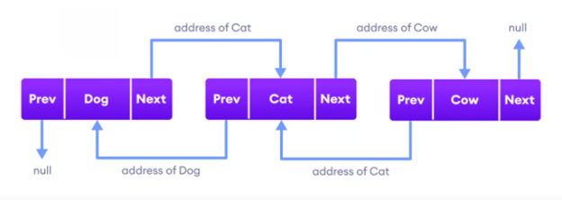
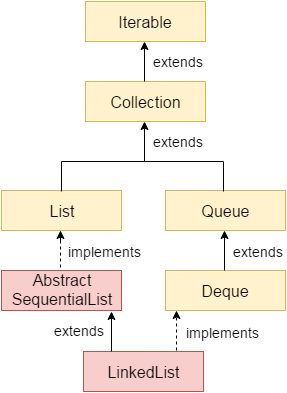

## Java

#### Q1. Given the string "strawberries" saved in a variable called fruit, what would `fruit.substring(2, 5)` return?

- [ ] rawb
- [x] raw
- [ ] awb
- [ ] traw

#### Explanation

The Java String class `substring()` method returns a part of the string.

We pass `beginIndex` and `endIndex` number positions in the Java substring method where beginIndex is inclusive, and
endIndex is exclusive. In other words, the beginIndex starts from 0, whereas the endIndex starts from 1.

Signature:

```java
public String substring(int startIndex)  // type - 1  
public String substring(int startIndex,int endIndex)  // type - 2
```

Parameters:

- startIndex – starting index is inclusive;
- endIndex – ending index is exclusive.
-

Example:

```java
public class SubstringExample {
    public static void main(String[] args) {
        String s1 = "javatpoint";
        System.out.println(s1.substring(2, 4));//returns 'va' 
        System.out.println(s1.substring(2));//returns 'vatpoint'
    }
} 
```

#### Q2. How can you achieve runtime polymorphism in Java?

- [ ] method overloading
- [ ] method overrunning
- [x] method overriding
- [ ] method calling

#### Explanation

Polymorphism in Java is a concept by which we can perform a single action in different ways.

There are two types of polymorphism in Java:

- compile-time polymorphism;
- runtime polymorphism.
-

We can perform polymorphism in Java by:

- method overloading;
- method overriding.

If you overload a static method in Java, it is an example of compile time polymorphism.

Runtime polymorphism in Java is also known as Dynamic Binding or Dynamic Method Dispatch. In this process, the call to
an overridden method is resolved dynamically at runtime rather than at compile-time.

An overridden method is called through the reference variable of a superclass. The determination of the method to be
called is based on the Object being referred to by the reference variable.

Runtime polymorphism is achieved through Method Overriding.

#### Q3. Given the following definitions, which of these expressions will **NOT** evaluate to true?

```java
boolean b1=true,b2=false;
        int i1=1,i2=2;
```

- [ ] `(i1 | i2) == 3`
- [x] `i2 && b1`
- [ ] `b1 || !b2`
- [ ] `(i1 ^ i2) < 4`

#### Explanation

| Operator | Name                   | Description                                                                                                                      | Example                                  |
|----------|------------------------|----------------------------------------------------------------------------------------------------------------------------------|------------------------------------------|
| ❘        | Binary “Or”            | Returns true if at least one of the operands evaluates to true. Both operands are evaluated before the “Or” operator is applied. | int i1 = 1; int i2 = 2; 01 ❘ 10 = 11 (3) |
| &&       | Logical “And”          | Returns true if both statements are true                                                                                         | x < 5 && x < 10                          |
| ❘❘       | Logical “Or”           | Returns true if one of the statements is true                                                                                    | x < 5 ❘❘ x < 4                           |
| ^        | Logical “Exclusive Or” | Returns true if and only if the operands are different.                                                                          | int i1 = 1; int i2 = 2; 01 ^ 10 = 11 (3  |

Example:

```java
public static void main(String[]args){
        boolean b1=true;
        boolean b2=false;
        int i1=1;
        int i2=2;

        boolean res=i2&&b1;
        }

        Compile-time Error:
        Operator'&&'cannot be applied to'int','boolean' 
```

#### Q4. What is the output of this code?

```java
1:

class Main {
2:

    public static void main(String[] args) {
        3:int[] array = {1, 2, 3, 4};
        4:for (int i = 0; i < array.size(); i++) {
            5:System.out.print(array[i]);
            6:}
        7:}
8:
}
```

- [x] It will not compile because of line 4.
- [ ] It will not compile because of line 3.
- [ ] 123
- [ ] 1234

#### Explanation

```
Compile-time error:
Cannot resolve method 'size()'
```

In Java, the array length is the number of elements that an array can hold. There is no predefined method to obtain the
length of an array. We can find the array length in Java by using the array attribute `length`. We use this attribute
with the array name.

With the help of the `length` variable, we can obtain the size of the array.

```java
public class Test {
    public static void main(String[] args) {
        int[] array = new int[4];
        System.out.println("The size of the array is "
                + array.length);

        String str = "LinkedIn Java Assessment";
        System.out.println("The size of the String is "
                + str.length());
    }
}
```

#### Q5. Which of the following can replace the CODE SNIPPET to make the code below print "Hello World"?

```java
interface Interface1 {
    static void print() {
        System.out.print("Hello");
    }
}

interface Interface2 {
    static void print() {
        System.out.print("World!");
    }
}
```

- [ ] `super1.print(); super2.print();`
- [ ] `this.print();`
- [ ] `super.print();`
- [x] `Interface1.print(); Interface2.print();`

#### Explanation

An interface is an abstract type that is used to specify a behavior that classes must implement.

An interface contains abstract methods except default and static methods.

For creating a default method in the Java interface, we need to use the `default` keyword with the method signature.

#### Q6. What does the following code print?

```java
public class Test {
    public static void main(String[] args) {
        String str = "abcde";
        str.trim();
        str.toUpperCase();
        str.substring(3, 4);
        System.out.println(str);
    }
}

```

- [ ] CD
- [ ] CDE
- [ ] D
- [x] "abcde"

#### Explanation

The value of `str` doesn't change since a variable is never assigned a new value during program execution.

Methods from the question:

The `trim()` method eliminates leading and trailing spaces. The Unicode value of space character is `\u0020`. This
method in Java string checks this Unicode value before and after the string, if it exists then the method removes the
spaces and returns the omitted string.

The `substring()` method returns a part of the string. We pass `beginIndex` and `endIndex` number positions in the Java
substring method where beginIndex is inclusive, and endIndex is exclusive. In other words, the beginIndex starts from 0,
whereas the endIndex starts from 1.

The `toUpperCase()` method returns the string in uppercase letter. In other words, it converts all characters of the
string into upper case letter.

#### Q7. What is the result of this code?

```java
class Main {
    public static void main(String[] args) {
        System.out.println(print(1));
    }

    static Exception print(int i) {
        if (i > 0) {
            return new Exception();
        } else {
            throw new RuntimeException();
        }
    }
}
```

- [ ] It will show a stack trace with a runtime exception.
- [x] "java.lang.Exception"
- [ ] It will run and throw an exception.
- [ ] It will not compile.

#### Explanation

An exception is an abnormal event that arises during the execution of the program and disrupts the normal flow of the
program.


The class `Exception` and its subclasses are a form of Throwable that indicates conditions that a reasonable application
might want to catch.

The class `Exception` and any subclasses that are not also subclasses of RuntimeException are checked exceptions.
Checked exceptions need to be declared in a method or constructor's throws clause if they can be thrown by the execution
of the method or constructor and propagate outside the method or constructor boundary.

The class `RuntimeException` is the superclass of those exceptions that can be thrown during the normal operation of the
Java Virtual Machine.

The class `RuntimeException` and its subclasses are unchecked exceptions. Unchecked exceptions do not need to be
declared in a method or constructor's throws clause if they can be thrown by the execution of the method or constructor
and propagate outside the method or constructor boundary.

#### Q8. Which class can compile given these declarations?

```java
interface One {
    default void method() {
        System.out.println("One");
    }
}

interface Two {
    default void method() {
        System.out.println("One");
    }
}
```

- [ ] A

```java
class Three implements One, Two {
    public void method() {
        super.One.method();
    }
}
```

- [ ] B

```java
class Three implements One, Two {
    public void method() {
        One.method();
    }
}
```

- [ ] C

```java
class Three implements One, Two {
}
```

- [x] D

```java
class Three implements One, Two {
    public void method() {
        One.super.method();
    }
}
```

#### Explanation

If you use `super` in a class it usually refers to the ancestor of that class.

In the case of override default method of an interface you have to specify the specific interface which default
implementation you want to invoke.

Syntax:

```java
<Interface>.super.<method>();
```

#### Q9. What is the output of this code?

```java
class Main {
    public static void main(String[] args) {
        List list = new ArrayList();
        list.add("hello");
        list.add(2);
        System.out.print(list.get(0) instanceof Object);
        System.out.print(list.get(1) instanceof Integer);
    }
}
```

- [ ] The code does not compile.
- [ ] truefalse
- [x] truetrue
- [ ] falsetrue

#### Explanation

The `instanceof` is a binary operator used to test if an object is of a given type. The result of the operation is
either `true` or `false`.

Class `Object` is the root of the class hierarchy. Every class has an Object as a superclass.

All objects, including arrays, implement the methods of this class.

#### Q10. Given the following two classes, what will be the output of the Main class?

```java
package mypackage;

public class Math {
    public static int abs(int num) {
        return num < 0 ? -num : num;
    }
}
```

```java
package mypackage.elementary;

public class Math {
    public static int abs(int num) {
        return -num;
    }
}
```

```java
import mypackage.Math;
import mypackage.elementary.*;

class Main {
    public static void main(String[] args) {
        System.out.println(Math.abs(123));
    }
}
```

- [ ] Lines 1 and 2 generate compiler errors due to class name conflicts.
- [ ] "-123"
- [ ] It will throw an exception on line 5.
- [x] "123"

#### Explanation

The answer is "123". The `abs()` method evaluates to the one inside `mypackage`.Math class.

#### Q11. What is the result of this code?

```java
class MainClass {
    final String message() {
        return "Hello!";
    }
}

class Main extends MainClass {
    public static void main(String[] args) {
        System.out.println(message());
    }

    String message() {
        return "World!";
    }
}
```

- [x] It will not compile because of line 10.
- [ ] "Hello!"
- [ ] It will not compile because of line 2.
- [ ] "World!"

#### Explanation

Java `final` keyword is a non-access specifier that is used to restrict a class, variable, and method.

If we declare a method as `final`, then it can’t be overridden by any subclasses. And, if we declare a class as `final`,
we restrict the other classes to inherit or extend it.

#### Q12. Given this code, which command will output "2"?

```java
class Main {
    public static void main(String[] args) {
        System.out.println(args[2]);
    }
}
```

- [ ] `java Main 1 2 "3 4" 5`
- [x] `java Main 1 "2" "2" 5`
- [ ] `java Main.class 1 "2" 2 5`
- [ ] `java Main 1 "2" "3 4" 5`

#### Explanation

A Java application can accept any number of arguments from the command line. This allows the user to specify
configuration information when the application is launched.

The user enters command-line arguments when invoking the application and specifies them after the name of the class to
be run.

For example, suppose a Java application called Sort sorts lines in a file. To sort the data in a file
named `friends.txt`, a user would enter:

```
java Sort friends.txt
```

When an application is launched, the runtime system passes the command-line arguments to the application's main method
via an array of Strings.

In the previous example, the command-line arguments passed to the Sort application in an array that contains a single
String: "friends.txt".

**Link**:
[Command-Line Arguments](https://docs.google.com/document/d/1esnVFZLjSsrBb6tK4BCaWsJqjwXQ8gTxboTXTZw9yzg/edit#heading=h.tj8iikd1nrrx)

#### Q13. What is the output of this code?

```java
class Main {
    public static void main(String[] args) {
        int a = 123451234512345;
        System.out.println(a);
    }
}
```

- [ ] "123451234512345"
- [x] Nothing - this will not compile.
- [ ] a negative integer value
- [ ] "12345100000"

#### Explanation

The `int` type in Java can be used to represent any whole number from -2.147.483.648 to 2.147.483.647.

Therefore, this code will not compile as the number assigned to `a` is larger than the `int` type can hold.

#### Q14. What is the output of this code?

```java
class Main {
    public static void main(String[] args) {
        String message = "Hello world!";
        String newMessage = message.substring(6, 12)
                + message.substring(12, 6);
        System.out.println(newMessage);
    }
}
```

- [ ] The code does not compile.
- [x] A runtime exception is thrown.
- [ ] "world!!world"
- [ ] "world!world!"

#### Explanation

```java
public String substring(int startIndex):
```

The `substring(int startIndex)` method returns a new String object containing the substring of the given string from
specified startIndex.

The method throws an `IndexOutOfBoundException` when the `startIndex` is larger than the length of String or less than
zero.

**Note**: Index starts from `0`.

The public class `IndexOutOfBoundsException` extends RuntimeException. Thrown to indicate that an index of some sort (
such as to an array, to a string, or to a vector) is out of range.


#### Q15. How do you write a foreach loop that will iterate over ArrayList\<Pencil\>pencilCase?

- [x] `for (Pencil pencil : pencilCase) {}`
- [ ] `for (pencilCase.next()) {}`
- [ ] `for (Pencil pencil : pencilCase.iterator()) {}`
- [ ] `for (pencil in pencilCase) {}`

#### Explanation

For-each is another array traversing technique like for loop, while loop and do-while loop.

Syntax:

```
class Main {
    public static void main(String[] args) {
        for (type var : array) {
            // statements using var;
        }
    }
}
```

Example:

```java
class TestClass {

    public static void main(String[] arg) {
        {
            int[] marks = {125, 132, 95, 116, 110};

            int highest_marks = maximum(marks);
            System.out.println("The highest score is " + highest_marks);
        }
    }

    public static int maximum(int[] numbers) {
        int maxSoFar = numbers[0];

        for (int num : numbers) {
            if (num > maxSoFar) {
                maxSoFar = num;
            }
        }
        return maxSoFar;
    }
}
Output:The highest score is 132
```

#### Q16. What does this code print?

```java
System.out.print("apple".compareTo("banana"));
```

- [ ] `0`
- [ ] positive number
- [x] negative number
- [ ] compilation error

#### Explanation

The Java String class `compareTo()` method compares the given string with the current string lexicographically.

The `compareTo()` method returns a positive number, negative number, or 0

- If the first string is lexicographically greater than the second string, it returns a positive number (difference of
  character value);
- If the first string is less than the second string lexicographically, it returns a negative number;
- If the first string is lexicographically equal to the second string, it returns 0.

```java
public class CompareToExample {
    public static void main(String[] args) {
        String s1 = "hello";
        String s2 = "hello";
        String s3 = "meklo";
        String s4 = "hemlo";
        String s5 = "flag";
        System.out.println(s1.compareTo(s2)); //0 because both are equal  
        System.out.println(s1.compareTo(s3)); //-5 because "h" is 5 times lower than "m"  
        System.out.println(s1.compareTo(s4)); //-1 because "l" is 1 times lower than "m"  
        System.out.println(s1.compareTo(s5)); //2 because "h" is 2 times greater than "f"  
    }
}
```

Alphabet:

```
ABCDEFGHIJKLMNOPQRSTUVWXYZ
```

#### Q17. You have an ArrayList of names that you want to sort alphabetically. Which approach would **NOT** work?

- [ ] `names.sort(Comparator.comparing(String::toString))`
- [ ] `Collections.sort(names)`
- [x] `names.sort(List.DESCENDING)`
- [ ] `names.stream().sorted((s1, s2) -> s1.compareTo(s2)).collect(Collectors.toList())`

#### Explanation

Let's take a quick look at the sorting methods offered in each answer.

Pojo class to compare methods:

```java
public class Player {
    private int ranking;
    private String name;
    private int age;
// constructor, getters, setters  
}
```

**1. `names.sort(Comparator.comparing(String::toString))`**

The `Comparator` interface defines a `compare(arg1, arg2)` method with two arguments that represent compared objects and
works similarly to the `Comparable.compareTo()` method.

The `Comparator.comparing` method returns a `Comparator` object that will use the specified field as the sort key.

We'll create a `Comparator` to use the ranking attribute of Player to sort the players:

```java
public class PlayerRankingComparator implements Comparator<Player> {

    @Override
    public int compare(Player firstPlayer, Player secondPlayer) {
        return Integer.compare(firstPlayer.getRanking(), secondPlayer.getRanking());
    }
}
```

The `Comparator.comparing` method takes a method calculating the property that will be used for comparing items, and
returns a matching Comparator instance:

```java
Comparator<Player> byRanking=Comparator.comparing(Player::getRanking);
```

**2. `Collections.sort(names)`**

The `java.util.Collections.sort()` method is used to sort the elements present in the specified list of Collection in
ascending order. It works similar to the `java.util.Arrays.sort()` method, but it is better than as it can sort the
elements of Array as well as linked list, queue and many more present in it.

Java program to demonstrate working of `Collections.sort()`

```java
public class CollectionSorting {
    public static void main(String[] args) {
        ArrayList<String> list = new ArrayList<String>();
        list.add("Geeks For Geeks");
        list.add("Friends");
        list.add("Dear");

        /* Collections.sort method is sorting the
        elements of ArrayList in ascending order. */
        Collections.sort(list);

        System.out.println("List after the use of" +
                " Collection.sort() :\n" + al);
    }
}
```

`names.sort(List.DESCENDING)`**

The `sort()` method accepts an instance of Comparator implementing class which must be able to compare the elements
contained in the arraylist. Internally, the `sort()` method uses `Arrays.sort()` method to compare and sort the elements
in the list.

```java
public void sort(Comparator<? super E>c){

final int expectedModCount=modCount;

        Arrays.sort((E[])elementData,0,size,c);

        if(modCount!=expectedModCount)
        throw new ConcurrentModificationException();
        modCount++;

        }
```

**4. `names.stream().sorted((s1,s2)->s1.compareTo(s2)).collect(Collectors.toList())`

The Stream `sorted()` returns a stream consisting of the elements of this stream, sorted according to natural order.

```java
class GFG {

    public static void main(String[] args) {
        List<Integer> list = Arrays.asList(-9, -18, 0, 25, 4);
        System.out.println("The sorted stream is : ");
        list.stream().sorted().forEach(System.out::println);
    }
}
```

The `compareTo(T o)` method compares this object with the specified object for order.

```java
public class Player implements Comparable<Player> {

    // same as before

    @Override
    public int compareTo(Player otherPlayer) {
        return Integer.compare(getRanking(), otherPlayer.getRanking());
    }
}
```

The sorting order is decided by the return value of the `compareTo()` method. The `Integer.compare(x, y)` returns

- -1 if x is less than y;
- 0 if they're equal;
- 1 otherwise.

The method returns a number indicating whether the object being compared is less than, equal to, or greater than the
object being passed as an argument.

#### Q18. By implementing encapsulation, you cannot directly access the class's \_ properties unless you are writing code inside the class itself.

- [x] private
- [ ] protected
- [ ] no-modifier
- [ ] public

#### Explanation

The `private` keyword is an access modifier used for attributes, methods and constructors, making them only accessible
within the declared class.

#### Q19. Which is the most up-to-date way to instantiate the current date?

- [ ] `new SimpleDateFormat("yyyy-MM-dd").format(new Date())`
- [ ] `new Date(System.currentTimeMillis())`
- [x] `LocalDate.now()`
- [ ] `Calendar.getInstance().getTime()`

#### Explanation

LocalDate is the newest class added in java 8.

The `now()` method of a `LocalDate` class is used to obtain the current date from the system clock in the default
time-zone:

- **Parameters**: This method accepts no parameter;
- **Return value**: This method returns the current date using the system clock and default time-zone.

#### Q20. Fill in the blank to create a piece of code that will tell whether `int0` is divisible by `5`:

`boolean isDivisibleBy5 = _____`

- [ ] `int0 / 5 ? true: false`
- [x] `int0 % 5 == 0`
- [ ] `int0 % 5 != 5`
- [ ] `Math.isDivisible(int0, 5)`

#### Q21. How many times will this code print "Hello World!"?

```
class Main {
    public static void main(String[] args) {
        for (int i = 0; i < 10; i = i++) {
            i += 1;
            System.out.println("Hello World!");
        }
    }
}
```

- [x] 10 times
- [ ] 9 times
- [ ] 5 times
- [ ] infinite number of times

#### Explanation

Observe the loop increment. It's not an increment, it's an assignment.

Standard syntax:

```java
for(int i=0;i< 5;i++){
        System.out.println(i);
        }
```

Our case:

```java
for(int i=0;i< 10;i=i++){
        i+=1;
        System.out.println("Hello World!");
        }
```

Note the difference between `i++` and `i=i++`.

#### Q22. The runtime system starts your program by calling which function first?

- [ ] print
- [ ] iterative
- [ ] hello
- [x] main

#### Explanation

A Java application must contain a `main()` method whose signature looks like this

```java
public static void main(String args[])
```

The method signature for the `main()` method contains three modifiers:

1. `public` indicates that the `main()` method can be called by any object.
2. `static` indicates that the `main()` method is a class method.
3. `void` indicates that the `main()` method has no return value.

The runtime system starts your program by calling its `main()` function first.

#### Q23. What code would you use in Constructor A to call Constructor B?

```java
public class Jedi {
    /* Constructor A */
    Jedi(String name, String species) {
    }

    /* Constructor B */
    Jedi(String name, String species, boolean followsTheDarkSide) {
    }
}
```

- [ ] Jedi(name, species, false)
- [ ] new Jedi(name, species, false)
- [x] this(name, species, false)
- [ ] super(name, species, false)

**Note:** This code won't compile, possibly broken code sample.

#### Explanation

In Java, a constructor is a block of codes similar to the method. It is called when an instance of the class is created.
At the time of calling constructor, memory for the object is allocated in the memory.

Constructor is a special type of method which is used to initialize the object.

```java
public class Foo {
    private int x;

    public Foo() {
        this(1);
    }

    public Foo(int x) {
        this.x = x;
    }
}
```

To chain to a particular superclass constructor instead of one and the same class, use `super` instead of `this`
keyword. Note that you can only chain to one constructor, and it has to be the first statement in your constructor body.

#### Q24. Which statement is **NOT** true?

- [ ] An anonymous class may specify an abstract base class as its base type.
- [x] An anonymous class does not require a zero-argument constructor.
- [ ] An anonymous class may specify an interface as its base type.
- [ ] An anonymous class may specify both an abstract class and interface as base types.

#### Explanation

An Anonymous class is an inner class without a name and for which only a single object is created.

1. There might exist exactly one instance of an anonymous class;
2. Therefore, they can never be abstract;
3. Since they have no name, we can't extend them;
4. Since they have no name, anonymous classes can’t have explicitly declared constructors.

An anonymous inner class can be useful when making an instance of an object with certain “extras” such as overloading
methods of a class or interface, without having to actually subclass a class.

Implementation without using an anonymous class:

```java
class AnonymousDemo {
    public static void main(String[] args) {
        MyClass obj = new MyClass();
        // calling getAge() method implemented at MyClass
        obj.getAge();
    }

}
```

```java
class MyClass implements Age {

    @Override
    public void getAge() {
        System.out.print("Age is " + x);
    }
}
```

```java
interface Age {
    int x = 21;

    void getAge();
}
```

In the program, interface Age is created with `getAge()` method and `x=21`.

`MyClass` is written as an implementation class of `Age` interface. As done in the Program, there is no need to write a
separate class `MyClass`. Instead, directly copy the code of `MyClass` into this parameter, as shown here:

```java
interface Age {
    int x = 21;

    void getAge();
}
```

```java
class AnonymousDemo {

    public static void main(String[] args) {
        // MyClass is hidden inner class of Age interface
        // whose name is not written but an object to it is created. 
        Age oj1 = new Age() {

            @Override
            public void getAge() {
                System.out.print("Age is " + x);
            }
        };
        oj1.getAge();
    }
}
```

#### Q25. What will this program print out to the console when executed?

```java
public class Main {
    public static void main(String[] args) {
        LinkedList<Integer> list = new LinkedList<>();
        list.add(5);
        list.add(1);
        list.add(10);
        System.out.println(list);
    }
}
```

- [x] [5, 1, 10]
- [ ] [10, 5, 1]
- [ ] [1, 5, 10]
- [ ] [10, 1, 5]

#### Explanation

Java LinkedList class uses a doubly linked list to store the elements. It provides a linked-list data structure.

LinkedList example:



It inherits the AbstractList class and implements List and Deque interfaces.



The important points about Java LinkedList are:

1. Java LinkedList class can contain duplicate elements.
2. Java LinkedList class maintains insertion order.
3. Java LinkedList class is non synchronized.
4. In Java LinkedList class, manipulation is fast because no shifting needs to occur.
5. Java LinkedList class can be used as a list, stack or queue.

Example:

```java
import java.util.*;

public class Test {

    public static void main(String[] args) {

        LinkedList<String> list = new LinkedList<String>();

        list.add("A");
        list.add("B");
        list.addLast("C");
        list.addFirst("D");
        list.add(2, "E");

        System.out.println(list);

        list.remove("B");
        list.remove(3);
        list.removeFirst();
        list.removeLast();

        System.out.println(list);
    }
}

Output:
        [D,A,E,B,C]
        [A]
```

#### Q26. What is the output of this code?

```java
class Main {
    public static void main(String[] args) {
        String message = "Hello";
        for (int i = 0; i < message.length(); i++) {
            System.out.print(message.charAt(i + 1));
        }
    }
}
```

- [ ] "Hello"
- [x] A runtime exception is thrown.
- [ ] The code does not compile.
- [ ] "ello"

#### Explanation

```
Output:
ello
Exception in thread "main" java.lang.StringIndexOutOfBoundsException: String index out of range: 5
at java.lang.String.charAt(String.java:658)
at Main.main(Main.java:5)
```

The `StringIndexOutOfBoundsException` exception thrown by String methods to indicate that an index is either negative or
greater than the size of the string.

For some methods such as the `String.charAt(int)` method, this exception also is thrown when the index is equal to the
size of the string.

`StringIndexOutOfBoundsException` class hierarchy

```
Class StringIndexOutOfBoundsException
java.lang.Object
java.lang.Throwable
java.lang.Exception
java.lang.RuntimeException
java.lang.IndexOutOfBoundsException
java.lang.StringIndexOutOfBoundsException
```

#### Q27. Object-oriented programming is a style of programming where you organize your program around \_ rather than \_ and data rather than logic.

- [ ] functions; actions
- [x] objects; actions
- [ ] actions; functions
- [ ] actions; objects

#### Explanation

In Object-Oriented Programming, a program is divided into small parts called objects.

Object-oriented programming is based on the concept of objects. In object-oriented programming data structures, or
objects are defined, each with its own properties or attributes. Each object can also contain its own procedures or
methods. Software is designed by using objects that interact with one another.

#### Q28. What statement returns true if "nifty" is of type String?

- [ ] `"nifty".getType().equals("String")`
- [ ] `"nifty".getType() == String`
- [ ] `"nifty".getClass().getSimpleName() == "String"`
- [x] `"nifty" instanceof String`

#### Q29. What is the output of this code?

```java
import java.util.*;

class Main {
    public static void main(String[] args) {
        List<Boolean> list = new ArrayList<>();
        list.add(true);
        list.add(Boolean.parseBoolean("FalSe"));
        list.add(Boolean.TRUE);
        System.out.print(list.size());
        System.out.print(list.get(1) instanceof Boolean);
    }
}
```

- [ ] A runtime exception is thrown.
- [ ] 3false
- [ ] 2true
- [x] 3true

#### Explanation

```java
System.out.println(list);

        Output:
        [true,false,true]
```

The `size()` method of List interface in Java is used to get the number of elements in this list. That is, this method
returns the count of elements present in this list container.

The `get(int i)` method of List interface in Java is used to get the element present in this list at a given specific
index.

The `instanceof` is a binary operator used to test if an object is of a given type. The result of the operation is
either true or false.

#### Q30. What is the result of this code?

```
1: class Main {
2: 	Object message(){
3: 		return "Hello!";
4: 	}
5: 	public static void main(String[] args) {
6: 		System.out.print(new Main().message());
7: 		System.out.print(new Main2().message());
8: 	}
9: }
10: class Main2 extends Main {
11: 	String message(){
12: 		return "World!";
13: 	}
14: }
```

- [ ] It will not compile because of line 7.
- [ ] Hello!Hello!
- [x] Hello!World!
- [ ] It will not compile because of line 11.

#### Explanation

The `extends` keyword is used to indicate that the class which is being defined is derived from the base class using
inheritance. So basically, `extends` keyword is used to extend the functionality of the parent class to the subclass.

The `Default` access modifier is package-private, and it is visible only from the same package.

Therefore, we can create objects of this class in any other class of the package (so no exception).

#### Q31. What method can be used to create a new instance of an object?

- [ ] another instance
- [ ] field
- [x] constructor
- [ ] private method

#### Explanation

A Constructor is similar to a method that is invoked when an object of the class is created. Unlike Java methods, a
constructor has the same name as that of the class and does not have any return type.

#### Q32. Which is the most reliable expression for testing whether the values of two string variables are the same?

- [ ] string1 == string2
- [ ] string1 = string2
- [ ] string1.matches(string2)
- [x] string1.equals(string2)

#### Explanation

The Java String class `equals() `method compares the two given strings based on the content of the string:

- If any character is not matched, it returns false;
- If all characters are matched, it returns true.

The String `equals()` method overrides the `equals()` method of the Object class.

#### Q33. Which letters will print when this code is run?

```java
public static void main(String[]args){
        try{
        System.out.println("A");
        badMethod();
        System.out.println("B");
        }catch(Exception ex){
        System.out.println("C");
        }finally{
        System.out.println("D");
        }
        }

public static void badMethod(){
        throw new Error();
        }
```

- [ ] A, B, and D
- [ ] A, C, and D
- [ ] C and D
- [x] A and D

#### Explanation

The letter "B" will not be printed because the program will terminate with an Error.

The letter "C" will not be printed because the program will throw an Error (not an Exception).

**Note**: `Error` is not inherited from `Exception`


#### Q34. What is the output of this code?

```java
class Main {
    static int count = 0;

    public static void main(String[] args) {
        if (count < 3) {
            count++;
            main(null);
        } else {
            return;
        }
        System.out.println("Hello World!");
    }
}
```

- [ ] It will throw a runtime exception.
- [ ] It will not compile.
- [x] It will print "Hello World!" three times.
- [ ] It will run forever.

#### Q35. What is the output of this code?

```java
import java.util.*;

class Main {
    public static void main(String[] args) {
        String[] array = {"abc", "2", "10", "0"};
        List<String> list = Arrays.asList(array);
        Collections.sort(list);
        System.out.println(Arrays.toString(array));
    }
}
```

- [ ] `[abc, 0, 2, 10]`
- [ ] The code does not compile.
- [ ] `[abc, 2, 10, 0]`
- [x] `[0, 10, 2, abc]`

#### Explanation

The `asList()` method of `java.util.Arrays` class is used to return a fixed-size list backed by the specified array.

This method acts as a bridge between array-based and collection-based APIs, in combination with `Collection.toArray()`.

The `asList()` method returns a fixed-size list backed by the specified array. Since an array cannot be structurally
modified, it is impossible to add elements to the list or remove elements from it. The list will throw
an `UnsupportedOperationException` if any resize operation is performed on it.

```java
public class UnsupportedOperationException
        extends RuntimeException
```

Example:

```java
class Main {
    public static void main(String[] args) {
        String[] array = {"abc", "2", "10", "0"};
        List<String> list = Arrays.asList(array);
        list.add("22");
    }
}

Output:
        Exception in thread"main"java.lang.UnsupportedOperationException at java.base/java.util.AbstractList.add(
        AbstractList.java:153)
```

#### Q36. What is the output of this code?

```
class Main {
	public static void main(String[] args) {
		String message = "Hello";
		print(message);
		message += "World!";
		print(message);
	}
	static void print(String message){
		System.out.print(message);
		message += " ";
	}
}
```

- [ ] Hello World!
- [x] HelloHelloWorld!
- [ ] Hello Hello World!
- [ ] Hello HelloWorld!

#### Q37. What is displayed when this code is compiled and executed?

```
public class Main {
	public static void main(String[] args) {
		int x = 5;
		x = 10;
		System.out.println(x);
	}
}
```

- [ ] x
- [ ] null
- [x] 10
- [ ] 5

#### Q38. Which approach cannot be used to iterate over a List named _theList_?

- [ ] A

```java
for(int i=0;i<theList.size();i++){
        System.out.println(theList.get(i));
        }
```

- [ ] B

```java
for(Object object:theList){
        System.out.println(object);
        }
```

- [x] C

```java
Iterator it=theList.iterator();
        for(it.hasNext()){
        System.out.println(it.next());
        }
```

- [ ] D

```java
theList.forEach(System.out::println);
```

#### Explanation

Consider each answer:

```java
for(int i=0;i<theList.size();i++){
        System.out.println(theList.get(i));
        }
```

The `size()` method of `List` interface in Java is used to get the number of elements in this list.

```java
for(Object object:theList){
        System.out.println(object);
        }
```

Class `Object` is the root of the class hierarchy and every class has an Object as a superclass. All objects, including
arrays, implement the methods of this class.

```java
Iterator it=theList.iterator();

        for(it.hasNext()){
        System.out.println(it.next());
        }

        Warning:cant resolve symbol hasNext.
```

**Explanation**: `for (it.hasNext())` should be `while (it.hasNext())`.

The `Iterator` is an interface which belongs to the collection framework. It allows us to traverse the collection,
access the data element and remove the data elements of the collection.

The `java.util` package has public interface `Iterator` and contains three methods:

| Method name        | Description of the method                                                                                                                                       |
|--------------------|-----------------------------------------------------------------------------------------------------------------------------------------------------------------|
| boolean hasNext(): | It returns true if the Iterator has more elements to iterate.                                                                                                   |
| Object next()      | It returns the next element in the collection until the hasNext() method returns true. This method throws ‘NoSuchElementException’ if there is no next element. |
| void remove()      | It removes the current element in the collection. This method throws ‘IllegalStateException’ if this function is called before next( ) is invoked.              |

```java
ArrayList<String> people=new ArrayList<String>();
        people.add("Tom");
        people.add("Alice");
        people.add("Kate");
        people.forEach(System.out::println);
```

The `forEach()` method of ArrayList is used to perform a certain operation for each element in ArrayList. This method
traverses each element of the `Iterable` of ArrayList until all elements have been Processed by the method or an
exception is raised.

#### Q39. What method signature will work with this code?

`boolean healthyOrNot = isHealthy("avocado");`

- [ ] public void isHealthy(String avocado)
- [x] boolean isHealthy(String string)
- [ ] public isHealthy("avocado")
- [ ] private String isHealthy(String food)

#### Q40. Which are valid keywords in a Java module descriptor (module-info.java)?

- [ ] provides, employs
- [ ] imports, exports
- [ ] consumes, supplies
- [x] requires, exports

#### Explanation

A Java Module is a packaging mechanism that enables you to package a Java application or Java API as a separate Java
module.

A Java module is packaged as a modular JAR file. A Java module can specify which of the Java packages it contains that
should be visible to other Java modules which use this module.

A Module descriptor is the compiled version of a module declaration that's defined in a file named module-info.java

```java
module moduleName {
  ...
}
```

The module declaration’s body can be empty or may contain various module directives, including

- requires;
- exports;
- provides… with;
- uses and opens (each of which we discuss).

A `requires` module directive specifies that this module depends on another module — this relationship is called a
module dependency. Each module must explicitly state its dependencies.

When `module A` requires `module B`, module A is said to read module B and module B is read by module A. To specify a
dependency on another module, use requires, as in:

```java
requires moduleName;
```

An `exports` module directive specifies one of the module’s packages whose public types (and their nested public and
protected types) should be accessible to code in all other modules.

An `exports… to` directive enables you to specify in a comma-separated list precisely which module’s or modules’ code
can access the exported package — this is known as a qualified export.

#### Q41. Which type of variable keeps a constant value once it is assigned?

- [ ] non-static
- [ ] static
- [x] final
- [ ] private

#### Explanation

Java `final` keyword is a non-access specifier that is used to restrict a class, variable, and method.

- If we initialize a variable with the `final` keyword, then we can’t modify its value;
- If we declare a method as `final`, then it can’t be overridden by any subclasses.

#### Q42. How does the keyword `volatile` affect how a variable is handled?

- [ ] It will be read by only one thread at a time.
- [ ] It will be stored on the hard drive.
- [x] It will never be cached by the CPU.
- [ ] It will be preferentially garbage collected.

#### Explanation

The Java `volatile` keyword is used to mark a Java variable as "being stored in main memory".

More precisely that means, that:

1. Every read of a volatile variable will be read from the computer's main memory, and not from the CPU cache;
2. Every write to a volatile variable will be written to main memory, and not just to the CPU cache.

#### Q43. What is the result of this code?

```java
char smooch='x';
        System.out.println((int)smooch);
```

- [ ] an alphanumeric character
- [ ] a negative number
- [x] a positive number
- [ ] a ClassCastException

#### Explanation

We can convert `char` to `int` in Java using various ways. If we directly assign a char variable to int, it will return
the ASCII value of the given character.

Let's see the simple code to convert char to int in java.

```
public class CharToIntExample1 {
  public static void main(String[] args) {
    char c = 'a';
    char c2 = '1';
    int a = c;
    int b = c2;
    System.out.println(a);
    System.out.println(b);
  }
}

Output:
        97
        49
```

#### Q44. You get a NullPointerException. What is the most likely cause?

- [ ] A file that needs to be opened cannot be found.
- [ ] A network connection has been lost in the middle of communications.
- [ ] Your code has used up all available memory.
- [x] The object you are using has not been instantiated.

#### Explanation

`NullPointerException` is raised in an application when we are trying to do some operation on null where an object is
required.

Some common reasons for `NullPointerException` in java programs are:

1. Invoking a method on an object instance but at runtime the object is null;
2. Accessing variables of an object instance that is null at runtime;
3. Throwing null in the program;
4. Accessing index or modifying value of an index of an array that is null;
5. Checking the length of an array that is null at runtime.


#### Q45. How would you fix this code so that it compiles?

```java
public class Nosey {
    int age;

    public static void main(String[] args) {
        System.out.println("Your age is: " + age);
    }
}
```

- [x] Make age static.
- [ ] Make age global.
- [ ] Make age public.
- [ ] Initialize age to a number.

#### Explanation

The error `non static variable can’t be referenced from a static context` in Java is mostly faced by the beginners at
the time of compilation of Java programs.

The reason for this error is that they use a non-static member variable in the `main()` method. Because the `main()`
method in Java is a static method, and it is invoked automatically, we need not create an object to invoke it.

To understand the error, first we should understand the static and non-static method in Java:

1. Each instance of a non-static variable has a different value and is created when the `new()` operator initializes an
   instance of an object;
2. The static variables are created or initialized when the class loads into JVM.

We need an instance of an object for calling the non-static variable. We can create many objects by giving different
values to that non-static or instance variable.

#### Q46. Add a Duck called "Waddles" to the ArrayList **ducks**.

```java
public class Duck {
    private String name;

    Duck(String name) {
    }
}
```

- [ ] `Duck waddles = new Duck();`
  `ducks.add(waddles);`
- [ ] `Duck duck = new Duck("Waddles");`
  `ducks.add(waddles);`
- [x] `ducks.add(new Duck("Waddles"));`
- [ ] `ducks.add(new Waddles());`

#### Q47. If you encounter `UnsupportedClassVersionError` it means the code was `___` on a newer version of Java than the JRE `___` it.

- [ ] executed; interpreting
- [ ] executed; compiling
- [x] compiled; executing
- [ ] compiled, translating

#### Explanation

The `UnsupportedClassVersionError` is a subclass of the `LinkageError` class and specifically, of the `ClassFormatError`
class. This error is thrown by the JVM when it tries to read a class file whose major and minor version numbers are not
supported.

The JRE is a software layer that runs on top of a computer’s operating system software and provides the class libraries
and other resources that a specific Java program needs to run.

Difference between JDK,JRE and JVM:


#### Q48. Given this class, how would you make the code compile?

```java
public class TheClass {
    private final int x;
}
```

- [ ] A

```java
public TheClass(){
        x+=77;
        }
```

- [ ] B

```java
public TheClass(){
        x=null;
        }
```

- [x] C

```java
public TheClass(){
        x=77;
        }
```

- [ ] D

```java
private void setX(int x){
        this.x=x;
        }
public TheClass(){
        setX(77);
        }
```

#### Explanation

The program gives an error at the compilation stage:

`Variable 'x' might not have been initialized`

This error occurs when you are trying to use a local variable without initializing it. You won't get this error if you
use an uninitialized class or instance variable because they are initialized with their default value e.g.

Reference types are initialized with `null` and integer types are initialized with `0`, but if you try to use an
uninitialized local variable in Java, you will get this error.

This is because Java has the rule to initialize the local variable before accessing or using them and this is checked at
compile time. If the compiler believes that a local variable might not have been initialized before the next statement
which is using it, you get this error.

The `final` class members are allowed to be assigned only in three places:

1. declaration;
2. constructor;
3. instance-initializer block.

#### Q49. How many times f will be printed?

```java
public class Solution {
    public static void main(String[] args) {
        for (int i = 44; i > 40; i--) {
            System.out.println("f");
        }
    }
}
```

- [x] 4
- [ ] 3
- [ ] 5
- [ ] A Runtime exception will be thrown

#### Explanation

```
Output:

i = 44 Print:  f
i = 43 Print:  f
i = 42 Print:  f
i = 41 Print:  f
```

#### Q50. Which statements about `abstract` classes are true?

1. `abstract` classes can be instantiated.
2. `abstract` classes allow member variables and methods to be inherited by subclasses.
3. `abstract` classes can contain constructors.

- [ ] 1, 2, and 3
- [ ] only 3
- [x] 2 and 3
- [ ] only 2

#### Explanation

An abstract class is a template definition of methods and variables of a class that contains one or more abstracted
methods.

Abstract classes can’t be instantiated, but they can be subclassed.

We can’t instantiate an abstract class in Java because it is abstract, it is not complete, hence it can’t be used.

```java
public abstract class GraphicObject {
    // declare fields and non-abstract methods
    abstract void draw();
}
```

An abstract class can have a constructor in Java. You can either explicitly provide a constructor to the abstract class
or if you don't, the compiler will add a default constructor of no argument in the abstract class.

```java
abstract class Server {
    protected final String name;

    public Server(String name) {
        this.name = name;
    }

    public abstract boolean start();
}
```

#### Q51. Which keyword lets you call the constructor of a parent class?

- [ ] parent
- [x] super
- [ ] this
- [ ] new

#### Explanation

The `super` keyword in Java is a reference variable which is used to refer to an immediate parent class object. Whenever
you create the instance of a subclass, an instance of the parent class is created implicitly which is referred to by
`super` reference variable.

Usage of Java super Keyword:

1. `super()` can be used to refer to an immediate parent class instance variable;
2. `super()` can be used to invoke the immediate parent class method;
3. `super()` can be used to invoke immediate parent class constructor.

Let's see a simple example:

```java
class Animal {
  Animal() {
    System.out.println("animal is created");
  }
}

class Dog extends Animal {
  Dog() {
    super();
    System.out.println("dog is created");
  }
}

class TestSuper3 {
  public static void main(String[] args) {
    Dog d = new Dog();
  }
}

Output:
        animal is created
        dog is created
```
