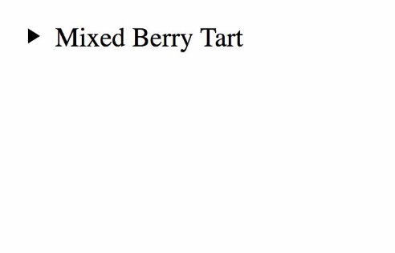
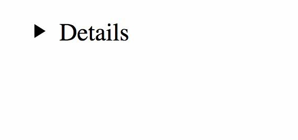
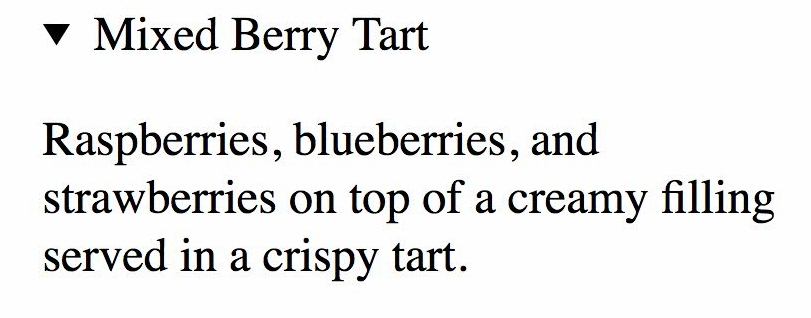
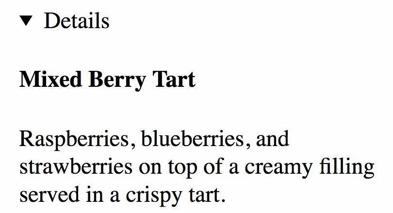

## HTML

#### Q1. What is the purpose of the `<track>` tag, and when should it be used?

- [ ] The `<track>` tag is used for specifying subtitles. It is typically applied as a child of the `<audio>`
  and `<video>` tags.
- [ ] The `<track>` tag is used for specifying subtitles. It is typically applied as a child of the `<video>` tag.
- [ ] The `<track>` tag is used for specifying subtitles, captions, and other types of time-based text. It is typically
  applied as a child of the `<video>` tag.
- [x] The `<track>` tag is used for specifying subtitles, captions, and other types of time-based text. It is typically
  applied as a child of the `<audio>` and `<video>` tag.

#### Explanation

The `<track>` tag specifies text tracks for `<audio>` or `<video>` elements.

This element is used to specify subtitles, caption files or other files containing text, that should be visible when the
media is playing.

Example: a video with subtitle tracks for two languages.

```html
<video width="320" height="240" controls>
    <source src="forrest_gump.mp4" type="video/mp4">
    <source src="forrest_gump.ogg" type="video/ogg">
    <track src="fgsubtitles_en.vtt" kind="subtitles" srclang="en" label="English">
    <track src="fgsubtitles_no.vtt" kind="subtitles" srclang="no" label="Norwegian">
</video>
```

#### Q2. What are the best examples of void elements?

- [ ] `<link><meta><title>`
- [x] `<br><base><source>`
- [ ] `<input><br><p>`
- [ ] `<area><embed><strong>`

#### Explanation

A void element is an element whose content model never allows it to have contents under any circumstances.

Void elements can have attributes. The following is a complete list of the void elements in HTML: area , base , br , col
, command , embed , hr , img , input , keygen , link , meta , param , source , track , wbr.

The `<br>` tag inserts a single line break.

The `<base>` tag specifies the base URL and/or target for all relative URLs in a document.

Example: specify a default URL and a default target for all links on a page.

```html
<head>
    <base href="https://www.w3schools.com/" target="_blank">
    <title>Base tag</title>
</head>

<body>

<a href="tags/tag_base.asp">HTML base Tag</a>
</body>
```

The `<source>` tag is used to specify multiple media resources for media elements, such as `<video>`, `<audio>`,
and `<picture>`.

Example: an audio player with two source files. The browser will choose the first `<source>` it supports.

```html
<audio controls>
    <source src="horse.ogg" type="audio/ogg">
    <source src="horse.mp3" type="audio/mpeg">
    Your browser does not support the audio element.
</audio>
```

#### Q3. In HTML5, which tag or tags embed a webpage inside a webpage?

- [ ] `<iframe>, <frame>, and <frameset>`
- [ ] `<frame>`
- [x] `<iframe>`
- [ ] `<frame> and <frameset>`

#### Explanation

The `<iframe>` tag specifies an inline frame.

An inline frame is used to embed another document within the current HTML document.

**Tip**: Use CSS to style the `<iframe>` (see example below).

**Tip**: It is a good practice to always include a title attribute for the `<iframe>`. This is used by screen readers to
read out what the content of the `<iframe>` is.

Example: an inline frame is marked up as follows:

```html
<iframe src="https://www.w3schools.com" title="W3Schools Free Online Web Tutorials"></iframe>
```

#### Q4. Where do `<header>` and `<footer>` tags typically occur?

- [ ] as children of `<body>, <article>, <aside>, and <section>` tags
- [x] as children of `<body>, <article>, and <section>` tags
- [ ] as children of `<body>, <article>, <aside>, <nav>, and <section>` tags
- [ ] as children of `<body>, <article>, <table>, and <section>` tags

#### Explanation

If there is a `<header>` there must be a `<footer>`.

A `<footer>` is generally found at the bottom of a document (`body` tag), a `section`, or an `article`. Just like
the <header> the content is generally meta-information, such as author details, legal information, and/or links to
related information.

#### Q5. What is the best way to apply bold styling to text?

- [x] `<strong>`
- [ ] Use CSS.
- [ ] `<bold>`
- [ ] `<b>`

#### Explanation

To make text bold in HTML, use the `<b>` … `</b>` tag or `<strong>` … `</strong>` tag.

Both the tags have the same functioning, but `<strong>` tag adds semantic strong importance to the text.

#### Q6. When is the `<link>` tag used?

- [ ] when linking style sheets, JavaScript, and icons for mobile apps
- [x] when linking style sheets, favicons, and preloading assets
- [ ] when linking one webpage to another
- [ ] when linking style sheets, external URLs, and favicons

#### Explanation

The `<link>` tag defines the relationship between the current document and an external resource.

The `<link>` tag is most often used to link to external style sheets or to add a favicon to your website.

The `<link>` element is an empty element, it contains attributes only.

#### Q7. What should fill the two blanks in the HTML code below?

```html
<address ______ _____>
    <span itemprop="streetAddress">6410 Via Real</span><br/>
    <span itemprop="addressLocality">Carpinteria</span>,
    <span itemprop="addressRegion">CA</span>
    <span itemprop="addressCode">93013</span>
</address>
```

- [x] `itemscope` `itemtype="http://schema.org/PostalAddress"`
- [ ] `itemsref="http://schema.org/PostalAddress"` `itemid="address"`
- [ ] `itemscope` `itemref="http://schema.org/PostalAddress"`
- [ ] `itemid="address"` `itemtype="http://schema.org/PostalAddress"`

#### Explanation

The `<address>` tag defines the contact information for the author/owner of a document or an article.

The `itemscope` is a boolean global attribute that defines the scope of associated metadata. Specifying the `itemscope`
attribute for an element creates a new item, which results in a number of name-value pairs that are associated with the
element.

Example:

```html
<address itemscope itemtype="schema.org/PostalAddress">
    <span itemprop="name">COMPANY NAME</span>
    <span itemprop="streetAddress">ADDRESS</span>
    <!-- more itemprop here -->
</address>
```

#### Q8. When should you use the `<aside>` element?

- [x] when the content can be removed without detracting from the page's message
- [ ] for anything you want to move to the side, like a pull quote box, a sidebar, or an image with text wrapping around
  it
- [ ] for anything in parentheses
- [ ] for anything in a sidebar

#### Explanation

The `<aside>` HTML element represents a portion of a document whose content is only indirectly related to the document's
main content.

Asides are frequently presented as sidebars or call-out boxes.


#### Q9. With which tags are the `<source>` element associated?

- [ ] `<svg>, <picture>, <audio>, and <video>`
- [x] `<picture>, <audio>, and <video>`
- [ ] It is interchangeable with the `src` attribute, so any element which uses `src` may use `<source>`
- [ ] `<audio> and <video>`

#### Explanation

The `<source>` tag is used to specify multiple media resources for media elements, such as `<video>`, `<audio>`,
and `<picture>`.

Example: an audio player with two source files. The browser will choose the first `<source>` it supports.

```html
<audio controls>
    <source src="horse.ogg" type="audio/ogg">
    <source src="horse.mp3" type="audio/mpeg">
    Your browser does not support the audio element.
</audio>
```

#### Q10. What is NOT a valid attribute for the `<textarea>` element?

- [ ] readonly
- [x] max
- [ ] form
- [ ] spellcheck

#### Explanation

The `<textarea>` tag defines a multi-line text input control.

The `<textarea>` element is often used in a form, to collect user inputs like comments or reviews.

Example: a multi-line text input control (text area).

```html
<label for="w3review">Review of W3Schools:</label>
<textarea id="w3review" name="w3review" rows="4" cols="50">
At w3schools.com you will learn how to make a website. They offer free tutorials in all web development technologies.
</textarea>
```

| Attribute   | Value            | Description                                                                     |
|-------------|------------------|---------------------------------------------------------------------------------|
| autofocus   | autofocus        | Specifies that a text area should automatically get focus when the page loads   |
| cols        | number           | Specifies the visible width of a text area                                      |
| dirname     | textareaname.dir | Specifies that the text direction of the textarea will be submitted             |
| disabled    | disabled         | Specifies that a text area should be disabled                                   |
| form        | form_id          | Specifies which form the text area belongs to                                   |
| maxlength   | number           | Specifies the maximum number of characters allowed in the text area             |
| name        | text             | Specifies a name for a text area                                                |
| placeholder | text             | Specifies a short hint that describes the expected value of a text area         |
| readonly    | readonly         | Specifies that a text area should be read-only                                  |
| required    | required         | Specifies that a text area is required/must be filled out                       |
| rows        | number           | Specifies the visible number of lines in a text area                            |
| wrap        | hard soft        | Specifies how the text in a text area is to be wrapped when submitted in a form |

The `max` attribute specifies the maximum value for an `<input>` element (not relevant for `<textarea>`).

#### Q11. What is the best way to code the sample shown?


- [ ] A

```html
<details>
    <summary>Parmesan Deviled Eggs</summary>
    <p>
        These delectable little bites are made with organic eggs, fresh Parmesan, and chopped pine nuts.
    </p>
</details>
```

- [ ] B

```html
<h4>▸ Parmesan Deviled Eggs</h4>
<p>
    These delectable little bites are made with organic eggs, fresh Parmesan, and chopped pine nuts.
</p>
```

- [x] C

```html
<details open>
    <summary>Parmesan Deviled Eggs</summary>
    <p>
        These delectable little bites are made with organic eggs, fresh Parmesan, and chopped pine nuts.
    </p>
</details>
```

- [ ] D

```html
<details>
    <h4>▸ Parmesan Deviled Eggs</h4>
    <p>
        These delectable little bites are made with organic eggs, fresh Parmesan, and chopped pine nuts.
    </p>
</details>
```

#### Explanation

The `<details>` tag specifies additional details that the user can open and close on demand.

The `<details>` tag is often used to create an interactive widget that the user can open and close. By default, the
widget is closed. When open, it expands, and displays the content within.

Example: specify details that the user can open and close on demand.

```html
<details>
    <summary>Epcot Center</summary>
    <p>Epcot is a theme park at Walt Disney World Resort featuring exciting attractions, international pavilions,
        award-winning fireworks and seasonal special events.</p>
</details>
```

#### Q12. What is the purpose of the `<samp>` element?

- [ ] It connects the web browser to a SA-MP server.
- [ ] It identifies enclosed text as a sampler or an example.
- [x] It identifies sample output from a computer program.
- [ ] It uses a simple application messaging protocol to connect the browser to a texting device.

#### Explanation

The `<samp>` tag is used to define sample output from a computer program. The content inside is displayed in the
browser's default monospace font.

**Note**: This tag is not deprecated. However, it is possible to achieve richer effect by using CSS.

Example: define some text as sample output from a computer program in a document.

```html
<p>Message from my computer:</p>
<p><samp>File not found.<br>Press F1 to continue</samp></p>
```

#### Q13. When should you use `<ol>` and `<ul>` elements?

- [x] Use `<ul>` when you want a bulleted list and `<ol>` when you want a numbered list.
- [ ] Use `<ul>` when you have a list of items in which the order of the items matters. Use `<ol>` when you have a list
  of items that could go in any order.
- [ ] Use `<ol>` when you want a bulleted list and `<ul>` when you want a numbered list.
- [ ] Use `<ol>` when you have a list of items in which the order of the items matters. Use `<ul>` when you have a list
  of items that could go in any order.

#### Explanation

An unordered list starts with the `<ul>` tag. Each list item starts with the `<li>` tag.

The list items will be marked with bullets (small black circles) by default:

```html
<ul>
    <li>Coffee</li>
    <li>Tea</li>
    <li>Milk</li>
</ul>
```

An ordered list starts with the `<ol>` tag. Each list item starts with the `<li>` tag.

The list items will be marked with numbers by default:

```html
<ol>
    <li>Coffee</li>
    <li>Tea</li>
    <li>Milk</li>
</ol>
```

#### Q14. What is the difference between the post and get methods in a form?

- [ ] post is used for sending information to the server. get is used for retrieving form information from the server.
- [ ] get is used for sending information to the server. post is used for retrieving form information from the server.
- [ ] With get, data is included in the form body when send to the server. With post, the data goes through the URL.
- [x] With post, data is included in the form body when send to the server. With get, the data goes through the URL.

#### Explanation

Both GET and POST method is used to transfer data from client to server in HTTP protocol but Main difference between
POST and GET method is that GET carries request parameter appended in URL string while POST carries request parameter in
message body.

#### Q15. What is the difference between the `<div>` and `<span>` tags?

- [x] `<div>` is used where a generic block-level tag is needed, while `<span>` is used where a generic inline tag is
  needed.
- [ ] `<div>` is used for major divisions on a page, while `<span>` is used to span across columns.
- [ ] `<div>` is the industry-standard default tag, but you could use `<span>` if you prefer.
- [ ] `<div>` is used where a generic inline tag is needed, while `<span>` is used where a generic block-level tag is
  needed.

#### Explanation

Span and div are both generic HTML elements that group together related parts of a web page. However, they serve
different functions. A div element is used for block-level organization and styling of page elements, whereas a span
element is used for inline organization and styling.

A basic example of a div element in HTML looks like this:

```html
<div id=“paragraphs”>
    <p>This is my first paragraph.</p>
    <p>This is my second paragraph.</p>
    <p>This is my final paragraph.</p>
</div>
```

A basic example of a span element in HTML looks like this:

```html
<p>This is a paragraph with <span id=“special-text”>a little something extra</span> inside it.</p>
```

#### Q16. What should fill the blank in the HTML code bellow?

```html
<form method="post" action="mailto:info@linkedin.com" ____="text/plain"></form>
```

- [x] enctype
- [ ] media
- [ ] type
- [ ] rel

#### Explanation

The `enctype` attribute specifies how the form-data should be encoded when submitting it to the server.

The `enctype` attribute can be used only if method="post".

Example:

```html
<form action=”mailto:contact@yourdomain.com” method=”POST” enctype=”text/plain” name=”EmailForm”>

    <label for="name">Name:</label><br>
    <input type="text" id="name" name="name"><br>
  
    <label for="ContactCommentt">Message:</label><br>
    <textarea id=”ContactCommentt” rows=”6″ cols=”20″>

<input type="submit" value="Send">
</form>
```

#### Q17. What is the correct markup for `alt` attribute of an image?

- [ ] A

```html

```

- [ ] B

```html

```
- [x] C
```html

```
- [ ] D
```html

```

#### Q18. In the code below, what is the purpose of the **id** attribute?

```html
<p id="warning">Be careful when installing this product.</p>
```

- [x] It establishes that id is a unique identifier in the document, used for styling CSS, scripting, and linking within a webpage.
- [ ] It establishes that id is a unique identifier in the document, used for styling CSS and with Javascript code.
- [ ] It establishes that id may be used for styling CSS several times per page.
- [ ] It establishes that id is a unique identifier in the website, used for styling CSS, scripting, and linking within a webpage.

#### Explanation

The `id` attribute specifies a unique id for an HTML element. The value of the id attribute must be unique within the HTML document.

The `id` attribute is used to point to a specific style declaration in a style sheet. It is also used by JavaScript to access and manipulate the element with the specific id.

#### Q19. What is the best semantic markup for the sentence shown?

```
On July 21, 1969, Neil Armstrong said, "One small step for man, one giant leap for mankind."
```

- [x] A

```html
<p>
  On <time datetime="1969-07-21">July 21, 1969</time>, Neil Armstrong said,
  <q cite="https://www.hq.nasa.gov/alsj/a11l/a11.html"
    >One small step for man, one giant leap for mankind.</q
  >
</p>
```

- [ ] B

```html
<p>
  On July 21, 1969, Neil Armstrong said,
  <q cite="https://www.hq.nasa.gov/alsj/a11l/a11.html"
    >"One small step for man, one giant leap for mankind."</q
  >
</p>
```

- [ ] C

```html
<p>
  On July 21, 1969, Neil Armstrong said,
  <q>"One small step for man, one giant leap for mankind."</q>
</p>
```

- [ ] D

```html
<p>
  On <time datetime="07-21-1969">July 21, 1969</time>, Neil Armstrong said,
  <q cite="https://www.hq.nasa.gov/alsj/a11l/a11.html"
    >One small step for man, one giant leap for mankind.</q
  >
</p>
```

#### Explanation

The `<q>` tag defines a short quotation.

Browsers normally insert quotation marks around the quotation.

**Note**: Use `<blockquote>` for long quotations. 

Example:

```html
<p>WWF's goal is to:
<q>Build a future where people live in harmony with nature.</q>
We hope they succeed.</p>
```

The `<time>` tag defines a specific time (or datetime).

The `datetime` attribute of this element is used translate the time into a machine-readable format so that browsers can offer to add date reminders through the user's calendar, and search engines can produce smarter search results.

Example:

```html
<p>Open from <time>10:00</time> to <time>21:00</time> every weekday.</p>
<p>I have a date on <time datetime="2008-02-14 20:00">Valentines day</time>.</p>
```

#### Q20. What should fill the blank in this HTML code?

```html
<a href="https://es.yahoo.com/" hreflang="____" target="_blank">Visita Yahoo</a>
```

- [ ] es
- [ ] es-spanish
- [x] es-es
- [ ] spanish

#### Explanation

The `hreflang` attribute specifies the language of the linked document.

This attribute is only used if the href attribute is set.

**Note**: This attribute is purely advisory.

Example:

```html
<a href="https://www.w3schools.com" hreflang="en">W3Schools</a>
```

For example, for Spain the hreflang is "es-es", while for Mexico it is "es-mx".

#### Q21. Review the text in the red box in the image shown. What is the best way to code this in HTML?


- [ ] ordered list
- [x] unordered list inside a nav element
- [ ] ordered list inside a nav element
- [ ] unordered list

#### Explanation

The `<footer>` HTML element represents a footer for its nearest ancestor sectioning content or sectioning root element.

The `<footer>` typically contains information about the author of the section, copyright data or links to related documents.

Example:

```html
<body>
  <nav id="footer">
    <ul>
      <li><a href="#">Home</a>|</li>
      <li><a href="#">About our Hotel</a>|</li>
      <li><a href="#">Services</a>|</li>
      <li><a href="#">Photogallery</a>|</li>
      <li><a href="#">Testimonials</a>|</li>
      <li><a href="#">Locations</a>|</li>
      <li><a href="#">Contacts</a></li>
    </ul>
    <div id="copyright">
      <span>Copyright &copy; </span>
      <span>&copy; Design by <a href="" target="_blank">Best Free Templates</a></span>
    </div>
  </nav>  
</body>
```

#### Q22. What is the best way to code three choices within a form so that the user can select only one item?

- [ ] A

```html
<label for="example">Make a choice:</label>
<datalist id="example">
  <option value="Choice 1"></option>
  <option value="Choice 2"></option>
  <option value="Choice 3"></option>
</datalist>
```

- [ ] B

```html
<p>Make a choice:</p>
<input id="choices" name="example" />

<datalist value="choices">
  <option value="Choice 1"></option>
  <option value="Choice 2"></option>
  <option value="Choice 3"></option>
</datalist>
```

- [ ] C

```html
<label for="example">Make a choice:</label>
<input list="example" id="choices" name="choices" />

<datalist id="choices">
  <option value="Choice 1">Choice 1</option>
  <option value="Choice 2">Choice 2</option>
  <option value="Choice 3">Choice 3</option>
</datalist>
```

- [x] D

```html
<label for="example">Make a choice:</label>
<input list="choices" id="example" name="example" />

<datalist id="choices">
  <option value="Choice 1"></option>
  <option value="Choice 2"></option>
  <option value="Choice 3"></option>
</datalist>
```

#### Explanation

The `<datalist>` tag specifies a list of pre-defined options for an `<input>` element.

The `<datalist>` tag is used to provide an "autocomplete" feature for `<input>` elements. Users will see a drop-down list of pre-defined options as they input data.

The `<datalist>` element's id attribute must be equal to the `<input>` element's list attribute (this binds them together).

Example:

```html
<label for="browser">Choose your browser from the list:</label>
<input list="browsers" name="browser" id="browser">

<datalist id="browsers">
  <option value="Edge">
  <option value="Firefox">
  <option value="Chrome">
  <option value="Opera">
  <option value="Safari">
</datalist>
```

#### Q23. How do you confirm that a document is written in HTML5?

- [ ] The server wraps the webpage in an HTML5 wrapper.
- [x] Use the `<!DOCTYPE html>` declaration that starts the document.
- [ ] The browser receives encoding from the server to display the document with HTML5.
- [ ] It is enclosed in a `<html>` tag.

#### Q24. What does the code shown below accomplish?

```html
<picture>
  <source srcset="image1.jpg" media="(min-width: 1000px)" />
  <source srcset="image2.jpg" media="(min-width: 750px)" />
  
</picture>
```

- [x] It displays image1.jpg at 1000px and higher, image2.jpg at 750-999px, and image3.jpg at 749px and lower.
- [ ] It displays image1.jps at 1000px and higher and image2.jpg at 750-999px, image3.jpg is a default in case `<picture>` is not supported.
- [ ] It displays image1.jpg at 1000px and higher and image2.jpg at 750px and higher, image3.jpg is a default in case `<picture>` is not supported.
- [ ] It displays image1.jpg, image2.jpg and image3.jpg at 1000px and higher.

#### Explanation

The `<picture>` tag gives web developers more flexibility in specifying image resources.

The most common use of the `<picture>` element will be for art direction in responsive designs. Instead of having one image that is scaled up or down based on the viewport width, multiple images can be designed to more nicely fill the browser viewport.

The `<picture>` element contains two tags: one or more `<source>` tags and one `` tag.

The browser will look for the first `<source>` element where the media query matches the current viewport width, and then it will display the proper image (specified in the srcset attribute). The `` element is required as the last child of the `<picture>` element, as a fallback option if none of the source tags matches.

**Note**: The `<picture>` element works "similar" to `<video>` and `<audio>`. You set up different sources, and the first source that fits the preferences is the one being used.

Example:

```html
<picture>
  <source media="(min-width:650px)" srcset="img_pink_flowers.jpg">
  <source media="(min-width:465px)" srcset="img_white_flower.jpg">
  
</picture>
```

#### Q25. What code will produce this table?


- [ ] A

```html
<table>
  <scope cols="2" style="background-color: yellow">
  <tr>
    <th>Col 1</th>
    <th>Col 2</th>
    <th>Col 3</th>
  </tr>
  <tr>
    <td>first</td>
    <td>second</td>
    <td>third</td>
  </tr>
</table>
```

- [x] B

```html
<table>
  <colgroup span="2" style="background-color: yellow">
  <tr>
    <th>Col 1</th>
    <th>Col 2</th>
    <th>Col 3</th>
  </tr>
  <tr>
    <td>first</td>
    <td>second</td>
    <td>third</td>
  </tr>
</table>
```

- [ ] C

```html
<table>
  <group cols="2" style="background-color: yellow">
  <tr scope="row">
    <th>Col 1</th>
    <th>Col 2</th>
    <th>Col 3</th>
  </tr>
  <tr scope="row">
    <td>first</td>
    <td>second</td>
    <td>third</td>
  </tr>
</table>
```

- [ ] D

```html
<table>
  <columns colspan="2" style="background-color: yellow">
  <tr>
    <th>Col 1</th>
    <th>Col 2</th>
    <th>Col 3</th>
  </tr>
  <tr>
    <td>first</td>
    <td>second</td>
    <td>third</td>
  </tr>
</table>
```

#### Explanation

The `<colgroup>` tag specifies a group of one or more columns in a table for formatting.

The `<colgroup>` tag is useful for applying styles to entire columns, instead of repeating the styles for each cell, for each row.

Example:

```html
<table>
  <colgroup>
    <col span="2" style="background-color:red">
    <col style="background-color:yellow">
  </colgroup>
  <tr>
    <th>ISBN</th>
    <th>Title</th>
    <th>Price</th>
  </tr>
  <tr>
    <td>3476896</td>
    <td>My first HTML</td>
    <td>$53</td>
  </tr>
</table>
```

#### Q26. What is the `<hr>`tag typically used for? / Alt.: What is the semantic meaning of the `<hr>` tag?

- [ ] This tag is depreciated (alt.: deprecated) and should not be used.
- [x] It designates a topic shift within a section at the paragraph level.
- [ ] It draws a horizontal line.
- [ ] It designates a shift of topic at the section level. / Alt.: It designates a separation of sections within an `<article>`.

#### Explanation

This is a confusing question and there can be an arguments for both the second and the third options being correct.

The `<hr>` tag defines a thematic break in an HTML page (e.g. a shift of topic).

The `<hr>` element is most often displayed as a horizontal rule that is used to separate content (or define a change) in an HTML page.

Example:

```html
<!DOCTYPE html>
<html>
<body>

<h1>The Main Languages of the Web</h1>

<p>HTML is the standard markup language for creating Web pages. HTML describes the structure of a Web page, and consists of a series of elements. HTML elements tell the browser how to display the content.</p>

<hr>

<p>CSS is a language that describes how HTML elements are to be displayed on screen, paper, or in other media. CSS saves a lot of work, because it can control the layout of multiple web pages all at once.</p>

<hr>

<p>JavaScript is the programming language of HTML and the Web. JavaScript can change HTML content and attribute values. JavaScript can change CSS. JavaScript can hide and show HTML elements, and more.</p>

</body>
</html>
```

#### Q27. What should fill the two blanks in the HTML code below?

```html
<section itemscope itemtype="http://schema.org/Restaurant">
  <h1 itemprop="name">Nadia's Garden</h1>
  <p itemscope ______ ______>
    <span itemprop="ratingValue">4.5</span> stars - based on
    <span itemprop="reviewCount">120</span> reviews
  </p>
</section>
```

- [ ] `itemprop="aggregateRating" itemref="http://schema.org/AggregateRating"`
- [x] `itemprop="aggregateRating" itemtype="http://schema.org/AggregateRating"`
- [ ] `itemid="aggregateRating" itemtype="http://schema.org/AggregateRating"`
- [ ] `itemid="aggregateRating" itemref="http://schema.org/AggregateRating"`

#### Explanation

The global attribute `itemscope` is a boolean attribute that defines the scope of associated metadata. Specifying the `itemscope` attribute for an element creates a new item, which results in a number of name-value pairs that are associated with the element.

The global attribute `itemtype` specifies the URL of the vocabulary that will be used to define `itemprop`'s (item properties) in the data structure.

```html
<div itemscope itemtype="http://schema.org/Product">
  <span itemprop="brand">ACME<br /></span>
  <span itemprop="name">Executive Anvil<br /></span>
  <br />

  <span itemprop="description">
    Sleeker than ACME's Classic Anvil, the Executive Anvil is perfect for the
    business traveler looking for something to drop from a height.
    <br />
  </span>

Product #: <span itemprop="mpn">925872<br /></span>
<span
itemprop="aggregateRating"
itemscope
itemtype="http://schema.org/AggregateRating">
Rating: <span itemprop="ratingValue">4.4</span> stars, based on
<span itemprop="reviewCount">89 </span> reviews
</span>
  <p>
    <span itemprop="offers" itemscope itemtype="http://schema.org/Offer">
      Regular price: $179.99<br />
      <meta itemprop="priceCurrency" content="USD" />
      <span itemprop="price">Sale price: $119.99<br /></span>
      (Sale ends
      <time itemprop="priceValidUntil" datetime="2020-11-05"> 5 November!</time>)<br />
      Available from:
      <span
        itemprop="seller"
        itemscope
        itemtype="http://schema.org/Organization">
        <span itemprop="name">Executive Objects<br /></span>
      </span>
      Condition:
      <link
        itemprop="itemCondition"
        href="http://schema.org/UsedCondition" />Previously owned, in excellent
      condition<br />
      <link itemprop="availability" href="http://schema.org/InStock" />In stock!
      Order now!
    </span>
  </p>
</div>
```

#### Q28. Which HTML snippet links back to the very top of a webpage?

- [x] A

```html
<a id="top"></a>

<!-- placed at the top of the page -->

<a href="#top">back to top</a>
```

- [ ] B

```html
<a name="top"></a>

<!-- placed at the top of the page -->

<a href="#top">back to top</a>
```

- [ ] C

```html
<a href="#">back to top</a> <a href="#top">back to top</a>
```

- [ ] D

```html
<button href="#">back to top</button> <button href="#top">back to top</button>
```

#### Explanation

To create a link that goes to the top of a web page, follow the steps below.

In your HTML code, find the opening `<body>` tag (this should be located right after the closing `</head>` tag). Immediately after the opening `<body>` tag, add the following code.

```html
<a id="top"></a>
```

The code above creates an anchor on the page named top.

Next, add the top of page link using the `#` symbol and "top" anchor id as the value of the `href` attribute, as shown below.

```html
<a href="#top">Back to top of page</a>
```

**Note**: All modern browsers understand the `#top` value. Even if the `id` anchor is not used, you still return to the top of the page. However, all other anchors need to be defined in the page.

#### Q29. Which three tags where deprecated in HTML4 but returned to HTML5?

- [x] `<rb> <rp> <rt>`
- [ ] `<acronym> <code> <wbr>`
- [ ] `<hgroup> <q> <wbr>`
- [ ] `<b> <i> <u>`

#### Q30. The **\_** tag is used for marking up a short code snippet, while the \_ tag is used for marking up a longer block of code

- [ ] `<kdb>`, `<pre>`
- [ ] `<pre>`, `<code>`
- [ ] `<kdb>`, `<mark>`
- [x] `<code>`, `<pre>`

#### Explanation

The `<pre>` tag defines preformatted text.

Text in a `<pre>` element is displayed in a fixed-width font, and the text preserves both spaces and line breaks. The text will be displayed exactly as written in the HTML source code.

Example:

```html
<!DOCTYPE html>
<html>
<body>

<h2>Standard pre</h2>
<pre>This is a standard pre. It will use as much space as it needs.</pre>

<h2>Fixed width pre</h2>
<div style="width:200px;overflow:auto">
  <pre>This is a pre with a fixed width. It will use as much space as specified.</pre>
</div>

</body>
</html>
```

The `<code>` tag is used to define a piece of computer code. The content inside is displayed in the browser's default monospace font.

```html
<!DOCTYPE html>
<html>
<head>
<style>
code {
  font-family: Consolas,"courier new";
  color: crimson;
  background-color: #f1f1f1;
  padding: 2px;
  font-size: 105%;
}
</style>
</head>
<body>

<h1>The code element + CSS</h1>

<p>The HTML <code>button</code> tag defines a clickable button.</p>
<p>The CSS <code>background-color</code> property defines the background color of an element.</p>

</body>
</html>
```

#### Q31. What does the `<label>` element do?

- [ ] It labels webpages with important information.
- [ ] It creates an ID for a corresponding input element.
- [ ] It overrides the name attribute's value on a child input element.
- [x] It programmatically associates a text label with an interface element.

#### Explanation

The `<label>` tag defines a label for several elements:

- `<input type="checkbox">`
- `<input type="color">`
- `<input type="date">`

... and others.

Proper use of labels with the elements above will benefit:

1. Screen reader users (will read out loud the label, when the user is focused on the element)
2. Users who have difficulty clicking on very small regions (such as checkboxes) - because when a user clicks the text within the <label> element, it toggles the input (this increases the hit area). 

Example:

```html
<form action="/action_page.php">
  <input type="radio" id="html" name="fav_language" value="HTML">
  <label for="html">HTML</label><br>
  <input type="radio" id="css" name="fav_language" value="CSS">
  <label for="css">CSS</label><br>
  <input type="radio" id="javascript" name="fav_language" value="JavaScript">
  <label for="javascript">JavaScript</label><br><br>
  <input type="submit" value="Submit">
</form>
```

#### Q32. To get a link to open in a new window or tab, use the **\_** attribute

- [x] `_blank`
- [ ] `_self`
- [ ] `_new`
- [ ] `_parent`

#### Explanation

The `target` attribute specifies where to open the linked document.

| Value      | Description                                                                     |
|------------|---------------------------------------------------------------------------------|
| **_blank** | **Opens the linked document in a new window or tab**                            |
| _self      | Opens the linked document in the same frame as it was clicked (this is default) |
| _parent    | Opens the linked document in the parent frame                                   |
| _top       | Opens the linked document in the full body of the window                        |
| framename  | Opens the linked document in the named iframe                                   |


#### Q33. What is the most semantically accurate way to mark up the sentence shown below? Note: "TLAs" stands for "three-letter acronyms."

**We are fond of our TLAs in web design.**

- [ ] A

```html
<p>We are fond of our <span title="three-letter acronyms">TLAs</span> in web design.</p>
```

- [ ] B

```html
<p>We are fond of our TLAs in web design.</p>
```

- [x] C

```html
<p>we are fond of our <abbr title="three-letter acronyms">TLAs</abbr> in web design.</p>
```

- [ ] D

```html
<p>we are fond of our <acronym title="three-letter acronym">TLAs</acronym> in web design.</p>
```

`<acronym>` has been removed in HTML5 and shouldn't be used anymore. Instead web developers should use the `<abbr>` element.

#### Explanation

The `<abbr>` tag defines an abbreviation or an acronym, like "HTML", "CSS", "Mr.", "Dr.", "ASAP", "ATM".

```html
<!DOCTYPE html>
<html>
<body>

<h1>The abbr element</h1>

<p>The <abbr title="World Health Organization">WHO</abbr> was founded in 1948.</p>

</body>
</html>
```

#### Q34. What is the correctly nested markup for this list?


- [ ] A

```html
<ul>
  <li>
    office
    <ol style="circle">
      <li>staple</li>
      <li>paper</li>
    </ol>
  </li>
  <li>
    groceries
    <ol style="circle">
      <li>milk</li>
    </ol>
  </li>
</ul>
```


- [x] B

```html
<ul>
  <li>
    Office Supplies
    <ul>
      <li>Stapler</li>
      <li>Paper clips</li>
    </ul>
  </li>
  <li>
    Groceries
    <ul>
      <li>Milk</li>
    </ul>
  </li>
</ul>
```

- [ ] C

```html
<ul>
  <li>office</li>
  <li>staple</li>
  <li>paper</li>
  <li>groceries</li>
  <li>milk</li>
</ul>
```

#### Explanation

A nested list or a sublist is a list within a list. The trick to marking nested lists up correctly in HTML is to recognize that the sublist is actually a child of a list item and not of a list.

Start by creating a list. It can be ordered or unordered:

```html
<ul>
  <li>Fruit</li>
  <li>Vegetables</li>
  <li>Meat</li>
</ul>
```

Now add a nested list to the first list item:

```html
<ul>
  <li>Fruit
    <ul>
      <li>Bananas</li>
      <li>Apples</li>
      <li>Pears</li>
    </ul>
  </li>
  <li>Vegetables</li>
  <li>Meat</li>
</ul>
```

Notice that the sublist is a child and not a sibling of an `<li>` tag.

#### Q35. What should fill the blank below?

```html
<link href="phone.css" rel="stylesheet" _____="print" />
```

- [ ] title
- [ ] type
- [ ] device
- [x] media

#### Explanation

The `media` attribute specifies what media/device the target resource is optimized for.

This attribute is mostly used with CSS style sheets to specify different styles for different media types.

The `media` attribute can accept several values.

Example:

```html
<head>
  <link rel="stylesheet" type="text/css" href="theme.css">
  <link rel="stylesheet" type="text/css" href="print.css" media="print">
</head>
```

#### Q36. What is the semantically correct way to mark up this layout?


- [ ] A

```html
<p>
  "Making money is what you have to do to sustain a business—being driven to make something of value
  and purpose is much more powerful."
</p>
<p><em>Lynda Weinman</em></p>
```

- [ ] B

```html
<blockquote>
  <q
    >"Making money is what you have to do to sustain a business—being driven to make something of
    value and purpose is much more powerful."</q
  >
  <cite><em>Lynda Weinman</em></cite>
</blockquote>
```

- [x] C

```html
<blockquote>
  <p>
    "Making money is what you have to do to sustain a business—being driven to make something of
    value and purpose is much more powerful."
  </p>
  <cite>Lynda Weinman</cite>
</blockquote>
```

- [ ] D

```html
<section>
  <q
    >"Making money is what you have to do to sustain a business—being driven to make something of
    value and purpose is much more powerful."</q
  >
  <cite>Lynda Weinman</cite>
</section>
```

#### Explanation

The `<blockquote>` tag specifies a section that is quoted from another source.

Browsers usually indent `<blockquote>` elements (look at example below to see how to remove the indentation).

Example:

```html
<!DOCTYPE html>
<html>
<body>

<h1>The blockquote element</h1>

<p>Here is a quote from WWF's website:</p>

<blockquote cite="http://www.worldwildlife.org/who/index.html">
For 50 years, WWF has been protecting the future of nature. The world's leading conservation organization, WWF works in 100 countries and is supported by 1.2 million members in the United States and close to 5 million globally.
</blockquote>

</body>
</html>
```

#### Q37. Which choice uses the correct terminology in describing this markup: `<p>info</p>`?

- [ ] The element opener is `<p>`, the element closer is `</p>`, and the element information is info.
- [ ] The start tag is `<p>`, the end tag is `</p>`, and the enclosed HTML is info.
- [x] The start tag is `<p>`, the end tag is `</p>`, and the element content is info.
- [ ] The start element is `<p>`, the end element is `</p>`, and the tag content is info.

#### Q38. What is the difference between `<input type="submit" value="click me">` and `<button type="submit">Click me</button>`?

- [ ] There is no difference. Both will render a button that submits a form.
- [x] Both will submit a form. However, the `<button>` can have content other than text, like an image or nested HTML elements, while the `<input>` cannot.
- [ ] `<input type="button">` has been deprecated in HTML5. You should use the `<button>` tag instead.
- [ ] Both will submit a form. However, the `<input>` can have content other than text, like an image or nested HTML elements, while the `<button>` cannot.

#### Explanation

Both `<button type="submit">` and `<input type="submit">` display as buttons and cause the form data to be submitted to the server.

The difference is that `<button>` can have content, whereas `<input>` cannot (it is a null element).

#### Q39. What is the best semantic way to indicate that text refers to keyboard entry?

- [ ] `<p>Press the <tt>Enter</tt> key to proceed.</p>`
- [x] `<p>Press the <kbd>Enter</kbd> key to proceed.</p>`
- [ ] `<p>Press the <samp>Enter</samp> key to proceed.</p>`
- [ ] `<p>Press the Enter key to proceed.</p>`

#### Explanation

The `<kbd>` tag is used to define keyboard input. The content inside is displayed in the browser's default monospace font.

#### Q40. What does this code do?

```html
<audio controls>
  <source src="sound.mp3" type="audio/mpeg" />
  <source src="sound.ogg" type="audio/ogg" />
  <source src="sound.wav" type="audio/wav" />
</audio>
```

- [x] The browser chooses the first supported format to play with the browser's default controls.
- [ ] The browser chooses the best audio format to play with JavaScript-provided controls.
- [ ] The browser plays each sound file in order automatically. The user has controls to stop playback.
- [ ] The browser chooses the first supported sound file and will loop the sound until the user stops it.

#### Explanation

The `src` attribute specifies the location (URL) of the audio file.

The example above uses an Ogg file, and will work in Firefox, Opera, Chrome, and Edge. However, to play the audio file in IE or Safari, we must use an MP3 file.

To make it work in all browsers - use `<source>` elements inside the `<audio>` element.

Each `<source>` element can link to different audio files. The browser will use the first recognized format:

```html
<audio controls>
  <source src="horse.ogg" type="audio/ogg">
  <source src="horse.mp3" type="audio/mpeg">
  Your browser does not support the audio tag.
</audio>
```

#### Q41. What attribute applies a keyboard shortcut hint to the current element?

- [x] `accesskey`
- [ ] `shortcut`
- [ ] `keyboard`
- [ ] `access`

#### Explanation

The `accesskey` attribute specifies a shortcut key to activate/focus an element.

The `accesskey` attribute value must be a single character (a letter or a digit).

Example:

```html
<a href="https://www.w3schools.com/html/" accesskey="h">HTML</a><br>
<a href="https://www.w3schools.com/css/" accesskey="c">CSS</a>
```

**Note**: Using accesskeys is difficult because they may conflict with other key standards in the browser.

To avoid this problem, most browsers will use accesskeys only if pressed together with the Alt key.

#### Q42. What is the correct way to code a link that, when clicked, will email `email@example.com` with a subject of "Hello"?

- [ ] `<a href="mailto:email@example.com&subject=Hello">Click me</a>`
- [ ] `<a href="mailto:email@example.com">Hello</a>`
- [x] `<a href="mailto:email@example.com?subject=Hello">Click me</a>`
- [ ] `<a href="mailto:email@example.com?&subject=Hello">Click me</a>`

#### Explanation

Adding the subject to the mailto HTML tag is an easy way to help direct e-mails when listing more than one e-mail address on your website or blog.

Using the mailto in the `a href` HTML tag lets you send an e-mail using the installed e-mail client. If you want to add a subject to that e-mail add `?subject=<subject>` to the mailto tag.

Example:

```html
<a href="mailto:test@example.com?subject=Testing out mailto!">First Example</a>
```

#### Q43. Which tag is the root element of an HTML document?

- [ ] `<DOCTYPE html>`
- [x] `<html>`
- [ ] `<body>`
- [ ] `<root>`

#### Explanation

The `<html>` tag is the root element of an HTML document, which means that it contains all the contents and tags of the HTML document within it. The html element represents the root of a document.

#### Q44. Which code snippet creates the layout shown, starting at `<table>` and ending at `</table>`?


- [ ] A

```html
<tr>
  <td>Table cell 1</td>
  <td>Table cell 2</td>
</tr>
<tr>
  <td rowspan="2">Table cell 3</td>
</tr>
```

- [ ] B

```html
<tr>
  <td>Table cell 1</td>
  <td>Table cell 2</td>
  <td>Table cell 3</td>
</tr>
```

- [x] C

```html
<tr>
  <td>Table cell 1</td>
  <td>Table cell 2</td>
</tr>
<tr>
  <td colspan="2">Table cell 3</td>
</tr>
```

- [ ] D

```html
<tr>
  <td>Table cell 1</td>
  <td>Table cell 2</td>
</tr>
<tr>
  <td>Table cell 3</td>
</tr>
```

#### Explanation

The colspan attribute defines the number of columns a cell should span.

Example:

```html
<table>
  <tr>
    <th>Month</th>
    <th>Savings</th>
  </tr>
  <tr>
    <td>January</td>
    <td>$100</td>
  </tr>
  <tr>
    <td>February</td>
    <td>$80</td>
  </tr>
  <tr>
    <td colspan="2">Sum: $180</td>
  </tr>
</table>
```

#### Q45. Which choice is NOT a legal value for the **name** attribute within a `<meta>` tag?

- [x] charset
- [ ] viewport
- [ ] generator
- [ ] author

#### Explanation

The `<meta>` tag defines metadata about an HTML document. Metadata is data (information) about data.

| Attribute  | Value                                                          | Description                                                                |
|------------|----------------------------------------------------------------|----------------------------------------------------------------------------|
| charset    | character_set                                                  | Specifies the character encoding for the HTML document                     |
| content    | text                                                           | Specifies the value associated with the http-equiv or name attribute       |
| http-equiv | content-security-policy content-type default-style refresh     | Provides an HTTP header for the information/value of the content attribute |
| name       | application-name author description generatorkeywords viewport | Specifies a name for the metadata                                          |

#### Q46. Which form is coded correctly?

- [ ] A

```html
<form>
  <legend>Title</legend>
  <fieldset>
    <label for="name">Your name:</label>
    <input type="text" name="name" id="name" />
    <button type="submit">Submit</button>
  </fieldset>
</form>
```

- [ ] B

```html
<form>
  <fieldset>
    <legend>Title</legend>
    <p>Your name:</p>
    <input type="text" name="name" id="name" />
    <input type="submit" value="Submit" />
  </fieldset>
</form>
```

- [x] C

```html
<form>
  <fieldset>
    <legend>Title</legend>
    <label for="name">Your name:</label>
    <input type="text" name="name" id="name" />
    <button type="submit">Submit</button>
  </fieldset>
</form>
```

- [ ] D

```html
<form>
  <legend>Title</legend>
  <label for="name">Your name:</label>
  <input type="text" name="name" id="name" />
  <input type="submit" value="Submit" />
</form>
```

#### Explanation

The `<fieldset>` tag is used to group related elements in a form.

The `<fieldset>` tag draws a box around the related elements.

Example:

```html
<!DOCTYPE html>
<html>
<body>

<h1>The fieldset element</h1>

<form action="/action_page.php">
 <fieldset>
  <legend>Personalia:</legend>
  <label for="fname">First name:</label>
  <input type="text" id="fname" name="fname"><br><br>
  <label for="lname">Last name:</label>
  <input type="text" id="lname" name="lname"><br><br>
  <label for="email">Email:</label>
  <input type="email" id="email" name="email"><br><br>
  <label for="birthday">Birthday:</label>
  <input type="date" id="birthday" name="birthday"><br><br>
  <input type="submit" value="Submit">
 </fieldset>
</form>

</body>
</html>
```

#### Q47. What does the **poster** attribute do in the `<video>` tag?

- [x] It specifies an image that should display while the video downloads and until the video is played.
- [ ] It specifies an image that only displays if there is a problem with the video.
- [ ] It specifies an image that should display until the video is played.
- [ ] It specifies an image that should display while the video downloads.

#### Explanation

The `poster` attribute specifies an image to be shown while the video is downloading, or until the user hits the play button. If this is not included, the first frame of the video will be used instead.

Example:

```html
<video controls poster="/images/w3html5.gif">
  <source src="movie.mp4" type="video/mp4">
  <source src="movie.ogg" type="video/ogg">
  Your browser does not support the video tag.
</video>
```

#### Q48. What does this code do?

```html
<audio controls src="sound.mp3" type="audio/mpeg">When does this text display?</audio>
```

- [ ] The text displays over the audio controls, unless CSS is used to position it elsewhere.
- [ ] The text displays under the audio controls.
- [x] The text displays when the browser cannot play the sound.
- [ ] The text never displays.

#### Q49. What is the primary purpose of the `<canvas>` tag?

- [ ] It allows raster images to be rendered on the webpage.
- [ ] It displays annotated images.
- [x] It allows drawing on a bitmap via JavaScript.
- [ ] It allows vector images to be rendered on the webpage.

#### Explanation

The HTML `<canvas>` element is used to draw graphics, on the fly, via JavaScript.

The `<canvas>` element is only a container for graphics. You must use JavaScript to actually draw the graphics.

Canvas has several methods for drawing paths, boxes, circles, text, and adding images.

#### Q50. Which choice contains three valid block-level elements?

- [ ] `<details> <abbr> <figcaption>`
- [ ] `<canvas> <select> <noscript>`
- [x] `<dt> <table> <pre>`
- [ ] `<kbd> <p> <main>`

#### Explanation

The `<dt>` tag defines a term/name in a description list.

```html
<dl>
  <dt>Coffee</dt>
  <dd>Black hot drink</dd>
  <dt>Milk</dt>
  <dd>White cold drink</dd>
</dl>
```

Most browsers will display the `<dt>` element with the following default values:

```css
dt {
  display: block;
}
```

A table in HTML consists of table cells inside rows and columns.

```html
<table>
  <tr>
    <td>Emil</td>
    <td>Tobias</td>
    <td>Linus</td>
  </tr>
</table>
```

The `<table>` tag defines a block html element.

The `<pre>` tag defines preformatted text.

Text in a `<pre>` element is displayed in a fixed-width font, and the text preserves both spaces and line breaks. The text will be displayed exactly as written in the HTML source code.

Example:

```html
<pre>
Text in a pre element
is displayed in a fixed-width
font, and it preserves
both      spaces and
line breaks
</pre>
```

Most browsers will display the `<pre>` element with the following default values:

```css
pre {
  display: block;
  font-family: monospace;
  white-space: pre;
  margin: 1em 0;
}
```

#### Q51. In the code below, what is the purpose of the **lang** attribute?

```html
<p lang="en-GB">Welcome to our wonderful website.</p>
```

- [ ] It establishes the language for the website—in this case, English.
- [ ] It establishes the language and dialect for the website—in this case, British English.
- [x] It establishes the language and dialect for the paragraph—in this case, British English.
- [ ] It establishes the language for the paragraph—in this case, English.

#### Explanation

The `lang` attribute specifies the language of the element's content.

Common examples are "en" for English, "es" for Spanish, "fr" for French, and so on.

[Language code reference](https://www.w3schools.com/tags/att_global_lang.asp#:~:text=Language%20code%20reference)

#### Q52. Which image formats can be displayed by all web browsers?

- [ ] JPG, GIF, TIF
- [ ] JPG, TIF, BMP
- [ ] TIF, BMP, GIF
- [x] PNG, GIF, JPG

#### Q53. Review the code below. What is the absolute URL for a page called **page.html**?

```html
<base href="http://www.linkedin.com/dir/" />
```

- [x] `http://www.linkedin.com/dir/page.html`
- [ ] `page.html`
- [ ] `http://www.linkedin.com/page.html`
- [ ] `dir/page.html`

#### Explanation

The `<base>` tag specifies the base URL and/or target for all relative URLs in a document.

The `<base>` tag must have either a href or a target attribute present, or both.

There can only be one single `<base>` element in a document, and it must be inside the `<head>` element.

Example:

```html
<head>
  <base href="https://www.w3schools.com/" target="_blank">
</head>

<body>

<a href="tags/tag_base.asp">HTML base Tag</a>
</body>
```

#### Q54. What is the correct way to include a stylesheet named **style.css** in the `<head>` of your document?

- [ ] `<style link="style.css">`
- [x] `<link rel="stylesheet" href="style.css">`
- [ ] `<style src="style.css"></style>`
- [ ] `<link style="style.css">`

#### Explanation

The `<link>` tag defines the relationship between the current document and an external resource.

Example of a link to an external style sheet:

```html
<head>
  <link rel="stylesheet" href="styles.css">
</head>
```

#### Q55. You want to have single spacing in between some lines, like in a poem or an address. Which approach should you use?

- [ ] Wrap the text in a box that is the right width so everything wraps correctly. Set the box width with CSS.
- [x] Separate lines with a `<p>`, then use CSS to make single spacing.
- [ ] Use the `<pre>` tag to make the line spacing look exactly like you want.
- [ ] Separate the lines with the `<br>` tag.

#### Explanation

The `<p>` tag defines a paragraph.

Browsers automatically add a single blank line before and after each `<p>` element.

**Note**: from my point of view the option with <br> is correct too.

Example:

```html
<address>
Written by <a href="mailto:webmaster@example.com">Jon Doe</a>.<br>
Visit us at:<br>
Example.com<br>
Box 564, Disneyland<br>
USA
</address>
```

#### Q56. What does the `<wbr>` tag do?

- [ ] It requires the browser to wrap the current line at that point.
- [ ] It breaks a word into two pieces, using a hyphen to connect the words.
- [ ] It formats a sentence to be easily breakable.
- [x] It presents an opportunity for a break in a very long word, if needed for proper page display.

#### Explanation

The `<wbr>` (Word Break Opportunity) tag specifies where in a text it would be ok to add a line-break.

**Note**: When a word is too long, the browser might break it at the wrong place. You can use the `<wbr>` element to add word break opportunities.

```html
<!DOCTYPE html>
<html>
<body>

<h1>The wbr element</h1>

<p>Try to shrink the browser window, to view how the very long word in 
the paragraph below will break:</p>

<p>This is a veryveryveryveryveryveryveryveryveryveryveryveryveryveryveryveryveryvery<wbr>longwordthatwillbreakatspecific<wbr>placeswhenthebrowserwindowisresized.</p>

<p><b>Note:</b> The wbr element is not supported in Internet Explorer 11 (or earlier).</p>

</body>
</html>
```

#### Q57. Review the code below. How do you include subnavigation for Link 2 that includes a link?

```html
<nav>
  <ul>
    <li><a href="#">Link 1</a></li>
    <li><a href="#">Link 2</a></li>
    <li><a href="#">Link 3</a></li>
  </ul>
</nav>
```

- [ ] A

```html
<nav>
  <ul>
    <li><a href="#">Link 1</a></li>
    <li><a href="#">Link 2</a></li>
    <ul>
      <li><a href="#">Link 2a</a></li>
    </ul>
    <li><a href="#">Link 3</a></li>
  </ul>
</nav>
```

- [x] B

```html
<nav>
  <ul>
    <li><a href="#">Link 1</a></li>
    <li>
      <a href="#">Link 2</a>
      <ul>
        <li><a href="#">Link 2a</a></li>
      </ul>
    </li>
    <li><a href="#">Link 3</a></li>
  </ul>
</nav>
```

- [ ] C

```html
<ul>
  <nav>
    <li><a href="#">Link 1</a></li>
    <li>
      <a href="#">Link 2</a>
      <ul>
        <nav>
          <li><a href="#">Link 2a</a></li>
        </nav>
      </ul>
    </li>
    <li><a href="#">Link 3</a></li>
  </nav>
</ul>
```

- [ ] D

```html
<nav>
  <ul>
    <li><a href="#">Link 1</a></li>
    <li><a href="#">Link 2</a></li>
    <nav>
      <ul>
        <li><a href="#">Link 2a</a></li>
      </ul>
    </nav>
    <li><a href="#">Link 3</a></li>
  </ul>
</nav>
```

#### Explanation

A nested list or a sublist is a list within a list. The trick to marking nested lists up correctly in HTML is to recognize that the sublist is actually a child of a list item and not of a list.

Start by creating a list. It can be ordered or unordered:

```html
<ul>
  <li>Fruit</li>
  <li>Vegetables</li>
  <li>Meat</li>
</ul>
```

Now add a nested list to the first list item:

```html
<ul>
  <li>Fruit
    <ul>
      <li>Bananas</li>
      <li>Apples</li>
      <li>Pears</li>
    </ul>
  </li>
  <li>Vegetables</li>
  <li>Meat</li>
</ul>
```

Notice that the sublist is a child and not a sibling of an `<li>` tag.

#### Q58. What is the correct way to code a comment in HTML?

- [ ] `//this is a comment`
- [ ] `/* this is a comment */`
- [ ] `<! this is a comment ->`
- [x] `<!-- this is a comment -->`

#### Explanation

You can add comments to your HTML source by using the following syntax:

```html
<!-- Write your comments here -->
```

Notice that there is an exclamation point (!) in the start tag, but not in the end tag.

#### Q59. Which statement is **false**?

- [ ] Inline elements can be nested inside inline elements.
- [ ] Block elements can be nested inside block elements.
- [ ] Inline elements can be nested inside block elements.
- [x] Block elements can be nested inside inline elements.

#### Explanation

You shouldn't put block elements within inline elements because it breaks the element structure. Inline elements are meant to reside within block level elements so that they render correctly and follow the flow of content.

#### Q60. What is the best semantic to use Quotes in HTML?

`Steve Kruz Said: "He will Win"`

- [x] `<q>`
- [ ] `<quote>`
- [ ] `<blockquote>`
- [ ] `<notation>`

#### Explanation

The `<q>` tag defines a short quotation.

Browsers normally insert quotation marks around the quotation.

```html
<!DOCTYPE html>
<html>
<body>

<h1>The q element</h1>

<p>WWF's goal is to: 
<q>Build a future where people live in harmony with nature.</q>
We hope they succeed.</p>

</body>
</html>
```

#### Q61. How will a video look displayed on a fully loaded webpage if the `<video>` tag is used and the **autoplay** attribute is not set?

- [ ] It will display a random frame from a video, unless the **poster** attribute is set.
- [x] It will display the first frame of the video, unless the **poster** attribute is set.
- [ ] It will display nothing unless the **poster** attribute is set.
- [ ] It will display a black window unless the **poster** attribute is set.

#### Explanation

The `<video>` tag is used to embed video content in a document, such as a movie clip or other video streams.

The `<video>` tag contains one or more `<source>` tags with different video sources. The browser will choose the first source it supports.

The `poster` attribute specifies an image to be shown while the video is downloading, or until the user hits the play button. If this is not included, the first frame of the video will be used instead.

```html
<video controls poster="/images/w3html5.gif">
  <source src="movie.mp4" type="video/mp4">
  <source src="movie.ogg" type="video/ogg">
  Your browser does not support the video tag.
</video>
```

#### Q62. What is the correct way to describe an empty element / Alt.: What is the correct way to describe an empty element, such as a line break tag?

- [ ] It has opening and closing tags but no child content.
- [ ] It display nothing on a website.
- [x] It has no child content and no closing tag.
- [ ] It has child content but no closing tag.

#### Explanation

An empty element is a component that doesn't have any embedded elements or text elements.

Empty elements do not have successor nodes. In other words, the tags that do not contain any closing tags are empty tags. Empty tags contain only the opening tag but they perform some action in the webpage.

The below are the examples of few empty elements using in HTML:

| Elements |                                                                                                               Description                                                                                                               |
|:--------:|:---------------------------------------------------------------------------------------------------------------------------------------------------------------------------------------------------------------------------------------:|
| `<area>` | It is used to map a portion of an image to make it clickable by the end-user. It is used to direct the user to different links after the user clicks on the mapped portions of the image. It is used as a child tag of the `<map>` tag. |
| `<base>` |                                           For all relative URLs in a document, the base URL is specified to use with the <base> element. Only one `<base>` element can be used in a document.                                           |
|  `<br>`  |       The `<br>` element is used for a line break in a text (can also be called carriage-return). It is useful in the case of writing an address, story, blogs, etc where the long sentence needs to break for clear visibility.        |
| `<col>`  |               The `<col>` tag in HTML is used to set the column properties for each column within a `<colgroup>` tag. This tag is used to set the style property to each column. This tag does not contain closing tags.                |

#### Q63. What is the purpose of async in this code?

`<script async src="myscript.js"></script>`

- [ ] It downloads the script from the server when resources allow.
- [ ] It runs the script after HTML parsing is complete.
- [x] It runs the script when the script is ready.
- [ ] It pauses the parsing of HTML code while the script runs.

#### Explanation

The `async` attribute is a boolean attribute.

If the `async` attribute is set, the script is downloaded in parallel to parsing the page, and executed as soon as it is available. The parsing of the page is interrupted once the script is downloaded completely, and then the script is executed, before the parsing of the rest of the page continues.

**Note**: The `async` attribute is only for external scripts (and should only be used if the `src` attribute is present).

There are several ways an external script can be executed:

1. If `async` is present: The script is downloaded in parallel to parsing the page, and executed as soon as it is available (before parsing completes)
2. If `defer` is present (and not async): The script is downloaded in parallel to parsing the page, and executed after the page has finished parsing
3. If neither `async` or `defer` is present: The script is downloaded and executed immediately, blocking parsing until the script is completed

#### Q64. What does this code do on a page you are visiting for the first time?

`<audio autoplay loop src="sound.mp3" type="audio/mpeg"></audio>`

- [ ] When the **Play** button is pressed, the browser plays the sound over and over again until the user stops it.
- [ ] The browser plays the sound once automatically in the background. The user has no control over the sound.
- [ ] The browser plays the sound automatically and continuously in the background. The user may stop the sound at any tune.
- [x] It does nothing. Modern browsers require some form of interaction before they let a page autoplay with audio.

#### Explanation

The `autoplay` attribute is a boolean attribute.

When present, the audio/video will automatically start playing as soon as it can do so without stopping.

```html
<!DOCTYPE html>
<html>
<body>

<h1>The audio autoplay attribute</h1>

<p>Click on the play button to play a sound:</p>

<audio controls autoplay>
  <source src="horse.ogg" type="audio/ogg">
  <source src="horse.mp3" type="audio/mpeg">
  Your browser does not support the audio element.
</audio>

</body>
</html>
```

Automatically starting the playback of audio (or videos with audio tracks) immediately upon page load can be an unwelcome surprise to users. While autoplay of media serves a useful purpose, it should be used carefully and only when needed. **In order to give users control over this, browsers often provide various forms of autoplay blocking**.

#### Q65. What is the difference between the `<head>` and `<header>` tags?

- [ ] There is only one `<head>` tag per page, while there may be many `<header>` tags.
- [ ] The `<head>` tag may contain CSS and Javascript links, while the `<header>` tag may contain headings and navigational links.
- [x] all of these answers
- [ ] The `<head>` tag contains meta information, while the `<header>` tag contains navigation, logos, and other page identifying content.

#### Explanation

The `<head>` tag is used for holding Meta information, title, links, etc. and is not displayed on the page.

The `<header>` tag is used within the body of the website and can be used multiple times if required, e.g. to determine the top of an article .

Example:

```html
<!DOCTYPE html>
<html>
  <head>
    <meta charset="utf-8">
    <title>Nick Pettit</title>
  </head>
  <body>
    <header>
      <a href="index.html">
        <h1>Nick Pettit</h1>
        <h2>Designer</h2>
      </a>
    </header>
    <section></section>
    <footer>
      <p>&copy; 2013 Nick Pettit.</p>
    </footer>
  </body>
</html>
```

#### Q66. In this code, what is the purpose of defer?

`<script defer src="myscript.js"></script>`

- [ ] It downloads the script from the server when resources allow.
- [x] It runs the script after HTML parsing is complete.
- [ ] It runs the script when the script is ready.
- [ ] It pauses the parsing of HTML code while the script runs.

#### Explanation

The `defer` attribute is a boolean attribute.

If the `defer` attribute is set, it specifies that the script is downloaded in parallel to parsing the page, and executed after the page has finished parsing.

There are several ways an external script can be executed:

1. If `async` is present: The script is downloaded in parallel to parsing the page, and executed as soon as it is available (before parsing completes)
2. If `defer` is present (and not async): The script is downloaded in parallel to parsing the page, and executed after the page has finished parsing
3. If neither `async` or `defer` is present: The script is downloaded and executed immediately, blocking parsing until the script is completed

```html
<script src="demo_defer.js" defer></script>
```

#### Q67. The code below contains some errors. Which choice corrects all the errors?

```html
<table>
  <tr>
    Cell 1
  </tr>
  <td>Cell 2</td>
  <caption>
    A table
  </caption>
</table>
```

- [ ] A

```html
<caption>
  A table
</caption>
<table>
  <td>
    <tr>
      Cell 1
    </tr>
    <tr>
      Cell 2
    </tr>
  </td>
</table>
```

- [ ] B

```html
<caption>
  A table
</caption>
<table>
  <tr>
    <td>Cell 1</td>
    <td>Cell 2</td>
  </tr>
</table>
```

- [x] C

```html
<table>
  <caption>
    A table
  </caption>
  <tr>
    <td>Cell 1</td>
    <td>Cell 2</td>
  </tr>
</table>
```

- [ ] D

```html
<table>
  <tr>
    <td>Cell 1</td>
    <td>Cell 2</td>
  </tr>
  <caption>
    A table
  </caption>
</table>
```

#### Explanation

The `<caption>` tag defines a table caption.

The `<caption>` tag must be inserted immediately after the `<table>` tag.

Example:

```html
<table>
  <caption>Monthly savings</caption>
  <tr>
    <th>Month</th>
    <th>Savings</th>
  </tr>
  <tr>
    <td>January</td>
    <td>$100</td>
  </tr>
</table>
```

#### Q68. Given the file and directory structure shown here, what is the correct element to place in file profit.html to link to info.html?


- [ ] `<a href="../work/info.html">See Information </a>`
- [x] `<a href="../info.html">See Information </a>`
- [ ] `<a href="../../info.html">See Information </a>`
- [ ] `<a href="info.html">See Information </a>`

#### Explanation

In a DOS, Windows or Mac command line, two dots (..) refer to the preceding folder/directory level.

#### Q69. When should you use the `<article>` element?

- [ ] For blog posts and other social media items
- [ ] For the main content area of your website
- [x] When the content stands alone as a unit, is suitable for syndication, or is reusable
- [ ] To associate comments with a blog post

#### Explanation

The `<article>` tag is one of the new semantic elements introduced with HTML5.

According to the HTML5 specification : The article element represents a section of content that forms an independent part of a document or site; for example, a magazine or newspaper article, or a blog entry.

Example:

```html
<!DOCTYPE html>
<html>
<body>

<h1>The article element</h1>

<article>
  <h2>Google Chrome</h2>
  <p>Google Chrome is a web browser developed by Google, released in 2008. Chrome is the world's most popular web browser today!</p>
</article>

<article>
  <h2>Mozilla Firefox</h2>
  <p>Mozilla Firefox is an open-source web browser developed by Mozilla. Firefox has been the second most popular web browser since January, 2018.</p>
</article>

<article>
  <h2>Microsoft Edge</h2>
  <p>Microsoft Edge is a web browser developed by Microsoft, released in 2015. Microsoft Edge replaced Internet Explorer.</p>
</article>

</body>
</html>
```

#### Q70. Which list comprises three empty elements?

- [ ] A

```html
<area />
<embed />
<strong></strong>
```

- [ ] B

```html
<input />
<br />
<p></p>
```

- [ ] C

```html
<link>
<meta>
<title>
```

- [x] D

```html
<wbr />
<base />
<source />
```

#### Explanation

An empty element is a component that doesn't have any embedded elements or text elements.

Empty elements do not have successor nodes. In other words, the tags that do not contain any closing tags are empty tags. Empty tags contain only the opening tag but they perform some action in the webpage.

The below are the examples of few empty elements using in HTML:

|  Elements  |                                                                                                                                                           Description                                                                                                                                                            |
|:----------:|:--------------------------------------------------------------------------------------------------------------------------------------------------------------------------------------------------------------------------------------------------------------------------------------------------------------------------------:|
|  `<base>`  |                                                                                       For all relative URLs in a document, the base URL is specified to use with the <base> element. Only one `<base>` element can be used in a document.                                                                                        |
|  `<wbr>`   |          The `<wbr>` tag in HTML stands for word break opportunity and is used to define the position within the text which is treated as a line break by the browser. It is mostly used when the used word is too long and there are chances that the browser may break lines at the wrong place for fitting the text.          |
| `<source>` | The `<source>` element is an empty element that provides various media resources for the <image>, <audio>, or <video> elements.  It provides the same media material in several file formats to ensure compatibility with a wide variety of browsers, as image and media file formats are supported by the browsers differently. |

#### Q71. Which snippet of HTML, when clicked, makes a phone call on a mobile device?

- [x] `<a href="tel:802-555-1212">Call me</a>`
- [ ] `<a href="phone">802-555-1212</a>`
- [ ] `<a href="tel">802-555-1212</a>`
- [ ] `<a href="phone:802-555-1212">Call me</a>`

#### Explanation

Steps to Add a Clickable Telephone Link in HTML:

1. Create an anchor element.
2. Enter your phone number in the href attribute.
3. Add tel: before the number inside the quotation marks.
4. Include text in the anchor element.

```html
<a href="tel:6031112298">Click to call a customer support rep.</a>
```

#### Q72. What is the purpose of the `class` attribute?

- [ ] Classes allow CSS to select specific elements on the page. You may list as many class names within the class attribute as you wish,
  separated by spaces.
- [ ] Classes allow CSS and JavaScript to select specific elements on the page. You may list only one class name per class attribute.
- [ ] Classes allow CSS to select specific elements on the page. You may list only one class name per class attribute.
- [x] Classes allow CSS and JavaScript to select specific elements on the page. You may list as many class names within the class attribute
  as you wish, separated by spaces.

#### Explanation

The HTML `class` attribute is used to specify a class for an HTML element.

The `class` attribute is often used to point to a class name in a style sheet. It can also be used by a JavaScript to access and manipulate elements with the specific class name.

Example:

```html
<!DOCTYPE html>
<html>
<head>
<style>
.city {
  background-color: tomato;
  color: white;
  border: 2px solid black;
  margin: 20px;
  padding: 20px;
}
</style>
</head>
<body>

<div class="city">
  <h2>London</h2>
  <p>London is the capital of England.</p>
</div>

<div class="city">
  <h2>Paris</h2>
  <p>Paris is the capital of France.</p>
</div>

<div class="city">
  <h2>Tokyo</h2>
  <p>Tokyo is the capital of Japan.</p>
</div>

</body>
</html>
```

#### Q73. Which choice is not a legal type attribute for the `<input>` tag?

- [ ] `<input type="color">`
- [ ] `<input type="tel">`
- [ ] `<input type="week">`
- [x] `<input type="num">`

#### Explanation

The `<input type="color">` is used for input fields that should contain a color.

Depending on browser support, a color picker can show up in the input field.

Example:

```html
<form>
  <label for="favcolor">Select your favorite color:</label>
  <input type="color" id="favcolor" name="favcolor">
</form>
```

The `<input type="tel">` is used for input fields that should contain a telephone number.

Example:

```html
<form>
  <label for="phone">Enter your phone number:</label>
  <input type="tel" id="phone" name="phone" pattern="[0-9]{3}-[0-9]{2}-[0-9]{3}">
</form>
```

The `<input type="week">` allows the user to select a week and year.

Depending on browser support, a date picker can show up in the input field.

Example:

```html
<form>
  <label for="week">Select a week:</label>
  <input type="week" id="week" name="week">
</form>
```

The `<input type="num">` is not a legal type attribute.

#### Q74. What is the most semantic way to mark up this sentence so that "happy talk must die" is rendered as an inline quote?

As Steve Krug once said, happy talk must die.

- [ ] `<p>`As Steve Krug once said, `<b>`happy talk must die.`</b>` `</p>`
- [ ] `<p>`As Steve Krug once said, `<i>`happy talk must die.`</i>` `</p>`
- [ ] `<p>`As Steve Krug once said, `<blockquote>`happy talk must die.`</blockquote>` `</p>`
- [x] `<p>`As Steve Krug once said, `<q>`happy talk must die.`</q>` `</p>`

#### Explanation

The `<q>` tag defines a short quotation.

Browsers normally insert quotation marks around the quotation.

**Note**: Use `<blockquote>` for long quotations.

Example:

```html
<p>WWF's goal is to:
<q>Build a future where people live in harmony with nature.</q>
We hope they
```

#### Q75. What is the most semantically accurate way to make up a main navigation bar, displayed in a horizontal direction?

- [ ] A

```html
<p>
  <a href="index.html">Home</a>
  <a href="about.html">About</a>
  <a href="contact.html">Contact</a>
</p>
```

- [ ] B

```html
<nav>
  <a href="index.html">Home</a>
  <a href="about.html">About</a>
  <a href="contact.html">Contact</a>
</nav>
```

- [ ] C

```html
<nav>
  <ol>
    <li><a href="index.html">Home</a></li>
    <li><a href="about.html">About</a></li>
    <li><a href="contact.html">Contact</a></li>
  </ol>
</nav>
```

- [x] D

```html
<nav>
  <ul>
    <li><a href="index.html">Home</a></li>
    <li><a href="about.html">About</a></li>
    <li><a href="contact.html">Contact</a></li>
  </ul>
</nav>
```

#### Explanation

One way to build a horizontal navigation bar is to specify the `<li>` elements as inline.

Example:

```html
<!DOCTYPE html>
<html>
<head>
<style>
ul {
  list-style-type: none;
  margin: 0;
  padding: 0;
}

li {
display: inline;
}
</style>
</head>
<body>

<ul>
  <li><a href="#home">Home</a></li>
  <li><a href="#news">News</a></li>
  <li><a href="#contact">Contact</a></li>
  <li><a href="#about">About</a></li>
</ul>

</body>
</html>
```

#### Q76. Which choice is the best way to mark up this layout?


- [x] A

```html
<h4>Mailing Address</h4>
<address>
  6410 Via Real <br />
  Carpinteria, CA 93013<br />
  <a href="mailto:info@linkedin.com">info@linkedin.com</a>
</address>
```

- [ ] B

```html
<h4><strong>Mailing Address</h4>
<address><em>
  6410 Via Real <br>
  Carpinteria, CA 93013<br>
  <a href="mailto:info@linkedin.com">info@linkedin.com</a>
</em></address>
```

- [ ] C

```html
<h4>Mailing Address</h4>
<p>
  <em>
    6410 Via Real <br />
    Carpinteria, CA 93013<br />
    <a href="mailto:info@linkedin.com">info@linkedin.com</a>
  </em>
</p>
```

- [ ] D

```html
<p><strong>Mailing Address</strong></p>
<p>
  <em>
    6410 Via Real <br />
    Carpinteria, CA 93013<br />
    <a href="mailto:info@linkedin.com">info@linkedin.com</a>
  </em>
</p>
```

#### Explanation

The `<address>` tag defines the contact information for the author/owner of a document or an article.

Example:

```html
<address>
Written by <a href="mailto:webmaster@example.com">Jon Doe</a>.<br>
Visit us at:<br>
Example.com<br>
Box 564, Disneyland<br>
USA
</address>
```

#### Q77. What is the primary purpose of HTML?

- [x] HTML structures the webpage, identifying its elements such as paragraphs, headings, and lists.
- [ ] HTML structures and provides a rudimentary look to webpages.
- [ ] HTML is responsible for the structure, styling, and interactivity of webpages.
- [ ] HTML is responsible for the structure and styling of webpages.

#### Q78. For the HTML code below, when will "Sample Text" display to the browser?

```html
<noscript>Sample Text</noscript>
```

- [ ] when there is no JavaScript used on this webpage
- [x] when JavaScript is not supported by the browser or if JavaScript is disabled in the browser
- [ ] when JavaScript is disabled in the web browser
- [ ] when JavaScript is not supported by the web browser

#### Explanation

The `<noscript>` tag defines an alternate content to be displayed to users that have disabled scripts in their browser or have a browser that doesn't support script.

```html
<script>
document.write("Hello World!")
</script>
<noscript>Your browser does not support JavaScript!</noscript>
```

#### Q79. How will this code render by default in most web browsers?

```html
<details>
  <h4>Mixed Berry Tart.</h4>
  <p>
    Raspberries, blueberries, and strawberries on top of a creamy filling served in a crispy tart.
  </p>
</details>
```

- [x] A
  
- [ ] B
  
- [ ] C
  
- [ ] D
  

#### Explanation

The `<details>` tag specifies additional details that the user can open and close on demand.

The `<details>` tag is often used to create an interactive widget that the user can open and close. **By default, the
widget is closed.** When open, it expands, and displays the content within.

Example:

```html
<details>
    <summary>Epcot Center</summary>
    <p>Epcot is a theme park at Walt Disney World Resort featuring exciting attractions, international pavilions,
        award-winning fireworks and seasonal special events.</p>
</details>
```

#### Q80. What is the difference between the `<svg>` and `<canvas>`?

- [x] `<svg>` produces vector graphics, while `<canvas>` produces raster graphics.
- [ ] `<svg>` integrates with JavaScript, while `<canvas>` does not.
- [ ] `<svg>` produces raster graphics, while `<canvas>` produces vector graphics.
- [ ] `<svg>` cannot be used as a background image, while `<canvas>` can be used as a background

#### Explanation

SVG: The Scalable Vector Graphics (SVG) is an XML-based image format that is used to define two-dimensional vector-based graphics for the web. Unlike raster image (Ex .jpg, .gif, .png, etc.), a vector image can be scaled up or down to any extent without losing the image quality.

Example:

```html
<!DOCTYPE html>
<html>

<head>
    <style>
        #svgelem {
            position: relative;
            left: 50%;
            -webkit-transform: translateX(-20%);
            -ms-transform: translateX(-20%);
            transform: translateX(-20%);
        }
    </style>
    <title>HTML5 SVG</title>
</head>

<body>
    <h2 align="center">
        SVG Circle(Geeks For Geeks)
    </h2>

    <svg id="svgelem" height="200">
        <circle id="greencircle" cx="60"
            cy="60" r="50" fill="green" />
    </svg>
</body>

</html>
```

**Canvas**: The HTML element is used to draw graphics on the fly, via scripting (usually JavaScript). The element is only a container for graphics. You must use a script to actually draw the graphics. Canvas has several methods for drawing paths, boxes, circles, text, and adding images.

```html
<!DOCTYPE html>
<html>

<head>
	<title>HTML5 Canvas Tag</title>
</head>

<body>
	<h2>Canvas Square(Geeks For Geeks)</h2>

	<canvas id="newCanvas" width="100" height="100"
		style="border:1px solid #000000;">
	</canvas>
	
	<script>
		var c = document.getElementById('newCanvas');
		var ctx = c.getContext('2d');
		ctx.fillStyle = '#7cce2b';
		ctx.fillRect(0, 0, 100, 100);
	</script>
</body>

</html>
```

| SVG                                                                                   | Canvas                                                                                   |
|---------------------------------------------------------------------------------------|------------------------------------------------------------------------------------------|
| Vector based (composed of shapes)                                                     | Raster based (composed of pixel)                                                         |
| SVG has better scalability. So it can be printed with high quality at any resolution. | Canvas has poor scalability. Hence it is not suitable for printing on higher resolution. |
| SVG gives better performance with smaller number of objects or larger surface.        | Canvas gives better performance with smaller surface or larger number of objects.        |
| SVG can be modified through script and CSS.                                           | Canvas can be modified through script only.                                              |
| Multiple graphical elements, which become the part of the page’s DOM tree.            | Single element similar to  in behavior. Canvas dia                                  |


#### Q81. What is the difference between the _readonly_ and _disabled_ attributes for the `<textarea>` element?

- [x] _readonly_ allows clicking in the `<textarea>` element. _disabled_ prevents all interaction with the control.
- [ ] _readonly_ is invalid attribute for `<textarea>`, while _disabled_ is a valid attribute.
- [ ] _disabled_ allows clicking in the `<textarea>` element. _readonly_ prevents all interaction with the control.
- [ ] _disabled_ is invalid attribute for `<textarea>`, while _readonly_ is a valid attribute.

#### Explanation

The difference between disabled and readonly is that read-only controls can still function and are still focusable, whereas disabled controls can not receive focus and are not submitted with the form and generally do not function as controls until they are enabled.

#### Q82. In this code, what is _target_?

`<a target="_blank">...</a>`

- [x] an attribute
- [ ] a tag
- [ ] content
- [ ] an element

#### Explanation

An HTML attribute is a piece of markup language used to adjust the behavior or display of an HTML element.

For example, attributes can be used to change the color, size, or functionality of HTML elements.

Attributes are used by including them in an opening HTML tag:

```html
<tag_name attribute_name="value">Content</tag_name>
```

The `target` attribute specifies where to open the linked document.

Example:

```html
<a href="https://www.w3schools.com" target="_blank">Visit W3Schools</a>
```

#### Q83. What is the correct way to add a submit URL to a `button` element?

- [ ] A

```html
<button submit="http://example.com/process">Process data</button>
```

- [ ] B

```html
<button action="http://example.com/process">Process data</button>
```

- [x] C

```html
<button formaction="http://example.com/process">Process data</button>
```

- [ ] D

```html
<button method="http://example.com/process">Process data</button>
```

#### Explanation

The `formaction` attribute specifies where to send the form-data when a form is submitted. This attribute overrides the form's `action` attribute.

The `formaction` attribute is only used for buttons with `type="submit"`.

Example:

```html
<form action="/action_page.php" method="get">
  <label for="fname">First name:</label>
  <input type="text" id="fname" name="fname"><br><br>
  <label for="lname">Last name:</label>
  <input type="text" id="lname" name="lname"><br><br>
  <button type="submit">Submit</button>
  <button type="submit" formaction="/action_page2.php">Submit to another page</button>
</form>
```

#### Q84. Which is the best markup to produce this text?

`x<y&z>w`

- [ ] `<p>x<y&z>w</p>`
- [x] `<p>x\<y&z\>w</p>`
- [ ] `<p>x<<y&&z>>w`
- [ ] `<p>x<y&z>w</p>`

#### Explanation

This question has an issue, however this answer will count as correct
It's too strange question because all of that methods doesn't work. The good method is &amp, &lt, &gt using.

#### Q85. What is wrong with this code snippet?

```html
<label>Address:</label> <input type="text" name="address" id="address-input" />
```

- [ ] The `<label>` and `<input>` should be nested inside of a `<fieldset>` element.
- [ ] **"address"** is not a valid value for the attribute **name** on an `<input>` element.
- [ ] The `<label>` element is missing an **id** set to "address-input".
- [x] The `<label>` element is missing a **for** attribute set to "address-input".

#### Explanation

The `<label> `tag defines a label for several elements:

`<input type="checkbox">`
`<input type="color">`
`<input type="date">`
`<input type="datetime-local">`
`<input type="email">`
`and other input tapes`
`<meter>`
`<progress>`
`<select>`
`<textarea>`

Proper use of labels with the elements above will benefit:

1. Screen reader users (will read out loud the label, when the user is focused on the element)
2. Users who have difficulty clicking on very small regions (such as checkboxes) - because when a user clicks the text within the `<label>` element, it toggles the input (this increases the hit area). 

**Note**: The for attribute of <label> must be equal to the id attribute of the related element to bind them together. A label can also be bound to an element by placing the element inside the <label> element. 
