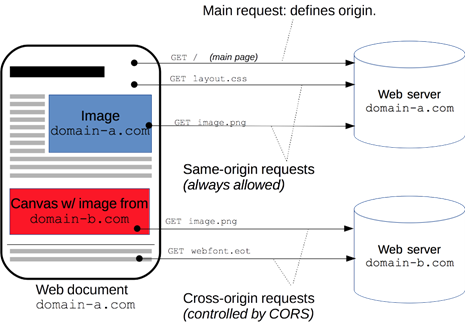
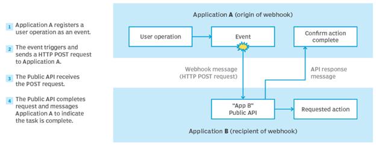
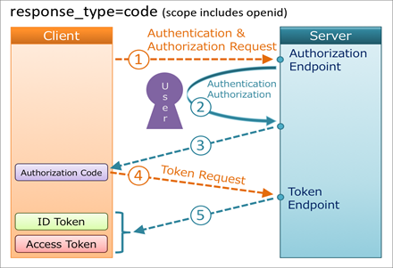
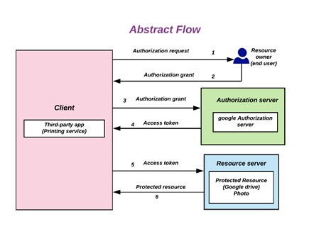
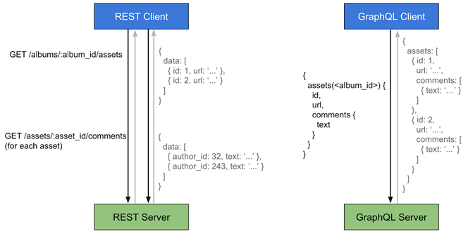
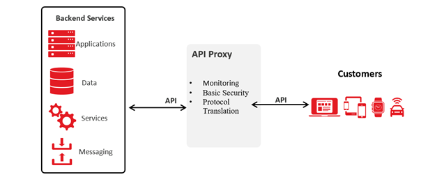
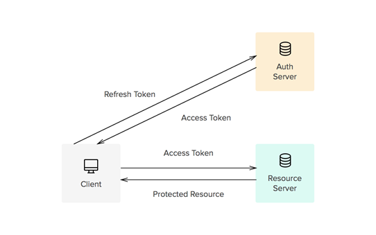
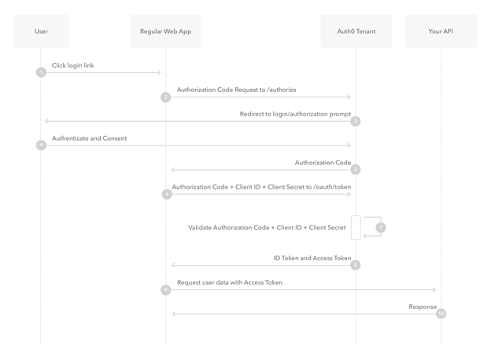
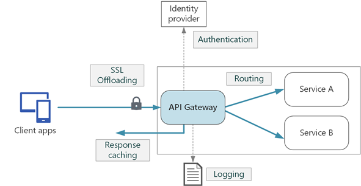

## REST APIs

#### Q1. Which REST constraint essentially prohibits the use of cookies?

- [x] Stateless
- [ ] Cacheable
- [ ] Layered System
- [ ] Uniform Interface

#### Explanation

A REST API is an application programming interface that conforms to the constraints of REST architectural style and allows for interaction with RESTful web services.

REST Principles:
1. Client-server
2. Stateless
3. Cacheable
4. Uniform interface
5. Layered system
6. Code on demand (optional)

Statelessness means that every HTTP request happens in complete isolation. When the client makes an HTTP request, it includes all information necessary for the server to fulfill the request.

The server never relies on information from previous requests from the client.

---

🎓 HTTP cookies (also called web cookies, Internet cookies, browser cookies, or simply cookies) are small blocks of data created by a web server while a user is browsing a website and placed on the user's computer or other device by the user's web browser.

#### Q2. Which URL pattern is recommended when working with one resource and a collection of resources?

- [ ] `/companies/{id} and/company`
- [ ] `/company/{id} and/companies`
- [x] `/companies/{id} and/companies`
- [ ] `/company/{id} and/company`

#### Explanation

Having a strong and consistent REST resource naming strategy – will prove one of the best design decisions in the long term.

When resources are named well, an API is intuitive and easy to use. If done poorly, that same API can feel difficult to use and understand.

The constraint of a uniform interface is partially addressed by the combination of URIs and HTTP verbs and using them in line with the standards and conventions.

A resource can be… 
- a singleton;
- a collection.

For example, “customers” is a collection resource and “customer” is a singleton resource.

We can identify “customers” collection resources using the URI:

```
/customers
```

We can identify a single “customer” resource using the URI:

```
/customers/{customerId}
```

#### Q3. When dealing with JSON web Tokens (JWTs), what is a claim?

- [x] `data in the token`
- [ ] `Ownership`
- [ ] `a permission`
- [ ] `and integer`

#### Explanation

JSON Web Token is a JSON encoded representation of a claim(s) that can be transferred between two parties. The claim is digitally signed by the issuer of the token, and the party receiving this token can later use this digital signature to prove the ownership of the claim.

Claims constitute the payload part of a JSON web token and represent a set of information exchanged between two parties.

JWTs can be broken down into three parts:

1. Header;
2. Payload;
3. Signature.

Each part is separated from the other by dot (.), and will follow the below structure:

```
Header.Payload.Signature
```

##### 1. Header

The header typically consists of two parts:

1. The type of the token, which is JWT;
2. The signing algorithm being used, such as HMAC SHA256 or RSA.

For example:

```json
{
  "alg": "HS256",
  "typ": "JWT"
}
```

Then, this JSON is Base64Url encoded to form the first part of the JWT.

##### 2. Payload

The second part of the token is the payload, which contains the claims. Claims are statements about an entity (typically, the user) and additional data.

There are three types of claims:

1. Registered claims,
2. Public claims,
3. Private claims.

An example payload could be:

```json
{
  "sub": "1234567890",
  "name": "John Doe",
  "admin": true
}
```

##### 3. Signature

To create the signature part you have to take the encoded header, the encoded payload, a secret, the algorithm specified in the header, and sign that.

For example if you want to use the HMAC SHA256 algorithm, the signature will be created in the following way:

```
HMACSHA256(
  base64UrlEncode(header) + "." +
  base64UrlEncode(payload),
  secret)
```

##### 4. Putting all together

The output is three Base64-URL strings separated by dots that can be easily passed in HTML and HTTP environments, while being more compact when compared to XML-based standards such as SAML.

The following shows a JWT that has the previous header and payload encoded, and it is signed with a secret.


#### Q4. Which REST constraint specifies that knowledge and understanding obtained from one component of the API should be generally applicable elsewhere in the API?

- [x] `Uniform Interface`
- [ ] `Client-Server`
- [ ] `Stateless`
- [ ] `Chacheable`

#### Explanation

A REST API is an application programming interface that conforms to the constraints of REST architectural style and allows for interaction with RESTful web services.

REST Principles:
1. Client-server
2. Stateless
3. Cacheable
4. Uniform interface
5. Layered system
6. Code on demand (optional)

The Uniform Interface constraint defines the interface between clients and servers.

By applying the software engineering principle of generality to the component interface, the overall system architecture is simplified and the visibility of interactions is improved.

In order to obtain a uniform interface, multiple architectural constraints are needed to guide the behavior of components. REST is defined by four interface constraints:

1. Identification of resources;
2. Manipulation of resources through representations;
3. Self-descriptive messages;
4. Hypermedia as the engine of application state.

##### 1. Resource-Based

Individual resources are identified in requests using URIs as resource identifiers. The resources themselves are conceptually separate from the representations that are returned to the client.

For example, the server doesn't send its database, but rather, some HTML, XML or JSON that represents some database records expressed.

##### 2. Actions on Resources Through Representations

When a client gets a representation of a resource, including any metadata attached, it has enough information to customize or delete the resource on the server, if it has permission to do so.

##### 3. Self-descriptive Messages

Each message includes precise information that describes how to process it. The responses also clearly indicate their cache-ability.

##### 4. Hypermedia as the Engine of Application State

Clients deliver the state via body contents, query-string parameters, request headers and the requested URI.

Services deliver state to clients via body content, response codes, and response headers.

#### Q5. What would you enable to allow a browser on another site to make an AJAX request to your API?

- [ ] `HTTP`
- [ ] `REST`
- [ ] `OPTIONS`
- [x] `CORS`

#### Explanation

AJAX means the interaction between client and server that enables us to partially update our web applications asynchronously.

When the Ajax interaction is complete, JavaScript updates the HTML source of the page so the changes are made immediately without requiring a page refresh.


CORS (Cross-origin resource sharing) is a mechanism that allows restricted resources on a web page to be requested from another domain outside the domain from which the first resource was served.



A web page may freely embed cross-origin images, stylesheets, scripts, iframes, and videos. Certain "cross-domain" requests, notably Ajax requests, are forbidden by default by the same-origin security policy.

CORS defines a way in which a browser and server can interact to determine whether it is safe to allow the cross-origin request. It allows for more freedom and functionality than purely same-origin requests, but is more secure than simply allowing all cross-origin requests.

#### Q6. APIs commonly use webhooks to **\_**.

- [x] `notify other systems of an event`
- [ ] `catch error faster`
- [ ] `improve error logging`
- [ ] `log additional data`

#### Explanation

A Webhook (also called a web callback or HTTP push API) is a way for an app to provide other applications with real-time information.

A webhook delivers data to other applications as it happens, meaning you get data immediately.



Webhooks are sometimes referred to as “Reverse APIs,” as they give you what amounts to an API spec, and you must design an API for the webhook to use. The webhook will make an HTTP request to your app (typically a POST), and you will then be charged with interpreting it.

##### Consuming a Webhook

The first step in consuming a webhook is giving the webhook provider a URL to deliver requests to. This is most often done through a backend panel or an API. This means that you also need to set up a URL in your app that’s accessible from the public web.

The majority of webhooks will POST data to you in one of two ways:

1. as JSON or XML to be interpreted,
2. as a form data (application/x-www-form-urlencoded or multipart/form-data).

Your provider will tell you how they deliver it (or even give you a choice in the matter). Both of these are fairly easy to interpret, and most web frameworks will do the work for you. If they don’t, you may need to call on a function or two.

#### Q7. What is the underlying goal of all APIs?

- [ ] `to add new technologies to an organization's infrastructure.`
- [x] `to share features and functionality with other system.`
- [ ] `to move infrastructure to the cloud.`
- [ ] `to appease the latest digital transformation effort.`

#### Explanation

API is an acronym that stands for “application programming interface,” and it allows apps to send information between each other.

While there are numerous protocols and technologies involved, the underlying purpose of APIs is always the same: to let one piece of software communicate with another.

#### Q8. Which is a common command-line tool for using or exploring an API?

- [ ] `bash`
- [x] `curl`
- [ ] `ssh`
- [ ] `powerShell`

#### Explanation

`curl` is a command line tool to transfer data to or from a server, using any of the supported protocols (HTTP, FTP, IMAP, POP3, SCP, SFTP, SMTP, TFTP, TELNET, LDAP or FILE).

This tool is preferred for automation, since it is designed to work without user interaction. curl can transfer multiple files at once.

Syntax:

```
curl [options] [URL...]
```

URL: The most basic use of curl is typing the command followed by the URL.

```
curl https://www.geeksforgeeks.org
```

Example with  “-o” options (saves the downloaded file on the local machine with the name provided in the parameters):

```
curl -o hello.zip ftp://speedtest.tele2.net/1MB.zip
```

#### Q9. What is the modern specification for describing an API?

- [x] `OpenAPI (Swagger)`
- [ ] `WADL`
- [ ] `WSDL`
- [ ] `OAuth`

#### Explanation

The OpenAPI Specification defines a standard, language-agnostic interface to RESTful APIs which allows both humans and computers to discover and understand the capabilities of the service without access to source code, documentation, or through network traffic inspection.

When The OpenAPI Specification properly defined, a consumer can understand and interact with the remote service with a minimal amount of implementation logic.

Swagger is a set of rules (in other words, a specification) for a format describing REST APIs. As a result, it can be used to share documentation among product managers, testers and developers, but can also be used by various tools to automate API-related processes

#### Q10. Which HTTP verb is normally used to update or create a resource in an API?

- [ ] `SUBMIT`
- [ ] `WRITE`
- [x] `POST`
- [ ] `CREATE`

#### Explanation

Use `POST` APIs to create new subordinate resources, e.g., a file is subordinate to a directory containing it or a row is subordinate to a database table.

When talking strictly in terms of REST, `POST` methods are used to create a new resource into the collection of resources.

HTTP response code:

1. Response code 201 “Created” – Ideally is used if a resource has been created on the origin server and contains an entity which describes the status of the request and refers to the new resource, and a Location header.
2. Response code 200 “OK” or 204 “No Content” is used when the action performed by the POST method might not result in a resource that can be identified by a URI.
 
☝🏼 **Important**: Please note that `POST` is neither safe nor idempotent, and invoking two identical POST requests will result in two different resources containing the same information except resource ids.

Example request URIs:

- HTTP POST http://www.appdomain.com/users 
- HTTP POST http://www.appdomain.com/users/123/accounts

#### Q11. What is one benefit of server-side caching in APIs?

- [ ] `Mobile app work better.`
- [ ] `It improves uptime.`
- [ ] `It offers better security.`
- [x] `It reduce load on servers.`

#### Explanation

A REST API is an application programming interface that conforms to the constraints of REST architectural style and allows for interaction with RESTful web services.

REST Principles:

1. Client-server
2. Stateless
3. Cacheable
4. Uniform interface
5. Layered system
6. Code on demand (optional)

Cache constraints require that the data within a response to a request be implicitly or explicitly labeled as cacheable or non-cacheable. If a response is cacheable, then a client cache is given the right to reuse that response data for later, equivalent requests.

For example, if you use server-side caching, the average latency for a transactional workload can be reduced by half.

#### Q12. Your API resource does not allow deletion, and a client application attempted to delete the resource. What HTTP response code should you return?

- [ ] `409 Conflict`
- [ ] `400 Bad Request`
- [ ] `406 Not Acceptable`
- [x] `405 Method Not Allowed`

#### Explanation

`HTTP 405 “Method Not Allowed”` code is an HTTP response status code indicating that the specified request HTTP method was received and recognized by the server, but the server has rejected that particular method for the requested resource.

---

🎓 `HTTP 406 “Not Acceptable”` code is an HTTP response status code indicating that the client has requested a response using `Accept-` headers that the server is unable to fulfill.

This status code indicates that the user agent (the web browser, in most cases) has requested a valid resource, however the request included a special `Accept-` header that indicates to the server a valid response can only contain certain types of information.

For example, the user agent may be localized to a particular locale or language that the server can't provide. A user agent may use the `Accept-Language` request header to specify a valid language of French (`Accept-Language: fr`), but if the server cannot serve a response in French, a `HTTP 406 “Not Acceptable”` code may be the only proper response.

🎓 `HTTP 409 “Conflict”` code is an HTTP response status code indicating that the request could not be completed due to a conflict with the current state of the target resource. This code is used in situations where the user might be able to resolve the conflict and resubmit the request.

Conflicts are most likely to occur in response to a PUT request. For example, if versioning were being used and the representation being PUT included changes to a resource that conflict with those made by an earlier (third-party) request, the origin server might use a `HTTP 409 “Conflict”` response to indicate that it can't complete the request.

In this case, the response representation would likely contain information useful for merging the differences based on the revision history.

🎓 `HTTP 400 “Bad Request”` is an HTTP response status code that indicates that the server was unable to process the request sent by the client due to invalid syntax.

#### Q13. What is OpenID Connect?

- [x] `an identify layer on top of OAuth 2.0`
- [ ] `the new name for SAML 3.0`
- [ ] `a modern replacement for API keys`
- [ ] `an SSO competitor for OAuth 2.0`

#### Explanation

OpenID Connect is an open authentication protocol that profiles and extends OAuth 2.0 to add an identity layer.

OpenID Connect allows clients to confirm an end user's identity using authentication by an authorization server.



---

🎓 The OAuth 2.0 authorization framework enables a third-party application to obtain limited access to an HTTP service, either on behalf of a resource owner by orchestrating an approval interaction between the resource owner and the HTTP service, or by allowing the third-party application to obtain access on its own behalf. 

In other words, the OAuth 2.0 provides consented access and restricts actions of what the client app can perform on resources on behalf of the user, without ever sharing the user's credentials.



#### Q14. What is one benefit of GraphQl over REST approaches?

- [x] `flexible querying/responses`
- [ ] `more stable APIs`
- [ ] `compatible with more gateways`
- [ ] `more secure by default`

#### Explanation

GraphQL is a query language for APIs and a runtime for fulfilling those queries with your existing data.

GraphQL provides a complete and understandable description of the data in your API, gives clients the power to ask for exactly what they need and nothing more, makes it easier to evolve APIs over time, and enables powerful developer tools.

Send a GraphQL query to your API and get exactly what you need, nothing more and nothing less. GraphQL queries always return predictable results. Apps using GraphQL are fast and stable because they control the data they get, not the server.



#### Q15. Which REST constraint specifies that there should be no shared context?

- [x] `Stateless`
- [ ] `Client-Server`
- [ ] `Uniform Interface`
- [ ] `Cacheable`

#### Explanation

A REST API is an application programming interface that conforms to the constraints of REST architectural style and allows for interaction with RESTful web services.

REST Principles:
1.Client-server
2. Stateless
3. Cacheable
4. Uniform interface
5. Layered system
6. Code on demand (optional)

The Statelessness constraint states that a RESTful Web Service should not keep a client state on the server.It is the responsibility of the client to pass its context to the server and then the server can store this context to process the client's further request.

#### Q16. What purpose does a User-Agent serve?

- [ ] `It identifies the user ID.`
- [x] `It identifies the client application or SDK.`
- [ ] `It identifies if the API should expect a user authentication.`
- [ ] `It identifies if the API should accept microservice traffic.`

#### Explanation

A user agent is any software that retrieves and presents Web content for end users or is implemented using Web technologies. User agents include Web browsers, media players, and plug-ins that help in retrieving, rendering and interacting with Web content.

The family of user agents also includes operating system shells, consumer electronics with Web-widgets, and stand-alone applications or embedded applications whose user interface is implemented as a combination of Web technologies.

#### Q17. If you were to add versioning by using the "Accept" and "Content-Type" header, what would be the correct format of the header value?

- [ ] `application/json`
- [ ] `application/json_version2`
- [ ] `text/html`
- [x] `application/vnd.myapp.v2+json`

#### Explanation

The `Accept` request HTTP header indicates which content types, expressed as MIME types, the client is able to understand.

The server uses content negotiation to select one of the proposals and informs the client of the choice with the `Content-Type` response header.

Syntax:

```htmlAccept: <MIME_type>/<MIME_subtype>
Accept: <MIME_type>/*
Accept: */*
```

Example with multiple types, weighted with the quality value syntax:

```htmlAccept: text/html, application/xhtml+xml, application/xml;q=0.9, image/webp, */*;q=0.8
```

---

API versioning is the practice of transparently managing changes to your API. Versioning is effective communication around changes to your API,
so consumers know what to expect from it. You are delivering data to the public in some fashion, and you need to communicate when you change the way that data is delivered.

Four REST API Versioning Strategies:

1. Versioning through URI Path
2. Versioning through query parameters
3. Versioning through custom headers
4. Versioning through content negotiation (the `Accept` header)

##### Versioning through content negotiation

Versioning through content negotiation allows us to version a single resource representation instead of versioning the entire API which gives us a more granular control over versioning. 
It creates a smaller footprint in the code base as we don’t have to fork the entire application when creating a new version.

Another advantage of this approach is that it doesn't require implementing URI routing rules introduced by versioning through the URI path.

One of the drawbacks of this approach is that it is less accessible than URI-versioned APIs:
Requiring HTTP headers with media types makes it more difficult to test and explore the API using a browser.

```bash
curl -H "Accept: application/vnd.xm.device+json; version=1"
https://www.example.com/api/products
```

- **Pros**: Allows us to version a single resource representation instead of versioning the entire API, which gives us a more granular control over versioning. Creates a smaller footprint. Doesn't require implementing URI routing rules.
- **Cons**: Requiring HTTP headers with media types makes it more difficult to test and explore the API using a browser

#### Q18. What is one benefit that OAuth provides over an API key approach?

- [ ] `A token is encrypted.`
- [ ] `A token is encoded.`
- [x] `A token is scoped to the use case.`
- [ ] `A token can be shared between systems.`

#### Explanation

An `API key` is a code used to identify and authenticate an application or user. API keys also act as a unique identifier and provide a secret token for authentication purposes.

Introducing API keys is an easy thing. Just issue a “secret” or “phrase” between you and the consumer. Every time the API is called this Key must be present and the API proxy will be able to verify it. This works well for most use cases; however, some best practices need to be considered.

For example, you should avoid putting the API Key inside the URL as a “query parameter” because proxies and all involved systems are likely to store it into their logs. Better places are Header or Payload. The header has turned out to be the most practical place.

While the Secret Key is always traveling with your request, OAuth provides an alternative solution.


OAuth 2.0 is the industry-standard protocol for authorization. OAuth 2.0 focuses on client developer simplicity while providing specific authorization flows for web applications, desktop applications, mobile phones, and living room devices.

☝🏼 **Note**: OAuth is basically a way to separate the Authentication Process from the Access to the Resource and therefore limit the exposure of the credentials. Delegation is the secret so instead of sending the credentials, the user retrieves a token that will then be used to access the resource.

One scenario you see often is Social Login where you use GitHub, LinkedIn, Google or Facebook to log into a Web app. You might have recognized the Consent Screen that usually talks about which data the Web app would like to read from your Git or Facebook account. If you accept, then you “Grant Access” and the resource can be opened on behalf. This is usually known as “3-legged OAuth Flow” or “Authorization Code Grant Flow.”


#### Q19. The ability to execute the same API request over and over again without changing the resource's state is an example of \_.

- [ ] `stateless architecture`
- [x] `idempotency`
- [ ] `a uniform interface`
- [ ] `cacheability

#### Explanation

From a RESTful service standpoint, for an operation (or service call) to be idempotent, clients can make that same call repeatedly while producing the same result.

In other words, making multiple identical requests has the same effect as making a single request.

HTTP methods include:

| Method  | Description                                   | Idempotent or not                     |
|---------|-----------------------------------------------|---------------------------------------|
| POST    | Creates a new resource.                       | is not idempotent and it is not safe. |
| GET     | Retrieves a resource.                         | is idempotent and it is safe.         |
| HEAD    | Retrieves a resource (without response body). | is idempotent and it is safe          |
| PUT     | Updates/replaces a resource.                  | is idempotent but it is not safe      |
| PATCH   | Partially updates a resource.                 | is not idempotent and it is not safe. |
| DELETE  | Deletes a resource.                           | is idempotent but it is not safe.     |
| TRACE   | Performs a loop-back test.                    | is idempotent but it is not safe.     |

---

##### ❓ Why DELETE method is idempotent?

Note that while idempotent operations produce the same result on the server (no side effects), the response itself may not be the same (e.g. a resource's state may change between requests).
The PUT and DELETE methods are defined to be idempotent.

##### ❓ Why PUT method is idempotent and POST is not?

The PUT method is idempotent. So if we retry a request multiple times, that should be equivalent to a single request invocation.
POST is NOT idempotent. So if we retry the request N times, we will end up having N resources with N different URIs created on the server.

##### ❓ Why PATCH method isn’t  idempotent?

A PATCH is not necessarily idempotent, although it can be. Contrast this with PUT ; which is always idempotent.
The word "idempotent" means that any number of repeated, identical requests will leave the resource in the same state.

#### Q20. What component can you use to wrap legacy architectures or protocols into a REST interface for easier consumption and integration?

- [x] `API proxy`
- [ ] `API gateway`
- [ ] `OpenAPI`
- [ ] `OAuth authorization server`

#### Explanation

A proxy is something that acts on behalf of something else. Sitting between your application and your backend, API proxies provide an interface to developers for accessing backend services.

First, let's define some terms we'll be using:

1. **API**: Application Programming Interface, an interface that allows different programs to interact with each other.
2. **Backend services**: The servers, APIs, or databases that make up the parts of the architecture that your applications rely on.
3. **Consumers**: The applications that interact with your backend. Used interchangeably with "frontends" in this article. Consumers can include mobile, web, or desktop applications as well as anyone or anything making API calls to your services.
4. **Shim**: A shim is a layer of code which helps provide compatibility between different interfaces or APIs.

An API proxy acts as an intermediary between a consumer and backend services. It can be a small shim, or a larger piece of code that handles data transformations, security, routing, traffic shaping and more. It can expose an interface customized for the consumer, and then makes the appropriate calls to the backend service(s) on behalf of the consumer.



Imagine you have a modern web application that needs to get information from a legacy backend that communicates in XML.

Instead of making your web application talk directly to that legacy backend using XML, you can create an API proxy which the web application communicates with in JSON format. The API proxy will then translate the request from the web application into the XML format that the legacy backend is expecting, and translate the response from the backend into the JSON format the web app is expecting.

#### Q21. What protection does a JSON Web Token (JWT) offer to mitigate tampering with its contents?

- [ ] `transport over SSL`
- [ ] `encrypted payload`
- [x] `a signature`
- [ ] `encoded payload`

#### Explanation

JSON Web Token is a JSON encoded representation of a claim(s) that can be transferred between two parties. The claim is digitally signed by the issuer of the token, and the party receiving this token can later use this digital signature to prove the ownership of the claim.

JWTs can be broken down into three parts:

1. header;
2. payload;
3. signature.

Each part is separated from the other by dot (.), and will follow the below structure:

```
Header.Payload.Signature
```

JSON Web Token is a JSON encoded representation of a claim(s) that can be transferred between two parties. The claim is digitally signed by the issuer of the token, and the party receiving this token can later use this digital signature to prove the ownership of the claim.

Claims constitute the payload part of a JSON web token and represent a set of information exchanged between two parties.

JWTs can be broken down into three parts:

1. Header;
2. Payload;
3. Signature.

Each part is separated from the other by dot (.), and will follow the below structure:

```
Header.Payload.Signature
```

##### 1. Header

The header typically consists of two parts:

1. The type of the token, which is JWT;
2. The signing algorithm being used, such as HMAC SHA256 or RSA.

For example:

```json
{
  "alg": "HS256",
  "typ": "JWT"
}
```

Then, this JSON is Base64Url encoded to form the first part of the JWT.

##### 2. Payload

The second part of the token is the payload, which contains the claims. Claims are statements about an entity (typically, the user) and additional data.

There are three types of claims:

1. Registered claims,
2. Public claims,
3. Private claims.

An example payload could be:

```json
{
  "sub": "1234567890",
  "name": "John Doe",
  "admin": true
}
```

##### 3. Signature

To create the signature part you have to take the encoded header, the encoded payload, a secret, the algorithm specified in the header, and sign that.

For example if you want to use the HMAC SHA256 algorithm, the signature will be created in the following way:

```
HMACSHA256(
  base64UrlEncode(header) + "." +
  base64UrlEncode(payload),
  secret)
```

##### 4. Putting all together

The output is three Base64-URL strings separated by dots that can be easily passed in HTML and HTTP environments, while being more compact when compared to XML-based standards such as SAML.

The following shows a JWT that has the previous header and payload encoded, and it is signed with a secret.


#### Q22. What OAuth term is used to represent permissions?

- [ ] `token`
- [x] `scope`
- [ ] `claim`
- [ ] `back channel`

#### Explanation

The OAuth 2.0 is a standard designed to allow a website or application to access resources hosted by other web apps on behalf of a user.


Scope is a mechanism in OAuth 2.0 to limit an application's access to a user's account. An application can request one or more scopes, this information is then presented to the user in the consent screen, and the access token issued to the application will be limited to the scopes granted.

The OAuth spec allows the authorization server or user to modify the scopes granted to the application compared to what is requested, although there are not many examples of services doing this in practice.

OAuth does not define any particular values for scopes, since it is highly dependent on the service's internal architecture and needs.

#### Q23. What additional type of token would you see when using OpenID Connect?

- [x] `ID token`
- [ ] `refresh token`
- [ ] `access token`
- [ ] `auth code token`

#### Explanation

OpenID Connect 1.0 is a simple identity layer on top of the OAuth 2.0 protocol. It allows Clients to verify the identity of the End-User based on the authentication performed by an Authorization Server, as well as to obtain basic profile information about the End-User in an interoperable and REST-like manner.


OpenID Connect allows clients of all types, including Web-based, mobile, and JavaScript clients, to request and receive information about authenticated sessions and end-users. The specification suite is extensible, allowing participants to use optional features such as encryption of identity data, discovery of OpenID Providers, and session management, when it makes sense for them.

##### ID Tokens

The core of OpenID Connect is based on a concept called “ID Tokens.” This is a new token type that the authorization server will return which encodes the user’s authentication information.

In contrast to access tokens, which are only intended to be understood by the resource server, ID tokens are intended to be understood by the third-party application. When the client makes an OpenID Connect request, it can request an ID token along with an access token.

OpenID Connect’s ID Tokens take the form of a JWT, which is a JSON payload that is signed with the private key of the issuer, and can be parsed and verified by the application.

Inside the JWT are a handful of defined property names that provide information to the application. They are represented with shorthand names to keep the overall size of the JWT small.

This includes…

- `sub` (short for “subject”) is a unique identifier for the user;
- `iss` (short for “issued the token“) is the identifier for the server;
- `aud` (short for “audience”) is the identifier for the client that requested this token,
… along with a handful of properties such as the lifetime of the token, and how long ago the user was presented with a primary authentication prompt.

```json
{
  "iss": "https://server.example.com",
  "sub": "24400320",
  "aud": "s6BhdRkqt3",
  "nonce": "n-0S6_WzA2Mj",
  "exp": 1311281970,
  "iat": 1311280970,
  "auth_time": 1311280969,
  "acr": "urn:mace:incommon:iap:silver"
}
```

Standardizing the endpoints, names, and metadata helps reduce implementation errors, and allows shared knowledge to be passed around about the security considerations of each.

#### Q24. What should you add to a Cache-Control response header to specify that a response should not be stored in an intermediary cache?

- [ ] `no-proxy`
- [ ] `client-only`
- [ ] `restricted`
- [x] `private`

#### Explanation

The `Cache-Control` HTTP header field holds directives — in both requests and responses — that control caching in browsers and shared caches.

The `private` response directive indicates that the response can be stored only in a private cache e.g. local caches in browsers.

```htmlCache-Control: private
```

You should add the `private` directive for user-personalized content — in particular, responses received after login, and sessions managed via cookies.

If you forget to add `private` to a response with personalized content, then that response can be stored in a shared cache and end up being used by multiple users, which can cause personal information to leak.

#### Q25. Which OAuth grant type can support a refresh token?

- [x] `Authorization Code Grant`
- [ ] `Client Credentials Grant`
- [ ] `Implicit Grant`
- [ ] `Authentication Grant`

#### Explanation

A refresh token is a special kind of token used to obtain a renewed access token. You can request new access tokens until the refresh token is on the DenyList. Applications must store refresh tokens securely because they essentially allow a user to remain authenticated forever.

Auth0 issues an access token or an ID token in response to an authentication request. You can use access tokens to make authenticated calls to a secured API, while the ID token contains user profile attributes represented in the form of claims.

Both are JSON web tokens and therefore have expiration dates indicated using the `exp` claim, as well as security measures, like signatures. Typically, a user needs a new access token when gaining access to a resource for the first time, or after the previous access token granted to them expires.



---

🎓 The `Authorization Code grant type` is used by confidential and public clients to exchange an authorization code for an access token.

The Authorization Code grant type is probably the most common of the OAuth 2.0 grant types that you’ll encounter. It is used by both web apps and native apps to get an access token after a user authorizes an app.

##### The Authorization Code Flow

The Authorization Code grant type is used by web and mobile apps. It differs from most of the other grant types by first requiring the app launch a browser to begin the flow.

At a high level, the flow has the following steps:

1. The application opens a browser to send the user to the OAuth server
2. The user sees the authorization prompt and approves the app’s request
3. The user is redirected back to the application with an authorization code in the query string
4. The application exchanges the authorization code for Access Token



##### Get the User’s Permission

OAuth is all about enabling users to grant limited access to applications. The application first needs to decide which permissions it is requesting, then send the user to a browser to get their permission.

To begin the authorization flow, the application constructs a URL like the following and opens a browser to that URL.

```htmlhttps://authorization-server.com/auth
?response_type=code
&client_id=29352915982374239857
&redirect_uri=https%3A%2F%2Fexample-app.com%2Fcallback
&scope=create+delete
&state=xcoiv98y2kd22vusuye3kch
```

Here’s each query parameter explained:

1. `response_type=code` – This tells the authorization server that the application is initiating the authorization code flow.
2. `client_id` – The public identifier for the application, obtained when the developer first registered the application.
3. `redirect_uri` – Tells the authorization server where to send the user back to after they approve the request.
4. `scope` – One or more space-separated strings indicating which permissions the application is requesting. The specific OAuth API you’re using will define the scopes that it supports.
5. `state` – The application generates a random string and includes it in the request. It should then check that the same value is returned after the user authorizes the app. This is used to prevent CSRF attacks.

When the user visits this URL, the authorization server will present them with a prompt asking if they would like to authorize this application’s request.

##### Exchange the Authorization Code for Access Token

We’re about ready to wrap up the flow. Now that the application has the authorization code, it can use that to get an access token.

The application makes a POST request to the service’s token endpoint with the following parameters:

1. `grant_type=authorization_code` - This tells the token endpoint that the application is using the Authorization Code grant type.
2. `code` - The application includes the authorization code it was given in the redirect.
3. `redirect_uri` - The same redirect URI that was used when requesting the code. Some APIs don’t require this parameter, so you’ll need to double-check the documentation of the particular API you’re accessing.
4. `client_id` - The application’s client ID.
5. `client_secret` - The application’s client secret. This ensures that the request to get the access token is made only from the application, and not from a potential attacker that may have intercepted the authorization code.

The token endpoint will verify all the parameters in the request, ensuring the code hasn't expired and that the client ID and secret match. If everything checks out, it will generate an access token and return it in the response!

```http request
HTTP/1.1 200 OK
Content-Type: application/json
Cache-Control: no-store
Pragma: no-cache

{
"access_token":"MTQ0NjJkZmQ5OTM2NDE1ZTZjNGZmZjI3",
"token_type":"bearer",
"expires_in":3600,
"refresh_token":"IwOGYzYTlmM2YxOTQ5MGE3YmNmMDFkNTVk",
"scope":"create delete"
}
```

#### Q26. Using OAuth, what scope would you request for write access to the API?

- [ ] `It varies from API to API.`
- [x] `admin`
- [ ] `write`
- [ ] `read-write`

#### Q27. Which property would you use to include subresources directly into a JSON document?

- [ ] `_embedded`
- [ ] `resources`
- [x] `subresources`
- [ ] `_links`

#### Q28. What is the best way to track SDK and version usage?

- [x] `tracking downloads`
- [ ] `Accept headers`
- [ ] `user agents`
- [ ] `polling users`

#### Explanation

To find out which SDKs are inside a mobile app, you can rely on app intelligence tools such as App Annie, Apptopia or 42 Matters. They provide a great way to see at a given time, how many apps use a certain SDK, be it for ad monetization, attribution, analytics, CRM, user support, etc.

---

🎓 SDK stands for Software Development Kit or devkit for short. It’s a set of software tools and programs used by developers to create applications for specific platforms.

#### Q29. Which REST constraint allows for the presence of caching, routing, and other systems between the client and server?

- [ ] `Layered System`
- [ ] `Stateless`
- [x] `Client-Server`
- [ ] `Cacheable`

#### Explanation

A REST API is an application programming interface that conforms to the constraints of REST architectural style and allows for interaction with RESTful web services.

REST Principles:
1. Client-server
2. Stateless
3. Cacheable
4. Uniform interface
5. Layered system
6. Code on demand (optional)

The Client-server constraint essentially means that client applications and server applications MUST be able to evolve separately without any dependency on each other. A client should know only resource URIs, and that's all.

By separating the user interface concerns from the data storage concerns, we improve the portability of the user interface across multiple platforms and improve scalability by simplifying the server components.

#### Q30. Which content is best to include in your documentation?

- [ ] `your tech stack`
- [ ] `reasoning for your naming schema`
- [ ] `your mission statement`
- [x] `sample code`

#### Q31. What metric tracks overall availability for your API?

- [ ] `Response Time`
- [ ] `Time to First Hello World`
- [ ] `TTL`
- [x] `Uptime`

#### Explanation

Uptime is the gold standard for measuring the availability of a service. Many enterprise agreements include an SLA (Service Level Agreement), and uptime is usually rolled up into that. Many times, you’ll hear terms like triple 9’s or four 9’s which is a measure of how much uptime vs downtime there is per year.

|      Availability %     | Downtime per year |
|:-----------------------:|:-----------------:|
| 99% –  “two nines”      |     3.65 days     |
| 99.9% –  “three nines”  |     8.77 hours    |
| 99.99% –  “four nines”  |   52.60 minutes   |
| 99.999% –  “five nines” |    5.26 minutes   |

#### Q32. What is the recommended method and URL pattern for retrieving a specific user?

- [ ] `GET /user/{id}`
- [x] `GET /users/{id}`
- [ ] `GET /user?id={id}`
- [ ] `GET /users?id={id}`

#### Explanation

Having a strong and consistent REST resource naming strategy – will prove one of the best design decisions in the long term.

REST APIs use URIs to address resources. REST API designers should create URIs that convey a REST API’s resource model to its potential client developers.

When resources are named well, an API is intuitive and easy to use. If done poorly, that same API can feel difficult to use and understand.

The constraint of a uniform interface is partially addressed by the combination of URIs and HTTP verbs and using them in line with the standards and conventions.

A resource can be… 

- a singleton;
- a collection.

For example, “customers” is a collection resource and “customer” is a singleton resource.

We can identify “customers” collection resources using the URI:

```
/customers
```

We can identify a single “customer” resource using the URI:

```
/customers/{customerId}
```

#### Q33. What is the purpose of a link relation?

- [ ] `to describe relationships between resources or actions`
- [ ] `to describe subresources related to the current one`
- [x] `to link two resources together`
- [ ] `to describe a resource and its purpose`

#### Explanation

A link relation is a descriptive attribute attached to a hyperlink in order to define the type of the link, or the relationship between the source and destination resources.

Standardized link relations are one of the foundations of HATEOAS as they allow the user agent to understand the meaning of the available state transitions in a REST system.

Link objects are used to express structural relationships in the API. So for example, the top-level collections, singleton resources and sub-collections (including actions) are all referenced using link objects. Object links are used to express semantic relationships from the application data model.

----

🎓 HATEOAS stands for Hypertext As The Engine Of Application State. It means that hypertext should be used to find your way through the API.

The phrase "hypermedia" can be defined as any content which holds connections for various other types of media like images, text, video clips as well as movies. REST provides an architectural approach that will allow you to use hypermedia links on those media contents so that your clients can navigate to all suitable resources at runtime as they traverse through these hypermedia links. The concept is the same for web page navigation through exact hyperlinks for reaching the desired resources.

#### Q34. When building SDKs, which languages should you support?

- [ ] Java, Javascript, and .NET
- [ ] and you can support
- [ ] PHP, Python, and Go
- [x] the languages that your target users use

#### Q35. Which property would you use to include references to other resources in a JSON document?

- [x] `resources`
- [ ] `_embedded`
- [ ] `subresources`
- [ ] `_links`

#### Explanation

There is no JSON standard for hypertext references, so we have to define our own technique. We have a really simple and concise implementation.

Here is an example of how an account resource is returned by the Stormpath API:

```http request
HTTP/1.1 200 OK
Content-Type: application/json;charset=UTF-8
 
{
  "href" : "https://api.stormpath.com/v1/accounts/cJoiwcorTTmkDDBsf02AbA",
  "username" : "jlpicard",
  "email" : "capt@enterprise.com",
  "givenName" : "Jean-Luc",
  "middleName" : "",
  "surname" : "Picard",
  "status" : "enabled",
  "directory" : {
    "href" : "https://api.stormpath.com/v1/directories/WpM9nyZ2TbaEzfbRvLk9KA"
  },
  …
}
```

This Account resource and every other JSON resource will always have an `href` property, which is the fully qualified canonical URL where that resource resides. Whenever you see an `href` property, you know you can access that resource by executing a GET request to the resource’s URL.

These holds true for resource references too. Notice the `directory` property in the above example. The `directory` property is a complex object that itself has an `href` attribute as well. Because the `directory` object has an `href` property, we know it is a resource itself, and the fact that a href is available means we have a direct reference or ‘link’ to that resource.

#### Q36. What is OAuth?

- [x] an authorization framework for granted delegated access
- [ ] an approach to single sign-on for APIs
- [ ] a method for API authentication
- [ ] HTTP Basic Authentication 2.0

#### Explanation

OAuth is an open-standard authorization protocol or framework that provides applications the ability for “secure designated access”.

For example, you can tell Facebook that it’s OK for ESPN.com to access your profile or post updates to your timeline without having to give ESPN your Facebook password. This minimizes risk in a major way: In the event ESPN suffers a breach, your Facebook password remains safe.

OAuth doesn't share password data but instead uses authorization tokens to prove an identity between consumers and service providers. OAuth is an authentication protocol that allows you to approve one application interacting with another on your behalf without giving away your password.

#### Q37. What should your API documentation describe?

- [ ] JSON
- [ ] HTTP
- [x] common use cases
- [ ] your tech stack

#### Q38. What is the purpose of an OAuth refresh token?

- [ ] to share user profile information
- [ ] to update an API configuration
- [ ] to keep a web session active
- [x] to retrieve Access Token

#### Explanation

A refresh token is a special kind of token used to obtain a renewed access token. You can request new access tokens until the refresh token is on the DenyList. Applications must store refresh tokens securely because they essentially allow a user to remain authenticated forever.

Auth0 issues an access token or an ID token in response to an authentication request. You can use access tokens to make authenticated calls to a secured API, while the ID token contains user profile attributes represented in the form of claims.

Both are JSON web tokens and therefore have expiration dates indicated using the `exp` claim, as well as security measures, like signatures. Typically, a user needs a new access token when gaining access to a resource for the first time, or after the previous access token granted to them expires.


#### Q39. What is Time to First Hello World?

- [x] how long it takes for a developer to do something with your API
- [ ] how long it takes to start a new programming language
- [ ] how long it takes to install your SDK
- [ ] how long it takes to read your documentation

#### Explanation

What does Time To First Hello World mean exactly? Those who are developers understand this Hello World expression and this phrase is used when you are testing the development of something for the first time.

For example, you installed a framework for a programming language and want to know if everything is OK.

But why is the time for this so critical? For context, the Hello World expression means more than the basic meaning, it means the time for the developer to start building an application. It could be minutes, hours or days.

#### Q40. Which response header tells the client and intermediaries that the response is not to be cached anywhere?

- [ ] Cache-State: none
- [ ] Expires:-1
- [ ] Cache-Control: no-cache
- [x] Cache-Control: no-store

#### Explanation

The `Cache-Control` HTTP header field holds directives (instructions) — in both requests and responses — that control caching in browsers and shared caches (e.g. Proxies, CDNs).

In a nutshell, when someone visits a website, their browser will save certain resources, such as images and website data, in a store called the cache. When that user revisits the same website, cache-control sets the rules which determine whether that user will have those resources loaded from their local cache, or whether the browser will have to send a request to the server for fresh resources.

The `no-cache` response directive indicates that the response can be stored in caches, but must be validated with the origin server before each reuse — even when the cache is disconnected from the origin server.

```http request
Cache-Control: no-cache
```

If you want caches to always check for content updates while reusing stored content when it hasn't changed, no-cache is the directive to use. It does this by requiring caches to revalidate each request with the origin server.

☝ Note: The `no-cache` response  does not mean "don't cache". It's allows caches to store a response, but requires them to revalidate it before reuses. If the sense of "don't cache" that you want is actually "don't store", then `no-store` is the directive to use.

```http request
Cache-Control: no-store
```

#### Q41. What component hides the distinctions or boundaries between various microservices from end-client applications?

- [x] `API gateway`
- [ ] `API logging `
- [ ] `a layered system `
- [ ] `API proxy`

#### Explanation

An `API gateway` is an API management tool that sits between a client and a collection of backend services.

An API gateway acts as a reverse proxy to accept all API calls, aggregate the various services required to fulfill them, and return the appropriate result.



Most enterprise APIs are deployed via API gateways. It’s common for API gateways to handle common tasks that are used across a system of API services, such as user authentication, rate limiting, and statistics.

At its most basic, an API service accepts a remote request and returns a response. But real life is never that simple. Consider your various concerns when you host large-scale APIs.

1. You want to protect your APIs from overuse and abuse, so you use an authentication service and rate limiting.
2. You want to understand how people use your APIs, so you’ve added analytics and monitoring tools.
3. If you have monetized APIs, you’ll want to connect to a billing system.
4. You may have adopted a microservices' architecture, in which case a single request could require calls to dozens of distinct applications.
5. Over time, you’ll add some new API services and retire others, but your clients will still want to find all your services in the same place.

Your challenge is offering your clients a simple and dependable experience in the face of all this complexity. An API gateway is a way to decouple the client interface from your backend implementation. When a client makes a request, the API gateway breaks it into multiple requests, routes them to the right places, produces a response, and keeps track of everything.

---

##### ❓ Is API proxy the same as API gateway?

Both an API proxy and API gateway provide access to your backend services. An API gateway can even act as a simple API proxy. However, an API gateway has a more robust set of features — especially around security and monitoring — than an API proxy.

#### Q42. The textbook approach to api versioning is to use **\_**.

- [ ] `common knowledge`
- [ ] `URLs`
- [ ] `no versioning`
- [x] `the Accept header`

#### Explanation

API versioning is the practice of transparently managing changes to your API. Versioning is effective communication around changes to your API,
so consumers know what to expect from it. You are delivering data to the public in some fashion, and you need to communicate when you change the way that data is delivered.

Four REST API Versioning Strategies:

1. Versioning through URI Path
2. Versioning through query parameters
3. Versioning through custom headers
4. Versioning through content negotiation (the `Accept` header)

##### Versioning through content negotiation

Versioning through content negotiation allows us to version a single resource representation instead of versioning the entire API which gives us a more granular control over versioning.
It creates a smaller footprint in the code base as we don’t have to fork the entire application when creating a new version.

Another advantage of this approach is that it doesn't require implementing URI routing rules introduced by versioning through the URI path.

One of the drawbacks of this approach is that it is less accessible than URI-versioned APIs:
Requiring HTTP headers with media types makes it more difficult to test and explore the API using a browser.

```bash
curl -H "Accept: application/vnd.xm.device+json; version=1"
https://www.example.com/api/products
```

- **Pros**: Allows us to version a single resource representation instead of versioning the entire API, which gives us a more granular control over versioning. Creates a smaller footprint. Doesn't require implementing URI routing rules.
- **Cons**: Requiring HTTP headers with media types makes it more difficult to test and explore the API using a browser

#### Q43. Which is the most secure method to transmit an API key?

- [ ] `URL parameter`
- [x] `Authorization header`
- [ ] `Base64 encoding`
- [ ] `Basic Auth`

#### Explanation

An API key is a code used to identify and authenticate an application or user. API keys also act as a unique identifier and provide a secret token for authentication purposes.


Introducing API keys is an easy thing. Just issue a “secret” or “phrase” between you and the consumer. Every time the API is called this Key must be present and the API proxy will be able to verify it. This works well for most use cases; however, some best practices need to be considered.

For example, you should avoid putting the API Key inside the URL as a “query parameter” because proxies and all involved systems are likely to store it into their logs. Better places are Header or Payload. The header has turned out to be the most practical place.

While the Secret Key is always traveling with your request, OAuth provides an alternative solution.

---

The HTTP Authorization request header contains the credentials to authenticate a user agent with a server.

An API key is a token that a client provides when making API calls. With API key auth, you send a key-value pair to the API either in the request headers or query parameters. Some APIs use API keys for authorization.

The key as a request header:

```http request
X-API-Key: abcdefgh123456789
```

#### Q44. Within Oauth, what component validates the user's identity?

- [ ] `client`
- [ ] `not specified`
- [x] `authorization server`
- [ ] `resource server`

#### Explanation

The OAuth 2.0 is a standard designed to allow a website or application to access resources hosted by other web apps on behalf of a user.

The OAuth 2.0 authorization framework enables a third-party application to obtain limited access to an HTTP service, either on behalf of a resource owner by…

- orchestrating an approval interaction between the resource owner and the HTTP service or 
- allowing the third-party application to obtain access on its own behalf.

In other words, the OAuth 2.0 provides consented access and restricts actions of what the client app can perform on resources on behalf of the user, without ever sharing the user's credentials.


##### OAuth2.0 Roles

The idea of roles is part of the core specification of the OAuth2.0 authorization framework.

These define the essential components of an OAuth 2.0 system, and are as follows:  

1. `Resource Owner` is the user or system that owns the protected resources and can grant access to them.
2. `Client` is the system that requires access to the protected resources. To access resources, the Client must hold the appropriate Access Token.
3. `Authorization Server` is the server that receives requests from the Client for Access Tokens and issues them upon successful authentication and consent by the Resource Owner.  The Authorization Server exposes two endpoints:
 - the Authorization endpoint, which handles the interactive authentication and consent of the user;
 - the Token endpoint, which is involved in a machine to machine interaction.
4. `Resource Server` is a server that protects the user’s resources and receives access requests from the Client. It accepts and validates an Access Token from the Client and returns the appropriate resources to it.

#### Q45. API traffic that is entirely internal to your organization is normally called \_?

- [ ] `inbound traffic`
- [ ] `north-south traffic `
- [x] `internal traffic `
- [ ] `east-west traffic`

#### Explanation

An internal API is an interface that enables access to a company's backend information and application functionality for use by the organization's developers.

#### Q46. What is the best approach for requesting JSON instead of XML from an API?

- [ ] `Add .json to the URL.`
- [ ] `APIs do not use XML.`
- [ ] `Use the Content-Type header.`
- [x] `Use the Accept header.`

#### Explanation

The `Accept` request HTTP header indicates which content types, expressed as MIME types, the client is able to understand.

The server uses content negotiation to select one of the proposals and informs the client of the choice with the `Content-Type` response header. Browsers set required values for this header based on the context of the request.

For example, a browser uses different values in a request when fetching a CSS stylesheet, image, video, or a script.

```http request
Accept: <MIME_type>/<MIME_subtype>
Accept: <MIME_type>/*
Accept: */*

Accept: text/html, application/xhtml+xml, application/xml;q=0.9, image/webp, */*;q=0.8
```

#### Q47. When a user attempts to access a record that is not their own, which HTTP response code is the most appropriate?

- [ ] `HTTP 403 Forbidden`
- [ ] `HTTP 404 Not Found`
- [x] `HTTP 401 Unauthorized`
- [ ] `HTTP 405 Method Not Allowed`

#### Explanation

`HTTP 403 Forbidden` client error status response code indicates that the server understands the request but refuses to authorize it.

This status is similar to 401, but in this case, re-authenticating will make no difference. The access is permanently forbidden and tied to the application logic, such as insufficient rights to a resource.

**Note:** the automatic system for analyzing the correct answer gives a `HTTP 401 Unauthorized` result, but I disagree with that.

---

`HTTP 401 Unauthorized` client error status response code indicates that the client request has not been completed because it lacks valid authentication credentials for the requested resource.

`HTTP 404 Not Found` client error response code indicates that the server can't find the requested resource. Links that lead to a 404 page are often called broken or dead links and can be subject to link rot.

You can display a custom 404 page to be more helpful to a user and provide guidance on what to do next.

`HTTP 405 Method Not Allowed` code is an HTTP response status code indicating that the specified request HTTP method was received and recognized by the server, but the server has rejected that particular method for the requested resource.

The server must generate an "Allow" header field in a 405 response containing a list of the target resource's currently supported methods.

#### Q48. Which is a benefit of using an API gateway?

- [ ] `HTTP verbs`
- [ ] `JSON payloads`
- [ ] `HTTP response codes`
- [x] `rate limiting/throttling`

#### Explanation

An `API gateway` is an API management tool that sits between a client and a collection of backend services.

An API gateway acts as a reverse proxy to accept all API calls, aggregate the various services required to fulfill them, and return the appropriate result.


Most enterprise APIs are deployed via API gateways. It’s common for API gateways to handle common tasks that are used across a system of API services, such as user authentication, rate limiting, and statistics.

At its most basic, an API service accepts a remote request and returns a response. But real life is never that simple. Consider your various concerns when you host large-scale APIs.

1. You want to protect your APIs from overuse and abuse, so you use an authentication service and rate limiting.
2. You want to understand how people use your APIs, so you’ve added analytics and monitoring tools.
3. If you have monetized APIs, you’ll want to connect to a billing system.
4. You may have adopted a microservices' architecture, in which case a single request could require calls to dozens of distinct applications.
5. Over time, you’ll add some new API services and retire others, but your clients will still want to find all your services in the same place.

Your challenge is offering your clients a simple and dependable experience in the face of all this complexity. An API gateway is a way to decouple the client interface from your backend implementation. When a client makes a request, the API gateway breaks it into multiple requests, routes them to the right places, produces a response, and keeps track of everything.

#### Q49. API testing must be treated as **\_**?

- [ ] `red team testing`
- [ ] `white box testing`
- [ ] `blue box testing`
- [x] `black box testing`

#### Explanation

An application program interface is a set of rules specifying interaction protocols between software “boxes.”

API testing is a form of black-box testing — i.e., interacting with a function without knowing what's going on inside, through feeding inputs and evaluating outputs.

#### Q50. Which HTTP verb is used in a CORS preflight request?

- [ ] `PUT`
- [ ] `POST`
- [ ] `GET`
- [x] `OPTIONS`

#### Explanation

A CORS preflight request (Cross-Origin Resource Sharing) is a request that checks to see if the CORS protocol is understood and a server is aware using specific methods and headers.

It is an OPTIONS request, using three HTTP request headers:

1. Access-Control-Request-Method;
2. Access-Control-Request-Headers;
3. The Origin header.

A preflight request is automatically issued by a browser and in normal cases, front-end developers don't need to craft such requests themselves. It appears when a request is qualified as "to be preflighted" and omitted for simple requests.

For example, a client might be asking a server if it would allow a DELETE request, before sending a DELETE request, by using a preflight request:

```http request
OPTIONS /resource/foo
Access-Control-Request-Method: DELETE
Access-Control-Request-Headers: origin, x-requested-with
Origin: https://foo.bar.org
```
If the server allows it, then it will respond to the preflight request with an `Access-Control-Allow-Methods` response header, which lists DELETE:

```http request
HTTP/1.1 204 No Content
Connection: keep-alive
Access-Control-Allow-Origin: https://foo.bar.org
Access-Control-Allow-Methods: POST, GET, OPTIONS, DELETE
Access-Control-Max-Age: 86400
```

The preflight response can be optionally cached for the requests created in the same URL using `Access-Control-Max-Age` header like in the above example.

#### Q51. Which response header will tell the client that the response is cached for 1 minute ?

- [ ] `Expires: 1 minute`
- [x] `Cache-Control: max-age=60`
- [ ] `Expires: 1 January 2020`
- [ ] `Cache-Expires: max-age=60`

#### Explanation

The `Cache-Control` HTTP header dictates browser caching behavior.

In a nutshell, when someone visits a website, their browser will save certain resources, such as images and website data, in a store called the cache. When that user revisits the same website, cache-control sets the rules which determine whether that user will have those resources loaded from their local cache, or whether the browser will have to send a request to the server for fresh resources.

The `Cache-Control` HTTP header field holds directives — in both requests and responses — that control caching in browsers and shared caches (e.g. Proxies, CDNs).

The max-age=N response directive indicates that the response remains fresh until N seconds after the response is generated.

```http request
Cache-Control: max-age=604800
```

#### Q52. What is the concept that allows an API client to explore an API via links embedded in payloads?

- [ ] `hypermedia`
- [x] `link relations`
- [ ] `parsing`
- [ ] `browsing`

#### Explanation

An API Client means the software that acts as the interface between the Agency's computer and the server.

A link relation is a descriptive attribute attached to a hyperlink in order to define…

1. the type of the link;
2. the relationship between the source and destination resources.

Standardized link relations are one of the foundations of HATEOAS as they allow the user agent to understand the meaning of the available state transitions in a REST system.

Link objects are used to express structural relationships in the API. So for example, the top-level collections, singleton resources and sub-collections (including actions) are all referenced using link objects. Object links are used to express semantic relationships from the application data model.

#### Q53. Which HTTP response code describes a new resource as created successfully?

- [ ] `200`
- [x] `201`
- [ ] `204`
- [ ] `202`

#### Explanation

The `HTTP 201 Created` success status response code indicates that the request has succeeded and has led to the creation of a resource.

The new resource is effectively created before this response is sent back and the new resource is returned to the body of the message, its location being either the URL of the request, or the content of the Location header.

The common use case of this status code is as the result of a POST request.

---

The `HTTP 202 Accepted` response status code indicates that the request has been accepted for processing, but the processing has not been completed; in fact, processing may not have started yet.

The request might or might not eventually be acted upon, as it might be disallowed when processing actually takes place.

The HTTP 202 Accepted status is non-committal, meaning that there is no way for the HTTP to later send an asynchronous response indicating the outcome of processing the request. It is intended for cases where another process or server handles the request, or for batch processing.

The `HTTP 204 No Content` success status response code indicates that a request has succeeded, but that the client doesn't need to navigate away from its current page.

This might be used, for example, when implementing "save and continue editing" functionality for a wiki site. In this case a PUT request would be used to save the page, and the 204 No Content response would be sent to indicate that the editor should not be replaced by some other page.

A 204 response is cacheable by default (an ETag header is included in such a response).

#### Q54. Which is an example of Code on Demand?

- [ ] AWS Lambda
- [ ] downloading open-source software
- [ ] Serverless
- [x] JavaScript on a webpage

#### Explanation

A REST API is an application programming interface that conforms to the constraints of REST architectural style and allows for interaction with RESTful web services.

REST Principles:
1. Client-server
2. Stateless
3. Cacheable
4. Uniform interface
5. Layered system
6. Code on demand (optional)

Code on demand is the constraint that allows client functionality to be extended by downloading and executing code in the form of applets or scripts. This simplifies clients by reducing the number of features required to be pre-implemented.

For example, a web browser acts like a REST client and the server passes HTML content that the browser renders. At the server side, there is some sort of server-side language which is performing some logical work at the server side. But if we want to add some logic which will work in the browser then we (as server-side developers) will have to send some JavaScript code to the client side and the browser and then execute that JavaScript.

#### Q55. Which URL pattern should you follow for accessing a subresource attached to a specific resource?

- [ ] /companies/employees/{companyId}/{employeeId}
- [ ] /company/{companyId}/employees/{employeeId}
- [x] /companies/{companyId}/employees/{employeeId}
- [ ] /companies/{companyId}/employee/{employeeId}

#### Explanation

Having a strong and consistent REST resource naming strategy – will prove one of the best design decisions in the long term.

When resources are named well, an API is intuitive and easy to use. If done poorly, that same API can feel difficult to use and understand.

The constraint of a uniform interface is partially addressed by the combination of URIs and HTTP verbs and using them in line with the standards and conventions.

A resource can be…
- a singleton;
- a collection.

For example, “customers” is a collection resource and “customer” is a singleton resource.

We can identify “customers” collection resources using the URI:

```
/customers
```

We can identify a single “customer” resource using the URI:

```
/customers/{customerId}
```

#### Q56. Which REST constraint essentially prohibits the use of cookies?

- [x] Stateless
- [ ] Cacheable
- [ ] Layered System
- [ ] Uniform Interface

#### Explanation

A REST API is an application programming interface that conforms to the constraints of REST architectural style and allows for interaction with RESTful web services.

REST Principles:
1. Client-server
2. Stateless
3. Cacheable
4. Uniform interface
5. Layered system
6. Code on demand (optional)

Statelessness means that every HTTP request happens in complete isolation. When the client makes an HTTP request, it includes all information necessary for the server to fulfill the request.

The server never relies on information from previous requests from the client.