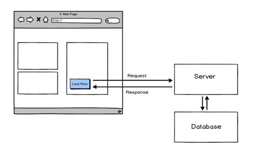
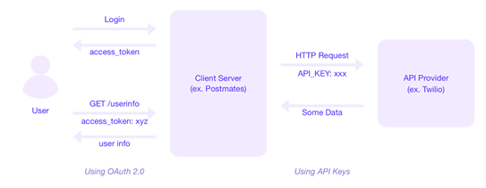

## REST APIs

#### Q1. Which REST constraint essentially prohibits the use of cookies?

- [x] Stateless
- [ ] Cacheable
- [ ] Layered System
- [ ] Uniform Interface

#### Explanation

A REST API is an application programming interface that conforms to the constraints of REST architectural style and allows for interaction with RESTful web services.

REST Principles:
1. Client-server
2. Stateless
3. Cacheable
4. Uniform interface
5. Layered system
6. Code on demand (optional)

Statelessness means that every HTTP request happens in complete isolation. When the client makes an HTTP request, it includes all information necessary for the server to fulfill the request.

The server never relies on information from previous requests from the client.

---

🎓 HTTP cookies (also called web cookies, Internet cookies, browser cookies, or simply cookies) are small blocks of data created by a web server while a user is browsing a website and placed on the user's computer or other device by the user's web browser.

#### Q2. Which URL pattern is recommended when working with one resource and a collection of resources?

- [ ] `/companies/{id} and/company`
- [ ] `/company/{id} and/companies`
- [x] `/companies/{id} and/companies`
- [ ] `/company/{id} and/company`

#### Explanation

Having a strong and consistent REST resource naming strategy – will prove one of the best design decisions in the long term.

When resources are named well, an API is intuitive and easy to use. If done poorly, that same API can feel difficult to use and understand.

The constraint of a uniform interface is partially addressed by the combination of URIs and HTTP verbs and using them in line with the standards and conventions.

A resource can be… 
- a singleton;
- a collection.

For example, “customers” is a collection resource and “customer” is a singleton resource.

We can identify “customers” collection resources using the URI:

```
/customers
```

We can identify a single “customer” resource using the URI:

```
/customers/{customerId}
```

#### Q3. When dealing with JSON web Tokens (JWTs), what is a claim?

- [x] `data in the token`
- [ ] `Ownership`
- [ ] `a permission`
- [ ] `and integer`

#### Explanation

JSON Web Token is a JSON encoded representation of a claim(s) that can be transferred between two parties. The claim is digitally signed by the issuer of the token, and the party receiving this token can later use this digital signature to prove the ownership of the claim.

Claims constitute the payload part of a JSON web token and represent a set of information exchanged between two parties.

JWTs can be broken down into three parts:

1. Header;
2. Payload;
3. Signature.

Each part is separated from the other by dot (.), and will follow the below structure:

```
Header.Payload.Signature
```

##### 1. Header

The header typically consists of two parts:

1. The type of the token, which is JWT;
2. The signing algorithm being used, such as HMAC SHA256 or RSA.

For example:

```json
{
  "alg": "HS256",
  "typ": "JWT"
}
```

Then, this JSON is Base64Url encoded to form the first part of the JWT.

##### 2. Payload

The second part of the token is the payload, which contains the claims. Claims are statements about an entity (typically, the user) and additional data.

There are three types of claims:

1. Registered claims,
2. Public claims,
3. Private claims.

An example payload could be:

```json
{
  "sub": "1234567890",
  "name": "John Doe",
  "admin": true
}
```

##### 3. Signature

To create the signature part you have to take the encoded header, the encoded payload, a secret, the algorithm specified in the header, and sign that.

For example if you want to use the HMAC SHA256 algorithm, the signature will be created in the following way:

```
HMACSHA256(
  base64UrlEncode(header) + "." +
  base64UrlEncode(payload),
  secret)
```

##### 4. Putting all together

The output is three Base64-URL strings separated by dots that can be easily passed in HTML and HTTP environments, while being more compact when compared to XML-based standards such as SAML.

The following shows a JWT that has the previous header and payload encoded, and it is signed with a secret.


#### Q4. Which REST constraint specifies that knowledge and understanding obtained from one component of the API should be generally applicable elsewhere in the API?

- [x] `Uniform Interface`
- [ ] `Client-Server`
- [ ] `Stateless`
- [ ] `Chacheable`

#### Explanation

A REST API is an application programming interface that conforms to the constraints of REST architectural style and allows for interaction with RESTful web services.

REST Principles:
1. Client-server
2. Stateless
3. Cacheable
4. Uniform interface
5. Layered system
6. Code on demand (optional)

The Uniform Interface constraint defines the interface between clients and servers.

By applying the software engineering principle of generality to the component interface, the overall system architecture is simplified and the visibility of interactions is improved.

In order to obtain a uniform interface, multiple architectural constraints are needed to guide the behavior of components. REST is defined by four interface constraints:

1. Identification of resources;
2. Manipulation of resources through representations;
3. Self-descriptive messages;
4. Hypermedia as the engine of application state.

##### 1. Resource-Based

Individual resources are identified in requests using URIs as resource identifiers. The resources themselves are conceptually separate from the representations that are returned to the client.

For example, the server doesn't send its database, but rather, some HTML, XML or JSON that represents some database records expressed.

##### 2. Actions on Resources Through Representations

When a client gets a representation of a resource, including any metadata attached, it has enough information to customize or delete the resource on the server, if it has permission to do so.

##### 3. Self-descriptive Messages

Each message includes precise information that describes how to process it. The responses also clearly indicate their cache-ability.

##### 4. Hypermedia as the Engine of Application State

Clients deliver the state via body contents, query-string parameters, request headers and the requested URI.

Services deliver state to clients via body content, response codes, and response headers.

#### Q5. What would you enable to allow a browser on another site to make an AJAX request to your API?

- [ ] `HTTP`
- [ ] `REST`
- [ ] `OPTIONS`
- [x] `CORS`

#### Explanation

AJAX means the interaction between client and server that enables us to partially update our web applications asynchronously.

When the Ajax interaction is complete, JavaScript updates the HTML source of the page so the changes are made immediately without requiring a page refresh.



CORS (Cross-origin resource sharing) is a mechanism that allows restricted resources on a web page to be requested from another domain outside the domain from which the first resource was served.


A web page may freely embed cross-origin images, stylesheets, scripts, iframes, and videos. Certain "cross-domain" requests, notably Ajax requests, are forbidden by default by the same-origin security policy.

CORS defines a way in which a browser and server can interact to determine whether it is safe to allow the cross-origin request. It allows for more freedom and functionality than purely same-origin requests, but is more secure than simply allowing all cross-origin requests.

#### Q6. APIs commonly use webhooks to **\_**.

- [x] `notify other systems of an event`
- [ ] `catch error faster`
- [ ] `improve error logging`
- [ ] `log additional data`

#### Explanation

A Webhook (also called a web callback or HTTP push API) is a way for an app to provide other applications with real-time information.

A webhook delivers data to other applications as it happens, meaning you get data immediately.


Webhooks are sometimes referred to as “Reverse APIs,” as they give you what amounts to an API spec, and you must design an API for the webhook to use. The webhook will make an HTTP request to your app (typically a POST), and you will then be charged with interpreting it.

##### Consuming a Webhook

The first step in consuming a webhook is giving the webhook provider a URL to deliver requests to. This is most often done through a backend panel or an API. This means that you also need to set up a URL in your app that’s accessible from the public web.

The majority of webhooks will POST data to you in one of two ways:

1. as JSON or XML to be interpreted,
2. as a form data (application/x-www-form-urlencoded or multipart/form-data).

Your provider will tell you how they deliver it (or even give you a choice in the matter). Both of these are fairly easy to interpret, and most web frameworks will do the work for you. If they don’t, you may need to call on a function or two.

#### Q7. What is the underlying goal of all APIs?

- [ ] `to add new technologies to an organization's infrastructure.`
- [x] `to share features and functionality with other system.`
- [ ] `to move infrastructure to the cloud.`
- [ ] `to appease the latest digital transformation effort.`

#### Explanation

API is an acronym that stands for “application programming interface,” and it allows apps to send information between each other.

While there are numerous protocols and technologies involved, the underlying purpose of APIs is always the same: to let one piece of software communicate with another.

#### Q8. Which is a common command-line tool for using or exploring an API?

- [ ] `bash`
- [x] `curl`
- [ ] `ssh`
- [ ] `powerShell`

#### Explanation

`curl` is a command line tool to transfer data to or from a server, using any of the supported protocols (HTTP, FTP, IMAP, POP3, SCP, SFTP, SMTP, TFTP, TELNET, LDAP or FILE).

This tool is preferred for automation, since it is designed to work without user interaction. curl can transfer multiple files at once.

Syntax:

```
curl [options] [URL...]
```

URL: The most basic use of curl is typing the command followed by the URL.

```
curl https://www.geeksforgeeks.org
```

Example with  “-o” options (saves the downloaded file on the local machine with the name provided in the parameters):

```
curl -o hello.zip ftp://speedtest.tele2.net/1MB.zip
```

#### Q9. What is the modern specification for describing an API?

- [x] `OpenAPI (Swagger)`
- [ ] `WADL`
- [ ] `WSDL`
- [ ] `OAuth`

#### Explanation

The OpenAPI Specification defines a standard, language-agnostic interface to RESTful APIs which allows both humans and computers to discover and understand the capabilities of the service without access to source code, documentation, or through network traffic inspection.

When The OpenAPI Specification properly defined, a consumer can understand and interact with the remote service with a minimal amount of implementation logic.

Swagger is a set of rules (in other words, a specification) for a format describing REST APIs. As a result, it can be used to share documentation among product managers, testers and developers, but can also be used by various tools to automate API-related processes

#### Q10. Which HTTP verb is normally used to update or create a resource in an API?

- [ ] `SUBMIT`
- [ ] `WRITE`
- [x] `POST`
- [ ] `CREATE`

#### Explanation

Use `POST` APIs to create new subordinate resources, e.g., a file is subordinate to a directory containing it or a row is subordinate to a database table.

When talking strictly in terms of REST, `POST` methods are used to create a new resource into the collection of resources.

HTTP response code:

1. Response code 201 “Created” – Ideally is used if a resource has been created on the origin server and contains an entity which describes the status of the request and refers to the new resource, and a Location header.
2. Response code 200 “OK” or 204 “No Content” is used when the action performed by the POST method might not result in a resource that can be identified by a URI.
 
☝🏼 **Important**: Please note that `POST` is neither safe nor idempotent, and invoking two identical POST requests will result in two different resources containing the same information except resource ids.

Example request URIs:

- HTTP POST http://www.appdomain.com/users 
- HTTP POST http://www.appdomain.com/users/123/accounts

#### Q11. What is one benefit of server-side caching in APIs?

- [ ] `Mobile app work better.`
- [ ] `It improves uptime.`
- [ ] `It offers better security.`
- [x] `It reduce load on servers.`

#### Explanation

A REST API is an application programming interface that conforms to the constraints of REST architectural style and allows for interaction with RESTful web services.

REST Principles:

1. Client-server
2. Stateless
3. Cacheable
4. Uniform interface
5. Layered system
6. Code on demand (optional)

Cache constraints require that the data within a response to a request be implicitly or explicitly labeled as cacheable or non-cacheable. If a response is cacheable, then a client cache is given the right to reuse that response data for later, equivalent requests.

For example, if you use server-side caching, the average latency for a transactional workload can be reduced by half.

#### Q12. Your API resource does not allow deletion, and a client application attempted to delete the resource. What HTTP response code should you return?

- [ ] `409 Conflict`
- [ ] `400 Bad Request`
- [ ] `406 Not Acceptable`
- [x] `405 Method Not Allowed`

#### Explanation

`HTTP 405 “Method Not Allowed”` code is an HTTP response status code indicating that the specified request HTTP method was received and recognized by the server, but the server has rejected that particular method for the requested resource.

---

🎓 `HTTP 406 “Not Acceptable”` code is an HTTP response status code indicating that the client has requested a response using `Accept-` headers that the server is unable to fulfill.

This status code indicates that the user agent (the web browser, in most cases) has requested a valid resource, however the request included a special `Accept-` header that indicates to the server a valid response can only contain certain types of information.

For example, the user agent may be localized to a particular locale or language that the server can't provide. A user agent may use the `Accept-Language` request header to specify a valid language of French (`Accept-Language: fr`), but if the server cannot serve a response in French, a `HTTP 406 “Not Acceptable”` code may be the only proper response.

🎓 `HTTP 409 “Conflict”` code is an HTTP response status code indicating that the request could not be completed due to a conflict with the current state of the target resource. This code is used in situations where the user might be able to resolve the conflict and resubmit the request.

Conflicts are most likely to occur in response to a PUT request. For example, if versioning were being used and the representation being PUT included changes to a resource that conflict with those made by an earlier (third-party) request, the origin server might use a `HTTP 409 “Conflict”` response to indicate that it can't complete the request.

In this case, the response representation would likely contain information useful for merging the differences based on the revision history.

🎓 `HTTP 400 “Bad Request”` is an HTTP response status code that indicates that the server was unable to process the request sent by the client due to invalid syntax.

#### Q13. What is OpenID Connect?

- [x] `an identify layer on top of OAuth 2.0`
- [ ] `the new name for SAML 3.0`
- [ ] `a modern replacement for API keys`
- [ ] `an SSO competitor for OAuth 2.0`

#### Explanation

OpenID Connect is an open authentication protocol that profiles and extends OAuth 2.0 to add an identity layer.

OpenID Connect allows clients to confirm an end user's identity using authentication by an authorization server.


---

🎓 The OAuth 2.0 authorization framework enables a third-party application to obtain limited access to an HTTP service, either on behalf of a resource owner by orchestrating an approval interaction between the resource owner and the HTTP service, or by allowing the third-party application to obtain access on its own behalf. 

In other words, the OAuth 2.0 provides consented access and restricts actions of what the client app can perform on resources on behalf of the user, without ever sharing the user's credentials.


#### Q14. What is one benefit of GraphQl over REST approaches?

- [x] `flexible querying/responses`
- [ ] `more stable APIs`
- [ ] `compatible with more gateways`
- [ ] `more secure by default`

#### Explanation

GraphQL is a query language for APIs and a runtime for fulfilling those queries with your existing data.

GraphQL provides a complete and understandable description of the data in your API, gives clients the power to ask for exactly what they need and nothing more, makes it easier to evolve APIs over time, and enables powerful developer tools.

Send a GraphQL query to your API and get exactly what you need, nothing more and nothing less. GraphQL queries always return predictable results. Apps using GraphQL are fast and stable because they control the data they get, not the server.


#### Q15. Which REST constraint specifies that there should be no shared context?

- [x] `Stateless`
- [ ] `Client-Server`
- [ ] `Uniform Interface`
- [ ] `Cacheable`

#### Explanation

A REST API is an application programming interface that conforms to the constraints of REST architectural style and allows for interaction with RESTful web services.

REST Principles:
1.Client-server
2. Stateless
3. Cacheable
4. Uniform interface
5. Layered system
6. Code on demand (optional)

The Statelessness constraint states that a RESTful Web Service should not keep a client state on the server.It is the responsibility of the client to pass its context to the server and then the server can store this context to process the client's further request.

#### Q16. What purpose does a User-Agent serve?

- [ ] `It identifies the user ID.`
- [x] `It identifies the client application or SDK.`
- [ ] `It identifies if the API should expect a user authentication.`
- [ ] `It identifies if the API should accept microservice traffic.`

#### Explanation

A user agent is any software that retrieves and presents Web content for end users or is implemented using Web technologies. User agents include Web browsers, media players, and plug-ins that help in retrieving, rendering and interacting with Web content.

The family of user agents also includes operating system shells, consumer electronics with Web-widgets, and stand-alone applications or embedded applications whose user interface is implemented as a combination of Web technologies.

#### Q17. If you were to add versioning by using the "Accept" and "Content-Type" header, what would be the correct format of the header value?

- [ ] `application/json`
- [ ] `application/json_version2`
- [ ] `text/html`
- [x] `application/vnd.myapp.v2+json`

#### Explanation

The `Accept` request HTTP header indicates which content types, expressed as MIME types, the client is able to understand.

The server uses content negotiation to select one of the proposals and informs the client of the choice with the `Content-Type` response header.

Syntax:

```html
Accept: <MIME_type>/<MIME_subtype>
Accept: <MIME_type>/*
Accept: */*
```

Example with multiple types, weighted with the quality value syntax:

```html
Accept: text/html, application/xhtml+xml, application/xml;q=0.9, image/webp, */*;q=0.8
```

---

API versioning is the practice of transparently managing changes to your API. Versioning is effective communication around changes to your API,
so consumers know what to expect from it. You are delivering data to the public in some fashion, and you need to communicate when you change the way that data is delivered.

Four REST API Versioning Strategies:

1. Versioning through URI Path
2. Versioning through query parameters
3. Versioning through custom headers
4. Versioning through content negotiation (the `Accept` header)

##### Versioning through content negotiation

Versioning through content negotiation allows us to version a single resource representation instead of versioning the entire API which gives us a more granular control over versioning. 
It creates a smaller footprint in the code base as we don’t have to fork the entire application when creating a new version.

Another advantage of this approach is that it doesn't require implementing URI routing rules introduced by versioning through the URI path.

One of the drawbacks of this approach is that it is less accessible than URI-versioned APIs:
Requiring HTTP headers with media types makes it more difficult to test and explore the API using a browser.

```bash
curl -H "Accept: application/vnd.xm.device+json; version=1"
https://www.example.com/api/products
```

- **Pros**: Allows us to version a single resource representation instead of versioning the entire API, which gives us a more granular control over versioning. Creates a smaller footprint. Doesn't require implementing URI routing rules.
- **Cons**: Requiring HTTP headers with media types makes it more difficult to test and explore the API using a browser

#### Q18. What is one benefit that OAuth provides over an API key approach?

- [ ] `A token is encrypted.`
- [ ] `A token is encoded.`
- [x] `A token is scoped to the use case.`
- [ ] `A token can be shared between systems.`

#### Explanation

An `API key` is a code used to identify and authenticate an application or user. API keys also act as a unique identifier and provide a secret token for authentication purposes.

Introducing API keys is an easy thing. Just issue a “secret” or “phrase” between you and the consumer. Every time the API is called this Key must be present and the API proxy will be able to verify it. This works well for most use cases; however, some best practices need to be considered.

For example, you should avoid putting the API Key inside the URL as a “query parameter” because proxies and all involved systems are likely to store it into their logs. Better places are Header or Payload. The header has turned out to be the most practical place.

While the Secret Key is always traveling with your request, OAuth provides an alternative solution.



OAuth 2.0 is the industry-standard protocol for authorization. OAuth 2.0 focuses on client developer simplicity while providing specific authorization flows for web applications, desktop applications, mobile phones, and living room devices.

☝🏼 **Note**: OAuth is basically a way to separate the Authentication Process from the Access to the Resource and therefore limit the exposure of the credentials. Delegation is the secret so instead of sending the credentials, the user retrieves a token that will then be used to access the resource.

One scenario you see often is Social Login where you use GitHub, LinkedIn, Google or Facebook to log into a Web app. You might have recognized the Consent Screen that usually talks about which data the Web app would like to read from your Git or Facebook account. If you accept, then you “Grant Access” and the resource can be opened on behalf. This is usually known as “3-legged OAuth Flow” or “Authorization Code Grant Flow.”


#### Q19. The ability to execute the same API request over and over again without changing the resource's state is an example of \_.

- [ ] `stateless architecture`
- [x] `idempotency`
- [ ] `a uniform interface`
- [ ] `cacheability

#### Explanation

From a RESTful service standpoint, for an operation (or service call) to be idempotent, clients can make that same call repeatedly while producing the same result.

In other words, making multiple identical requests has the same effect as making a single request.

HTTP methods include:

| Method  | Description                                   | Idempotent or not                     |
|---------|-----------------------------------------------|---------------------------------------|
| POST    | Creates a new resource.                       | is not idempotent and it is not safe. |
| GET     | Retrieves a resource.                         | is idempotent and it is safe.         |
| HEAD    | Retrieves a resource (without response body). | is idempotent and it is safe          |
| PUT     | Updates/replaces a resource.                  | is idempotent but it is not safe      |
| PATCH   | Partially updates a resource.                 | is not idempotent and it is not safe. |
| DELETE  | Deletes a resource.                           | is idempotent but it is not safe.     |
| TRACE   | Performs a loop-back test.                    | is idempotent but it is not safe.     |

---

#####❓ Why DELETE method is idempotent?

Note that while idempotent operations produce the same result on the server (no side effects), the response itself may not be the same (e.g. a resource's state may change between requests).
The PUT and DELETE methods are defined to be idempotent.

##### ❓ Why PUT method is idempotent and POST is not?

The PUT method is idempotent. So if we retry a request multiple times, that should be equivalent to a single request invocation.
POST is NOT idempotent. So if we retry the request N times, we will end up having N resources with N different URIs created on the server.

##### ❓ Why PATCH method isn’t  idempotent?

A PATCH is not necessarily idempotent, although it can be. Contrast this with PUT ; which is always idempotent.
The word "idempotent" means that any number of repeated, identical requests will leave the resource in the same state.

#### Q20. What component can you use to wrap legacy architectures or protocols into a REST interface for easier consumption and integration?

- [x] `API proxy`
- [ ] `API gateway`
- [ ] `OpenAPI`
- [ ] `OAuth authorization server`

#### Explanation

A proxy is something that acts on behalf of something else. Sitting between your application and your backend, API proxies provide an interface to developers for accessing backend services.

First, let's define some terms we'll be using:

1. **API**: Application Programming Interface, an interface that allows different programs to interact with each other.
2. **Backend services**: The servers, APIs, or databases that make up the parts of the architecture that your applications rely on.
3. **Consumers**: The applications that interact with your backend. Used interchangeably with "frontends" in this article. Consumers can include mobile, web, or desktop applications as well as anyone or anything making API calls to your services.
4. **Shim**: A shim is a layer of code which helps provide compatibility between different interfaces or APIs.

An API proxy acts as an intermediary between a consumer and backend services. It can be a small shim, or a larger piece of code that handles data transformations, security, routing, traffic shaping and more. It can expose an interface customized for the consumer, and then makes the appropriate calls to the backend service(s) on behalf of the consumer.


Imagine you have a modern web application that needs to get information from a legacy backend that communicates in XML.

Instead of making your web application talk directly to that legacy backend using XML, you can create an API proxy which the web application communicates with in JSON format. The API proxy will then translate the request from the web application into the XML format that the legacy backend is expecting, and translate the response from the backend into the JSON format the web app is expecting.

#### Q21. What protection does a JSON Web Token (JWT) offer to mitigate tampering with its contents?

- [ ] `transport over SSL`
- [ ] `encrypted payload`
- [x] `a signature`
- [ ] `encoded payload`

#### Explanation

JSON Web Token is a JSON encoded representation of a claim(s) that can be transferred between two parties. The claim is digitally signed by the issuer of the token, and the party receiving this token can later use this digital signature to prove the ownership of the claim.

JWTs can be broken down into three parts:

1. header;
2. payload;
3. signature.

Each part is separated from the other by dot (.), and will follow the below structure:

```
Header.Payload.Signature
```

JSON Web Token is a JSON encoded representation of a claim(s) that can be transferred between two parties. The claim is digitally signed by the issuer of the token, and the party receiving this token can later use this digital signature to prove the ownership of the claim.

Claims constitute the payload part of a JSON web token and represent a set of information exchanged between two parties.

JWTs can be broken down into three parts:

1. Header;
2. Payload;
3. Signature.

Each part is separated from the other by dot (.), and will follow the below structure:

```
Header.Payload.Signature
```

##### 1. Header

The header typically consists of two parts:

1. The type of the token, which is JWT;
2. The signing algorithm being used, such as HMAC SHA256 or RSA.

For example:

```json
{
  "alg": "HS256",
  "typ": "JWT"
}
```

Then, this JSON is Base64Url encoded to form the first part of the JWT.

##### 2. Payload

The second part of the token is the payload, which contains the claims. Claims are statements about an entity (typically, the user) and additional data.

There are three types of claims:

1. Registered claims,
2. Public claims,
3. Private claims.

An example payload could be:

```json
{
  "sub": "1234567890",
  "name": "John Doe",
  "admin": true
}
```

##### 3. Signature

To create the signature part you have to take the encoded header, the encoded payload, a secret, the algorithm specified in the header, and sign that.

For example if you want to use the HMAC SHA256 algorithm, the signature will be created in the following way:

```
HMACSHA256(
  base64UrlEncode(header) + "." +
  base64UrlEncode(payload),
  secret)
```

##### 4. Putting all together

The output is three Base64-URL strings separated by dots that can be easily passed in HTML and HTTP environments, while being more compact when compared to XML-based standards such as SAML.

The following shows a JWT that has the previous header and payload encoded, and it is signed with a secret.


#### Q22. What OAuth term is used to represent permissions?

- [ ] `token`
- [x] `scope`
- [ ] `claim`
- [ ] `back channel`

#### Explanation

The OAuth 2.0 is a standard designed to allow a website or application to access resources hosted by other web apps on behalf of a user.


Scope is a mechanism in OAuth 2.0 to limit an application's access to a user's account. An application can request one or more scopes, this information is then presented to the user in the consent screen, and the access token issued to the application will be limited to the scopes granted.

The OAuth spec allows the authorization server or user to modify the scopes granted to the application compared to what is requested, although there are not many examples of services doing this in practice.

OAuth does not define any particular values for scopes, since it is highly dependent on the service's internal architecture and needs.

#### Q23. What additional type of token would you see when using OpenID Connect?

- [x] `ID token`
- [ ] `refresh token`
- [ ] `access token`
- [ ] `auth code token`

#### Explanation


