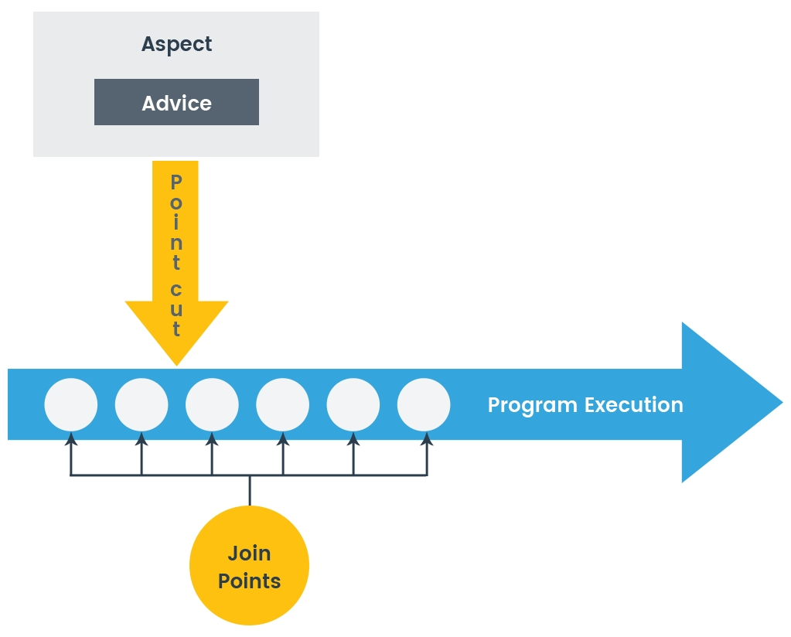
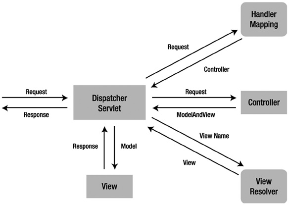
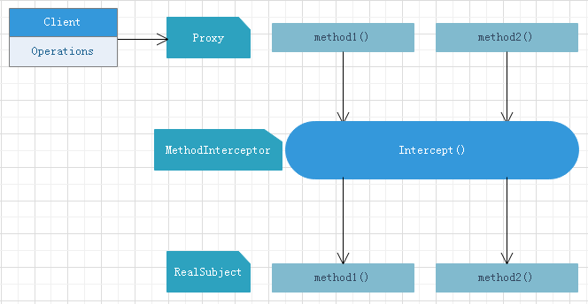
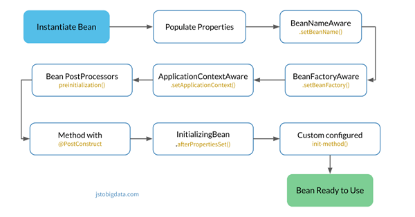
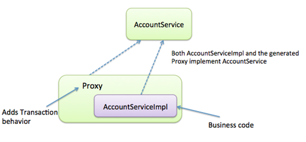
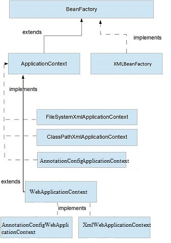
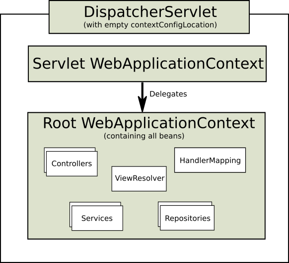

## Spring Framework

#### Q1. How filters are used in Spring Web?

- [x] Filters are called before a request hits the DispatcherServlet.They allow for interception-style, chained processing of web requests for security, timeouts, and other purposes.
- [ ] Filters are used with a checksum algorithm that will filter invalid bytes out of a byte stream request body and allow for processing of HTTP requests from the DispatcherRequestServlet.
- [ ] Filters are used with a checksum algorithm that will filter invalid bytes out of an octet stream a multipart upload and allow for chained processing of WebDispatcherServlet requests.
- [ ] Filters are used to validate request parameters out of the byte stream request body and allow for processing of requests from the DispatcherRequestServlet.

#### Explanation

A Filter is an object used to intercept the HTTP requests and responses of your application.
By using filter, we can perform two operations at two instances:
- Before sending the request to the controller;
- Before sending a response to the client.


Example of implementation of the `Filter interface`:

```java
@Component
public class SimpleFilter implements Filter {
   @Override
   public void destroy() {}
   @Override
   public void doFilter(ServletRequest request, ServletResponse response, FilterChain filterchain) throws IOException, ServletException {
      
      System.out.println("Remote Host:" + request.getRemoteHost());
      System.out.println("Remote Address:" + request.getRemoteAddr());
      filterchain.doFilter(request, response);
   }
   @Override
   public void init(FilterConfig filterconfig) throws ServletException {}
}
```
#### Q2. How is a resource defined in the context of a REST service?

- [ ] A resource is the actual String literal that composes a URI that is accessed on a RESTful web service.
- [x] It is an abstract concept that represents a typed object, data, relationships, and a set of methods that operate on it that is accessed via a URI.
- [ ] A REST service has a pool of resources composed of allocations of memory that allow a request to be processed.
- [ ] A resource for a REST service is an explicit allocation of a thread or CPU cycles to allow a request to be processed.

#### Explanation
A Resource is an object with a type, associated data, relationships to other resources, and a set of methods that operate on it.

It is similar to an object instance in an object-oriented programming language, with the important difference that only a few standard methods are defined for the resource, while an object instance typically has many methods.

#### Q3. Which of these is a valid Advice annotation?

- [ ] @AfterError
- [x] @AfterReturning
- [ ] @AfterException
- [ ] @AfterExecution

#### Explanation

Aspect-Oriented Programming complements Object-Oriented Programming by providing another way of thinking about program structure.

The key unit of modularity in OOP is the class, whereas in AOP the unit of modularity is the aspect.

**Aspect** is a modularization of a concern that cuts across multiple classes.
Transaction management is a good example of a crosscutting concern in enterprise Java applications.



Let's begin by defining some central AOP concepts and terminology:

- **Join Point** is a point during the execution of a program, such as the execution of a method or the handling of an exception (in Spring AOP, a join point always represents a method execution).
- **Advice** is action taken by an aspect at a particular join point. Different types of advice include "around," "before" and "after" advice. Many AOP frameworks, including Spring, model an advice as an interceptor, maintaining a chain of interceptors around the join point.

Types of advice:
- **Before advice**: Advice that executes before a join point, but which does not have the ability to prevent execution flow proceeding to the join point (unless it throws an exception).
- **After returning advice**: Advice to be executed after a join point completes normally:
for example, if a method returns without throwing an exception.
- **After throwing advice**: Advice to be executed if a method exits by throwing an exception.
- **After (finally) advice**: Advice to be executed regardless of the means by which a join point exits (normal or exceptional return).
- **Around advice**: Advice that surrounds a join point such as a method invocation. This is the most powerful kind of advice. Around advice can perform custom behavior before and after the method invocation. It is also responsible for choosing whether to proceed to the join point or to shortcut the advised method execution by returning its own return value or throwing an exception.

Example: 

```java
@Component
@Aspect
public class PublishingAspect {
    private ApplicationEventPublisher eventPublisher;
    @Autowired
    public void setEventPublisher(ApplicationEventPublisher eventPublisher) {
        this.eventPublisher = eventPublisher;
    }
    @Pointcut("@target(org.springframework.stereotype.Repository)")
    public void repositoryMethods() {}
    @Pointcut("execution(* *..create*(Long,..))")
    public void firstLongParamMethods() {}
    @Pointcut("repositoryMethods() && firstLongParamMethods()")
    public void entityCreationMethods() {}
    @AfterReturning(value = "entityCreationMethods()", returning = "entity")
    public void logMethodCall(JoinPoint jp, Object entity) throws Throwable {
        eventPublisher.publishEvent(new FooCreationEvent(entity));
    }
}
```

#### Q4. What does a ViewResolver do?

- [ ] It supports internationalization of web applications by detecting a user's locale.
- [x] It generates a view by mapping a logical view name returned by a controller method to a view technology.
- [ ] It creates a unique view determined by the uers's browser type,supporting cross-browser compatibility.
- [ ] It maps custom parameters to SQL views in the database, allowing for dynamic content to be created in the response.

#### Explanation

The `ViewResolver` is an interface to be implemented by objects that can resolve views by name.

The `View` interface addresses the preparation of the request and hands the request over to one of the view technologies.



```java
public interface ViewResolver {
	@Nullable
	View resolveViewName(String viewName, Locale locale) throws Exception;
}
```

```java
public interface View {
	String RESPONSE_STATUS_ATTRIBUTE = View.class.getName() + ".responseStatus";
	String PATH_VARIABLES = View.class.getName() + ".pathVariables";
	String SELECTED_CONTENT_TYPE = View.class.getName() + ".selectedContentType";
	@Nullable
	default String getContentType() {
		return null;
	}
	void render(@Nullable Map<String, ?> model, HttpServletRequest request, HttpServletResponse response) throws Exception;
}
```

#### Q5. How are Spring Data repositories implemented by Spring at runtime?

- [ ] Spring automatically generated code for you based on your YAML config that defined a MethodInterceptor chain that intercept calls to the instance and computed SQL on the fly.
- [x] A JDK proxy instance is created, which backs the repository interface, and a MethodInterceptor intercepts calls to the instance and routes as required.
- [ ] The Spring JDK proxy creates a separate runtime process that acts as an intermediary between the database and the Web server, and intercepts calls to the instance and handles requests.
- [ ] Spring automatically generated code for you based on your XML config files that define a SpringMethodAutoGeneration factory that intercepts calls to the instance and creates dynamic method that computer SQL on the fly.

#### Explanation

A JDK proxy instance is created programmatically using Spring's ProxyFactory🎓 API to back the interface.

☝🏼 **Note**: there's no code generation going on, which means there's no CGLib, no byte-code generation at all.


A `MethodInterceptor` intercepts all calls to the instance and routes the method into the appropriate places.

1. If the repository has been initialized with a custom implementation part, and the method invoked is implemented in that class, the call is routed there.
2. If the method is a query method, the store specific query execution mechanism kicks in and executes the query determined to be executed for that method at startup.
For that a resolution mechanism is in place that tries to identify explicitly declared queries in various places (using @Query on the method, JPA named queries) eventually falling back to query derivation from the method name.
3. If none of the above apply the method executed has to be one implemented by a store-specific repository base class (SimpleJpaRepository in case of JPA) and the call is routed into an instance of that.



The method interceptor implementing that routing logic is `QueryExecutorMethodInterceptor`.

The creation of those proxies is encapsulated into a standard Java based Factory pattern implementation. The high-level proxy creation can be found in `RepositoryFactorySupport`. The store-specific implementations then add the necessary infrastructure components so that for JPA you can go ahead and just write code like this:

```java
EntityManager em = ... // obtain an EntityManager
JpaRepositoryFactory factory = new JpaRepositoryFactory(em);
UserRepository repository = factory.getRepository(UserRepository.class);
```

#### Q6. What is SpEL and how is it used in Spring?

- [ ] SpEL(Spring Expression Language) runs in the JVM and can act as a drop-in replacement for Groovy or other languages.
- [x] SpEL(Spring Expression Language) supports boolean and relational operators and regular expressions, and is used for querying a graph of objects at runtime.
- [ ] SpEL(Spring Expression Language) allows you to build, configure,and execute tasks such as building artifacts and downloading object dependencies.
- [ ] SpEL(Spring Expression Language) natively transpiles one JVM language to another, allowing for greater flexibility.

#### Explanation

The Spring Expression Language is a powerful expression language that supports querying and manipulating an object graph at runtime. The language syntax is similar to Unified EL but offers additional features, most notably method invocation and basic string templating functionality.

For example, with the help of SpEL, we can access the contents of any Map or List in the context. We will create new bean workersHolder that will store information about some workers and their salaries in a List and a Map:

```java
@Component("workersHolder")
public class WorkersHolder {
    private List<String> workers = new LinkedList<>();
    private Map<String, Integer> salaryByWorkers = new HashMap<>();
    public WorkersHolder() {
        workers.add("John");
        workers.add("Susie");
        workers.add("George");
        salaryByWorkers.put("John", 35000);
        salaryByWorkers.put("Susie", 47000);
        salaryByWorkers.put("George", 14000);
    }
    //Getters and setters
}
```

Now we can access the values of the collections using SpEL:

```java
@Value("#{workersHolder.salaryByWorkers['John']}") // 35000
private Integer johnSalary;
@Value("#{workersHolder.salaryByWorkers['George']}") // 14000
private Integer georgeSalary;
@Value("#{workersHolder.salaryByWorkers['Susie']}") // 47000
private Integer susieSalary;
@Value("#{workersHolder.workers[0]}") // John
private String firstWorker;
@Value("#{workersHolder.workers[3]}") // George
private String lastWorker;
@Value("#{workersHolder.workers.size()}") // 4
private Integer numberOfWorkers;
```

#### Q7. The process of linking aspects with other objects to create an advised object is called

- [ ] dynamic chaining
- [ ] banding
- [x] weaving
- [ ] interleaving

#### Explanation

One of the key components of Spring Framework is the Aspect Oriented Programming framework.

Aspect-Oriented Programming entails breaking down program logic into distinct parts called so-called concerns.

The functions that span multiple points of an application are called cross-cutting concerns and these cross-cutting concerns are conceptually separate from the application's business logic.

There are various common good examples of aspects like… 
1. Logging;
2. Auditing;
3. Declarative transactions;
4. Security;
5. Caching,
etc.

**Weaving** is the process of linking Aspects with other application types or objects to create an Advised object.

This can be done at compile time (using the AspectJ compiler, for example), load time, or at runtime. Spring AOP, like other pure Java AOP frameworks, performs weaving at runtime.


An **Aspect** is a modularization of a concern that cuts across multiple classes. Unified logging can be an example of such cross-cutting concern.

Let's see how we define a simple Aspect:

```java
public class AdderAfterReturnAspect {
    private Logger logger = LoggerFactory.getLogger(this.getClass());
    public void afterReturn(Object returnValue) throws Throwable {
        logger.info("value return was {}",  returnValue);
    }
}
```

In the above example, we defined a simple Java class that has a method called afterReturn, which takes one argument of type Object and logs in that value.

An Advice is an action taken by an aspect at a particular Joinpoint. Different types of advice include “around,” “before,” and “after.”

In Spring, an Advice is modelled as an interceptor, maintaining a chain of interceptors around the Joinpoint.

#### Q8. How are JDK Dynamic proxies and CGLIB proxies used in Spring?

- [x] JDK Dynamic proxy can proxy only interface, so it is used if the target implements at least one interface. A CGLIB proxy can create a proxy by subclassing and is used if the target does not implement an interface.
- [ ] Only JDK Dynamic proxies are used in the Spring Bean Lifecycle. CGLIB proxies are used only for integrating with other frameworks.
- [ ] Only CGLIB proxies are used in the Spring Bean Lifecycle. JDK Dynamic proxies are used only for integrating with other frameworks.
- [ ] JDK Dynamic proxy can only using an abstract class extended by a target. A CGLIB proxy can create a proxy through bytecode interweaving and is used if the target does not extend an abstract class.

#### Explanation

Spring AOP is proxy based. Spring used two types of proxy strategy:

- JDK dynamic proxy;
- CGLIB proxy.


**JDK dynamic proxy** is available with the JDK. It can be only proxy by interface so the target class needs to implement the interface. If you are implementing one or more interfaces then spring will automatically use JDK dynamic proxies.

**CGLIB proxy** is a third party library which spring used for creating proxies. It can create a proxy by subclassing. Spring uses CGLIB for proxy if the class is not implementing an interface.

| Sr. No. | Key         | JDK dynamic proxy                                                              | CGLIB proxy                                                      |
|---------|-------------|--------------------------------------------------------------------------------|------------------------------------------------------------------|
| 1.      | Basic       | It can be only proxy by interface so target class needs to implement interface | It can create proxy by subclassing                               |
| 2.      | Package     | It is available with the Java                                                  | It is the third  library.                                        |
| 3.      | Performance | It is a bit slow than CGLIB proxy                                              | It is faster than JDK dynamic proxy                              |
| 4.      | Final       | Final class and Final method can not be proxy                                  | Final class and Final method can not be proxy                    |
| 5.      | Use case    | Spring uses JDK proxy when is class is implementing one or more interface      | Spring uses CGLib proxy when class in not implementing interface |

#### Q9. Which of these is not a valid method on the JoinPoint interface?

- [ ] getArgs()
- [x] getExceptions()
- [ ] getSignature()
- [ ] getTarget()

#### Explanation

`public interface JoinPoint` provides reflective access to both the state available at a join point and static information about it.

This information is available from the body of advice using the special form thisJoinPoint. The primary use of this reflective information is for tracing and logging applications.

```java
 aspect Logging {
     before(): within(com.bigboxco..*) && execution(public * *(..)) {
         System.err.println("entering: " + thisJoinPoint);
         System.err.println("  w/args: " + thisJoinPoint.getArgs());
         System.err.println("      at: " + thisJoinPoint.getSourceLocation());
     }
 }
 ```

| Method               | Return type          |                                                                          |
|----------------------|----------------------|--------------------------------------------------------------------------|
| getArgs()            | java.lang.Object[]   | Returns the arguments at this join point.                                |
| getKind()            | java.lang.String     | Returns a String representing the kind of join point.                    |
| getSignature()       | Signature            | Returns the signature at the join point.                                 |
| getSourceLocation()  | SourceLocation       | Returns the source location corresponding to the join point.             |
| getStaticPart()      | JoinPoint.StaticPart | Returns an object that encapsulates the static parts of this join point. |
| getTarget()          | java.lang.Object     | Returns the target object.                                               |
| getThis()            | java.lang.Object     | Returns the currently executing object.                                  |
| toLongString()       | java.lang.String     | Returns an extended string representation of the join point.             |
| toShortString()      | java.lang.String     | Returns an abbreviated string representation of the join point.          |
| toString()           | java.lang.String     |                                                                          |                                                                   |

#### Q10. In what order do the @PostConstruct annotated method, the init-method parameter method on beans and the afterPropertiesSet() method execute?

- [ ] 1. afterPropertiesSet() 2. init-method 3. @PostConstruct
- [x] 1. @PostConstruct 2. afterPropertiesSet() 3. init-method
- [ ] 1. init-method 2. afterPropertiesSet() 3. @PostConstruct
- [ ] You cannot use these methods together-you must choose only one.

#### Explanation

Running logic during Spring application's startup is a common scenario, but one that causes multiple problems.
In order to benefit from Inverse of Control, we naturally need to renounce partial control over the application's flow to the container – which is why instantiation, setup logic on startup, etc needs special attention.

We can't simply include our logic in the beans' constructors or call methods after instantiation of any object; we are simply not in control during those processes.

Let's look at the real-life example:

```java
@Component
public class InvalidInitExampleBean {
    @Autowired
    private Environment env;
    public InvalidInitExampleBean() {
        env.getActiveProfiles();
    }
}
```

Here, we're trying to access an autowired field in the constructor. When the constructor is called, the Spring bean is not yet fully initialized. This is problematic because calling not yet initialized fields will of course result in `NullPointerExceptions`.

Spring gives us a few ways of managing this situation.

##### 1. The @PostConstruct Annotation

Javax's `@PostConstruct` annotation can be used for annotating a method that should be run once immediately after the bean's initialization.

Keep in mind that the annotated method will be executed by Spring even if there is nothing to Inject.

Here's `@PostConstruct` in action:

```java
@Component
public class PostConstructExampleBean {
    private static final Logger LOG 
      = Logger.getLogger(PostConstructExampleBean.class);
    @Autowired
    private Environment environment;
    @PostConstruct
    public void init() {
        LOG.info(Arrays.asList(environment.getDefaultProfiles()));
    }
}
```

In the example above you can see that the Environment instance was safely Injected and then called in the `@PostConstruct` annotated method without throwing a `NullPointerException`.

##### 2. The InitializingBean Interface

The InitializingBean approach works pretty similarly to the previous one. Instead of annotating a method, you need to implement the `InitializingBean interface` and the `afterPropertiesSet()` method.

Here you can see the previous example implemented using the `InitializingBean interface`:

```java
@Component
public class InitializingBeanExampleBean implements InitializingBean {
    private static final Logger LOG 
      = Logger.getLogger(InitializingBeanExampleBean.class);
    @Autowired
    private Environment environment;
    @Override
    public void afterPropertiesSet() throws Exception {
        LOG.info(Arrays.asList(environment.getDefaultProfiles()));
    }
}
```

##### 3. The @Bean init-method Attribute

The `initMethod` property can be used to execute a method after a bean's initialization. Here's what a bean looks like:

```java
public class InitMethodExampleBean {
    private static final Logger LOG = Logger.getLogger(InitMethodExampleBean.class);
    @Autowired
    private Environment environment;
    public void init() {
        LOG.info(Arrays.asList(environment.getDefaultProfiles()));
    }
}
```

You can notice that there are no special interfaces implemented nor any special annotations used.

Then, we can define the bean using the `@Bean` annotation:

```java
@Bean(initMethod="init")
public InitMethodExampleBean initMethodExampleBean() {
    return new InitMethodExampleBean();
}
```

##### 4. Combining Mechanisms

In order to achieve full control over your beans, you might want to combine the above mechanisms together.

The order of execution is as follows:
1. The constructor
2. The `@PostConstruct` annotated methods
3. The InitializingBean's `afterPropertiesSet()` method
4. The initialization method specified as `init` method in XML

##### 6. Spring Bean LifeCycle

The Spring IoC (Inversion of Control) container manages Spring beans. 

The Spring IoC container is responsible for instantiating, initializing, and wiring beans. The container also manages the life cycle of beans.



#### Q11. What is the function of the `@Transactional` annotation at the class level?

- [ ] It's a transaction attribute configured by `spring.security.transactions.xml` config file that uses Spring's transaction implementation and validation code.
- [ ] It's a transaction that must actively validate by the bytecode of a transaction using Spring's `TransactionBytecodeValidator` class. Default Transaction behavior rolls back on validation exception but commits on proper validation
- [x] It creates a proxy that implements the same interface(s) as the annotated class, allowing Spring to inject behaviors before, after, or around method calls into the object being proxied.
- [ ] It's a transaction that must be actively validated by Spring's `TransactionValidator` class using Spring's transaction validation code. Default Transaction behavior rolls back on validation exception.

#### Explanation

Annotation `@Transactional` is used when you want the certain method/class(=all methods inside) to be executed in a transaction.

```java
@Target(value={TYPE,METHOD})
 @Retention(value=RUNTIME)
 @Inherited
 @Documented
public @interface Transactional
```
With transactions configured, we can now annotate a bean with 
```java
@Transactional either at the class or method level:
@Service
@Transactional
public class FooService {
… 
}
```

The annotation supports further configuration as well:
1. The Propagation Type of the transaction;
2. The Isolation Level of the transaction;
3. A Timeout for the operation wrapped by the transaction;
4. A readOnly flag – a hint for the persistence provider that the transaction should be read only;
5. The Rollback rules for the transaction.

At a high level, Spring creates proxies for all the classes annotated with `@Transactional`. The proxy allows the framework to Inject transactional logic before and after the running method, mainly for starting and committing the transaction.



#### Q12. Which is a valid example of the output from this code (ignoring logging statements) ?

```java
@SpringBootApplication
public class App {
     public static void main(String args[]) {
          SpringApplication.run(App.class, args);
          System.out.println("startup");
     }
}
public class Print implements InitializingBean {
     @Override
     public void afterPropertiesSet() throws Exception {
          System.out.println("init");
     }
}
```

- [ ] Nothing will print
- [ ] startup
      init
- [ ] init
- [x] startup

#### Explanation

```java
Output:
2021-10-04 10:54:47.953  INFO 12988 --- [main] com.example.demo.App : The following profiles are active: education
2021-10-04 10:54:48.586  INFO 12988 --- [main] com.example.demo.App : Started DemoApplication in 1.121 seconds (JVM running for 2.493)
startup
```

The 'init' will not be printed as there is no `@Bean`, `@Component`, `@Service`, etc. annotation above the `Print` class.

The `InitializingBean` interface to be implemented by beans that need to react once all their properties have been set by a BeanFactory: e.g. to perform custom initialization, or merely to check that all mandatory properties have been set.

The `InitializingBean` interface has only one `void afterPropertiesSet() throws Exception` method.

Invoked by the containing BeanFactory after it has set all bean properties and satisfied `BeanFactoryAware`, `ApplicationContextAware` etc.

This method allows the bean instance to perform validation of its overall configuration and final initialization when all bean properties have been set.

#### Q13. Which println statement would you remove to stop this code throwing a null pointer exception?

```java
@Component
public class Test implements InitializingBean {
     @Autowired
     ApplicationContext context;
     @Autowired
     static SimpleDateFormt formatter;
     @Override
     public void afterPropertiesSet() throws Exception {
          System.out.println(context.containsBean("formatter") + " ");
          System.out.println(context.getBean("formatter").getClass());
          System.out.println(formatter.getClass());
          System.out.println(context.getClass());
     }
}
@Configuration
class TestConfig {
     @Bean
     public SimpleDateFormat formatter() {
          return new SimpleDateFormat();
     }
}
```

- [x] formatter.getClass()
- [ ] context.getClass()
- [ ] context.getBean("formatter").getClass()
- [ ] context.containsBean("formatter")

#### Explanation

```java
2021-10-04 11:13:25.591  INFO 12860 --- [main] f.a.AutowiredAnnotationBeanPostProcessor: Autowired annotation is not supported on static fields: static java.text.SimpleDateFormat com.example.demo.Test.formatter
… 
org.springframework.beans.factory.BeanCreationException: Error creating bean with name 'test' defined in file [C:\Users\... \Test.class]: Invocation of init method failed; nested exception is java.lang.NullPointerException
```

It’s not possible `@Autowire` the static instance variable in the Spring Bean because when the class loader loads the static values, the Spring context is not yet necessarily loaded.

So the class loader won't properly Inject the static fields in the bean.
Static variable is not a property of Object, but it is a property of a Class. Spring `@Autowire` is done on objects and that makes the design clean.

You can deploy the `@Autowire` bean object as a Singleton, and achieve the same as defining it static.

#### Q14. What is the root interface for accessing a Spring bean container?

- [ ] SpringInitContainer
- [ ] ResourceLoader
- [ ] ApplicationEventPublisher
- [x] BeanFactory

#### Explanation

BeanFactory is the root interface for accessing a Spring bean container. Implementation of this interface provides objects that hold a number of bean definitions, each uniquely identified by a String name.

```java
public interface BeanFactory
```
Simply put, Beans are the java objects which form the backbone of a Spring application and are managed by Spring IoC Container. Other than being managed by the container, there is nothing special about a Bean (in all other respects it's one of many objects in the application).
The Spring container is responsible for instantiating, configuring, and assembling the beans. The container gets its information on what objects to instantiate, configure, and manage by reading configuration metadata we define for the application.

#### Q15. Which annotation can be used within Spring Security to apply method level security?
- [x] @Secured
- [ ] @RequiresRole
- [ ] @RestrictedTo
- [ ] @SecurePath
#### Explanation
Spring Security is a powerful and highly customizable authentication and access-control framework. It is the de-facto standard for securing Spring-based applications.
Spring Security supports authorization semantics at the method level.
The `@Secured` annotation is used to specify a list of roles on a method. So, a user only can access that method if she has at least one of the specified roles.
Let's define a getUsername method:
```java
@Secured("ROLE_VIEWER")
public String getUsername() {
    SecurityContext securityContext = SecurityContextHolder.getContext();
    return securityContext.getAuthentication().getName();
}
```

Here the `@Secured(“ROLE_VIEWER”)` annotation defines that only users who have the role `ROLE_VIEWER` are able to execute the `getUsername()` method.

Besides, we can define a list of roles in a `@Secured` annotation:

```java
@Secured({ "ROLE_VIEWER", "ROLE_EDITOR" })
public boolean isValidUsername(String username) {
    return userRoleRepository.isValidUsername(username);
}
```

In this case, the configuration states that if a user has either `ROLE_VIEWER` or `ROLE_EDITOR`, that user can invoke the isValidUsername method.

The `@Secured` annotation doesn't support Spring Expression Language.

#### Q16. What is the result of calling the map controller method using the HTTP request GET localhost:8080/map?foo=foo&bar=bar ?

```java
@RestController
public class SampleController {
     @RequestMapping("/map")
     public String map(@RequestParam("bar") String foo, @RequestParam("foo") String bar) {
          return bar + foo;
     }
}
```

- [ ] An InvalidParameterNameMappingException is thrown at runtime.
- [ ] barfoo
- [x] foobar
- [ ] A status code of 400 Bad Request is returned.

#### Explanation

Note that the values of the variables "bar" and "foo" are swapped.

The `@Controller` annotation is used to mark the class as the controller.

The `@RestController` annotation  is a specialized version of the controller. It includes the `@Controller` annotation and the `@ResponseBody` annotations so as a result, simplifies the controller implementation

The `@RequestMapping` annotation is used to map web requests to Spring Controller methods.

The `@RequestParam` annotation is used to extract query parameters, form parameters, and even files from the request.

#### Q17. What is the purpose of the @Lazy annotation and why would you use it?

- [ ] It prevents a bean from being created and injected until you run a specific CLI command. It reduces complexity in the application.
- [ ] It can be applied to a bean so that the bean is not persisted in the database. It reduces the number of database operations.
- [x] It can be applied to a bean so that the bean is not created and injected until it is needed. It can help speed up startup time for your application.
- [ ] It prevents a bean from being created and injected until it receives a HTTP request to a callback hook. It reduces disk footprint.

#### Explanation

The `Lazy` interface indicates whether a bean is to be lazily initialized.

```java
@Target(value={TYPE,METHOD,CONSTRUCTOR,PARAMETER,FIELD})
 @Retention(value=RUNTIME)
  @Documented
public @interface Lazy
```

##### 1. @Component or @Bean definition

If `@Lazy` annotation is not present on a `@Component` or `@Bean` definition, eager initialization will occur.

If `@Lazy` annotation is present and set to true, the `@Bean` or `@Component` will not be initialized until referenced by another bean or explicitly retrieved from the enclosing `BeanFactory`.

If `@Lazy` annotation is present and set to false, the bean will be instantiated on startup by bean factories that perform eager initialization of singletons.

##### 2. @Configuration class definition

If `@Lazy` annotation is present on a `@Configuration` class, this indicates that all `@Bean` methods within that `@Configuration` should be lazily initialized.

If `@Lazy` annotation is present and false on a `@Bean` method within a `@Lazy` annotated `@Configuration` class, this indicates overriding the 'default lazy' behavior and that the bean should be eagerly initialized.

In addition to its role for component initialization, this annotation may also be placed on Injection points marked with Autowired or Inject: In that context, it leads to the creation of a lazy-resolution proxy for all affected dependencies, as an alternative to using `ObjectFactory` or Provider.

#### Q18. What is dependency injection?

- [x] a method by which objects define dependencies they need as abstractions that allows the framework to instantiate and configure them in a central location at runtime.
- [ ] a paradigm where dependent code is injected into the bytecode of a Java application on a remote server.
- [ ] a way of injecting remote dependencies into a pre-packaged JAR file from the file system.
- [ ] a way of injecting remote dependencies into a pre-packaged WAR file from the file system.

#### Explanation

Dependency Injection is a fundamental aspect of the Spring framework, through which the Spring container “injects” objects into other objects or “dependencies”.

Simply put, this allows for loose coupling of components and moves the responsibility of managing components onto the container.

Here's how we would create an object dependency in traditional programming:

```java
public class Store {
    private Item item;
    public Store() { item = new ItemImpl1(); }
}
```

In the example above, we need to instantiate an implementation of the Item interface within the `Store` class itself.

By using DI, we can rewrite the example without specifying the implementation of the Item that we want:

```java
public class Store {
    private Item item;

    public Store(Item item) {
        this.item = item;
    }
}
```

#### Q19. What is a RESTful web service?

- [ ] Reactive Enterprise Status Transfer is a web service comprising a set of guidelines and technical constraints for web services that monitor and alert of a set of mission-critical resources.
- [x] Representational State Transfer an architectural style for creating web services that includes client-server architecture, statelessness, cacheability, a layered system, and a uniform interface.
- [ ] Redundant Enumerated State Transfer is a web service that provides redundancy in the case of failure and outlines technical constraints for web services that have access to resources.
- [ ] Reactive Enterprise State Transfer is a web service comprising a set of guidelines and technical constraints for web services y that have access to resources and are async in nature.

#### Explanation

RESTful Web Services are basically REST Architecture based Web Services. In REST Architecture everything is a resource.

RESTful web services are lightweight, highly scalable and maintainable and are very commonly used to create APIs for web-based applications.

##### 1. RESTFul Principles and Constraints

The REST architecture is based on a few characteristics which are elaborated below. Any RESTful web service has to comply with the below characteristics in order for it to be called RESTful.

##### 1.1. RESTFul Client-Server

This is the most fundamental requirement of a REST based architecture.

It means that the server will have a RESTful web service which would provide the required functionality to the client: 

- The client sends a request to the web service on the server;
- The server would either reject the request or comply and provide an adequate response to the client.

##### 1.2. Stateless

The concept of stateless means that it’s up to the client to ensure that all the required information is provided to the server.

This is required so that the server can process the response appropriately. The server should not maintain any sort of information between requests from the client.

It’s a very simple independent question-answer sequence. The client asks a question, the server answers it appropriately. The client will ask another question.

☝🏻 **Note**: The server will not remember the previous question-answer scenario and will need to answer the new question independently.

##### 1.3. Cache

The Cache concept is to help with the problem of statelessness which was described in the last point.

Since each server client request is independent in nature, sometimes the client might ask the server for the same request again. This is even though it had already asked for it in the past. This request will go to the server, and the server will give a response. This increases the traffic across the network.

The cache is a concept implemented on the client to store requests which have already been sent to the server. So if the same request is given by the client, instead of going to the server, it would go to the cache and get the required information. This saves the amount of to and from network traffic from the client to the server.

##### 1.4. Layered System

The concept of a layered system is that any additional layer such as a middleware layer can be inserted between the client and the actual server hosting the RESTFul web service.

The middleware layer is where all the business logic is created. This can be an extra service created with which the client could interact with before it makes a call to the web service.

But the introduction of this layer needs to be transparent so that it does not disturb the interaction between the client and the server.

##### 1.5. Uniform Interface

This is the underlying technique of how RESTful web services should work. RESTful basically works on the HTTP web layer and uses the below key verbs to work with resources on the server.

- POST – To create a resource on the server
- GET – To retrieve a resource from the server
- PUT – To change the state of a resource or to update it
- DELETE – To remove or delete a resource from the server

#### Q20. What happens when a class is annotated with the @Controller annotation?

- [x] A controller bean definition is defined in the servlet's WebApplicationContext. The class is marked as a web component, and you can map requests to controller methods.
- [ ] A controller bean definition is defined in the Web Context, and Web Servlet is marked as a component that reads mapped controller requests from an XML config file.
- [ ] A controller bean definition is defined in the Tomcat Context, and the Controller Servlet is marked as a web component that reads mapped controller requests from a YAML config file.
- [ ] A controller bean definition is defined in the Servlet Context, and the Controller Servlet is marked as a component that reads mapped controller requests from an XML config file.

#### Explanation

The `@Controller` annotation indicates that a particular class serves the role of a controller.

The `@Controller` annotation acts as a stereotype for the annotated class, indicating its role.

The dispatcher scans such annotated classes for mapped methods and detects `@RequestMapping` annotations.

```java
@Controller
@RequestMapping("/appointments")
public class AppointmentsController {

    private final AppointmentBook appointmentBook;

    @Autowired
    public AppointmentsController(AppointmentBook appointmentBook) {
        this.appointmentBook = appointmentBook;
    }

    @RequestMapping(method = RequestMethod.GET)
    public Map<String, Appointment> get() {
        return appointmentBook.getAppointmentsForToday();
    }
```

`WebApplicationContext` in Spring is web aware ApplicationContext i.e it has Servlet Context information.



#### Q21. Which property can be used to change the port of a Spring application?

- [ ] Port
- [ ] spring.port
- [ ] spring.settings.port
- [x] server.port

#### Explanation

By default, the embedded server starts on port 8080.

So, let's see how to provide a different value in an application.properties file:

```
server.port=8081
```

Now the server will start on port 8081.
And we can do the same if we're using an application.yml file:

```
server:
  port : 8081
```

Both files are loaded automatically by Spring Boot if placed in the `src/main/resources` directory of a Maven application.

#### Q22. What is the purpose of the @ResponseBody annotation?

- [ ] to validate the char array contained in a response to ensure that it is a valid character encoding
- [ ] to generate a local byte stream from the body of a response that allows a request to be scanned for security risks
- [x] to indicate whether a handler method return value should be bound to the web response body in servlet environments
- [ ] to ensure a ThreadLocal byte stream that allows a response to be encoded for reading directly into a socket stream

#### Explanation

The `@ResponseBody` annotation tells a controller that the object returned is automatically serialized into JSON and passed back into the HttpResponse object.

```java
@Controller
@RequestMapping("/post")
public class ExamplePostController {

    @Autowired
    ExampleService exampleService;

    @PostMapping("/response")
    @ResponseBody
    public ResponseTransfer postResponseController(
      @RequestBody LoginForm loginForm) {
        return new ResponseTransfer("Thanks For Posting!!!");
     }
}
```

#### Q23. How are mocking frameworks such as Mockito used with Spring?

- [ ] Mockito will spin up a mock web service hosted in a Docker container that can respond to HTTP requests to mock out third-party APIs.
- [x] Mockito can use annotations or factory methods to create mock objects that may be injected into tests in place of dependencies. The behavior of mocks can be explicitly configured.
- [ ] Mockito will create mock users to repeatedly perform requests against your Spring application to test your app's ability to take load.
- [ ] Mockito will spin up a mock web service hosted in a Docker container that can respond to RPC calls to mock out remote resources.

#### Q24. What is the name of the central servlet that dispatches requests to controllers?

- [ ] DispatchingDelegatorServlet
- [x] DispatcherServlet
- [ ] Router
- [ ] FrontControllerServlet

#### Explanation

A `Servlet` is a Java class that subclasses from class `HttpServlet` and usually overrides the `doGet` or `doPost` method.

A `Servlet` is used to extend the capabilities of servers that host applications accessed by means of a request-response programming model. Although servlets can respond to any type of request, they are commonly used to extend the applications hosted by web servers.

`DispatcherServlet` is a central dispatcher for HTTP request handlers/controllers, e.g. for web UI controllers or HTTP-based remote service exporters.

Dispatches to registered handlers for processing a web request, providing convenient mapping and exception handling facilities.

`public class DispatcherServlet extends FrameworkServlet`

The core responsibility of a DispatcherServlet is to dispatch incoming HttpRequests to the correct handlers specified with the `@Controller` or `@RestController` annotations.


#### Q25. What is the purpose of the Spring IoC (Inversion of Control) container?

- [x] It instantiates and configures objects, supplied at runtime, to classes that define them as a dependency.
- [ ] It allows the front-end code to manage the ResponseBody objects provided by a back-end REST API.
- [ ] It allows a database to define business objects via a shared schema at compile time.
- [ ] It facilitates a remote server to configure a local application.

#### Explanation

An Inversion of Control container is a common characteristic of frameworks that implement IoC. In the Spring framework, the interface `ApplicationContext` represents the IoC container.

The Spring container is responsible for instantiating, configuring and assembling objects known as Beans, as well as managing their life cycles.


Here's how we would create an object dependency in traditional programming:

```java
public class Store {
    private Item item;
    public Store() { item = new ItemImpl1(); }
}
```

In the example above, we need to instantiate an implementation of the Item interface within the Store class itself.

By using DI, we can rewrite the example without specifying the implementation of the Item that we want:

```java
public class Store {
    private Item item;

    public Store(Item item) {
        this.item = item;
    }
}
```

#### Q26. What is component scanning?

- [x] feature that scans packages for classes with specific annotations and, when found, creates their bean definitions within the IoC container
- [ ] paradigm where bytecode is actively scanned to identify additional optimizations to inject into components in the application context
- [ ] a method by which cloud repositories are scanned to identify components for injection into an IoC container
- [ ] a method by which binary data in a database is searched to identify components for injection into the IoC container

#### Explanation

When working with Spring, we can annotate our classes in order to make them into Spring beans.

Furthermore, we can tell Spring where to search for these annotated classes, as not all of them must become beans in this particular run.

The `@ComponentScan` annotation along with the `@Configuration` annotation to specify the packages that we want to be scanned.

The `@ComponentScan` annotation without arguments tells Spring to scan the current package and all of its sub-packages.

Let's say we have the following `@Configuration` in com.baeldung.componentscan.springapp package:

```java
@Configuration
@ComponentScan(basePackages = { "com.baeldung.componentscan.springapp" })
public class SpringComponentScanApp {
    private static ApplicationContext applicationContext;

    @Bean
    public ExampleBean exampleBean() {
        return new ExampleBean();
    }

    public static void main(String[] args) {
        applicationContext = 
        new AnnotationConfigApplicationContext(SpringComponentScanApp.class);

        for (String beanName : applicationContext.getBeanDefinitionNames()) {
            System.out.println(beanName);
        }
    }
}
```

#### Q27. What does @SpringBootApplication do?

- [ ] This annotation takes the String literal passed into the annotation as a parameter and automatically generates all the code for your application as per the passed in template parameter.
- [x] This compound annotation applies the @Bootable, @Springify, and @StandardConfig annotations that launch a CLI tool after launching the Spring Boot WAR file that will guide you through a series of prompts to set up your app.
- [ ] This annotation scans the provided spring-boot-config-construction.yaml file in your root directory and automatically generates all the code for your application as defined in the YAML file.

#### Explanation

**Comment**: Strange right answer 🤔

Many Spring Boot developers like their apps to use auto-configuration, component scan and be able to define extra configuration on their `application class`.

A single `@SpringBootApplication` annotation can be used to enable those three features, that is:
1. `@EnableAutoConfiguration`
enable Spring Boot’s auto-configuration mechanism
2. `@ComponentScan` enable `@Component` scan on the package where the application is located
3. `@Configuration`
allow to register extra beans in the context or import additional configuration classes

The `@SpringBootApplication` annotation is equivalent to using `@Configuration`, `@EnableAutoConfiguration`, and `@ComponentScan` with their default attributes, as shown in the following example:

```java
package com.example.myapplication;

import org.springframework.boot.SpringApplication;
import org.springframework.boot.autoconfigure.SpringBootApplication;

@SpringBootApplication
public class Application {

	public static void main(String[] args) {
		SpringApplication.run(Application.class, args);
	}
}
```

#### Q28. How does Spring Data facilitate queries against a datastore?

- [ ] Queries are explicitly coded in repository implementations using the Spring Data CriteriaBuilder.
- [ ] Query metadata is stored in the underlying datastore and retrieved at runtime per repository.
- [x] Queries are derived from the signatures of methods on a Spring Data repository that contain keywords in their name for constructing the query logic.
- [ ] A spring-data-queries.xml file contains queries within entity tags that specify the query logic for each repository.

#### Explanation

Spring Data JPA facilitates the implementation of JPA based repositories.

Spring Data JPA:
- enhances support for JPA based data access layers;
- makes it easier to build Spring-powered applications that use data access technologies.

Spring Data provides many ways to define a query that we can execute. One of these is the `@Query` annotation.

Let's look at a simple repository method that returns active User entities from the database:

```java
@Query("SELECT u FROM User u WHERE u.status = 1")
Collection<User> findAllActiveUsers();
```

#### Q29. How does Spring generate bean names for classes annotated with @Component that do not specify a name?

- [x] It uses the short name of the class with the first letter in lowercase.
- [ ] It uses the short name of the class.
- [ ] It uses the short name of the class in uppercase.
- [ ] It uses the canonical name of the class in lowercase.

#### Explanation

`@Component` is an annotation that allows Spring to automatically detect our custom beans. In other words, without having to write any explicit code, Spring will:
1. Scan our application for classes annotated with `@Component`
2. Instantiate this classes
3. Inject any specified dependencies into them.

By controlling the naming of our beans, we can tell Spring which beans we want to inject into a target bean.

Let's start with the default bean naming strategy: Spring gets the class name and converts the first letter to lowercase. Then, this value becomes the name of the bean.

We'll use the AuditService interface for the upcoming examples:

```java
public interface AuditService {
}
```

Now, let's see the default name generated for an AuditService implementation:

```java
@Component
public class LegacyAuditService implements AuditService {
 … 
}
```

Here, we have the `LegacyAuditService` bean. Spring will register this bean under the name of `legacyAuditService`.

#### Q30. What is the delegating filter proxy?

- [ ] It's the servlet filter chain proxy that handles all requests to the route defined in spring.security.xml. All calls to the filter proxy are forwarded to the ErrorDispatcherServlet.
- [ ] It's the servlet filter chain that handles requests to the route defined in spring.security.factories. All calls to the filter proxy y are forwarded to the ErrorServlet.
- [x] It's the servlet filter proxy delegating to a filter bean specified in web.xml. All calls to the filter proxy will be delegated to that servlet filter bean.
- [ ] It's the web servlet daemon filter proxy that delegates to a bean specified in spring.security.factories. All calls to the filter proxy that do not contain a proper route will return an error.

#### Explanation

The `DelegatingFilterProxy` is a servlet filter that allows passing control to `Filter` classes that have access to the Spring application context.

Spring Security relies on this technique heavily.

The Javadoc for `DelegatingFilterProxy` states that it's a
“_Proxy for a standard Servlet Filter, delegating to a Spring-managed bean that implements the Filter interface._”

When using servlet filters, we obviously need to declare them as a filter-class in our Java-config or web.xml, otherwise, the servlet container will ignore them.

Let's have a look at how `DelegatingFilterProxy` transfers control to our Spring Bean.

During initialization, `DelegatingFilterProxy` fetches the filter-name and retrieves the bean with that name from Spring Application Context.

☝🏼 **Note**: this bean must be of Type `javax.Servlet.Filter`, i.e. a “normal” servlet filter. Incoming requests will then be passed to this filter bean.

In short, `DelegatingFilterProxy`'s `doFilter()` method will delegate all calls to a Spring Bean, enabling us to use all Spring features within our filter bean.

If we're using Java-based configuration, our filter registration in `ApplicationInitializer` will be defined as:

```java
@Override
protected javax.servlet.Filter[] getServletFilters() {

    DelegatingFilterProxy delegateFilterProxy = new DelegatingFilterProxy();
    delegateFilterProxy.setTargetBeanName("applicationFilter");
    return new Filter[]{delegateFilterProxy};

}
```

This means that any request can be made to pass through the filter defined as Spring bean with the name applicationFilter.

Reference: [Overview and Need for DelegatingFilterProxy in Spring](https://www.baeldung.com/spring-delegating-filter-proxy)

#### Q31. What value does Spring Boot Actuator provide?

- [x] It helps monitor and manage a Spring Boot application by providing endpoints such as health checks, auditing, metrics gathering, and HTTP tracing.
- [ ] It provides out-of-the-box functionality that integrates with third-party metrics platforms to automatically scale up and down the number of threads in threadpools.
- [ ] It's a CLI that allows you to modify the configuration of a running Spring Boot application without the need for restarting or downtime.
- [ ] It provides out-of-the-box functionality that integrates wiltr?third-party metrics platforms to automatically scale up and down the number of instances of the Spring Boot application.

#### Explanation

Spring Boot Actuator is mainly used to expose operational information about the running application — health, metrics, info, dump, env, etc.

It uses HTTP endpoints or JMX beans to enable us to interact with it. Once this dependency is on the classpath, several endpoints are available for us out of the box.

In essence, Actuator brings production-ready features to our application:
- Monitoring our app;
- Gathering metrics;
- Understanding traffic;
- Understanding the state of our database.

To enable Spring Boot Actuator, we just need to add the spring-boot-actuator dependency to our package manager.

```xml
<dependency>
    <groupId>org.springframework.boot</groupId>
    <artifactId>spring-boot-starter-actuator</artifactId>
</dependency>
```

#### Q32. What is the purpose of the @ContextConfiguration annotation in a JUnit Test?

- [ ] It introspects the local machine and automatically provisions resources based on certain contextual configuration files.
- [ ] It automatically generates comments for annotated classes on autowired dependencies to provide additional context about dependencies.
- [x] It defines metadata at the class-level to determine how to load or configure an ApplicationContext in Spring integration tests.
- [ ] It automatically generates JavaDocs for annotated classes to provide additional context about the purpose of the class.

#### Explanation

Annotation `@ContextConfiguration` defines class-level metadata that is used to determine how to load and configure an `ApplicationContext` for integration tests.

#### Q33. How are authentication and authorization different?

- [ ] Authentication is the act of granting access to specific resources and functions based on config settings. Authorization is the act of introspecting a user's credentials to ensure they are not impersonating another user.
- [ ] Authentication is the act of verifying certain resources and functions are actually valid. Authorization is the act of verifying a user's credentials have not expired.
- [ ] Authentication is the act of verifying that certain resources and functions actually exist in the database. Authorization is the act of verifying a user's credentials to ensure they are valid.
- [x] Authentication is validating that users are who they claim to be. Authorization is granting access to specific resources and functions.

#### Explanation

Authentication is the act of validating that users are whom they claim to be. This is the first step in any security process. 

Authorization in system security is the process of giving the user permission to access a specific resource or function. This term is often used interchangeably with access control or client privilege.


