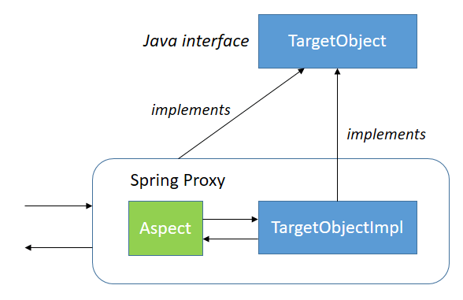
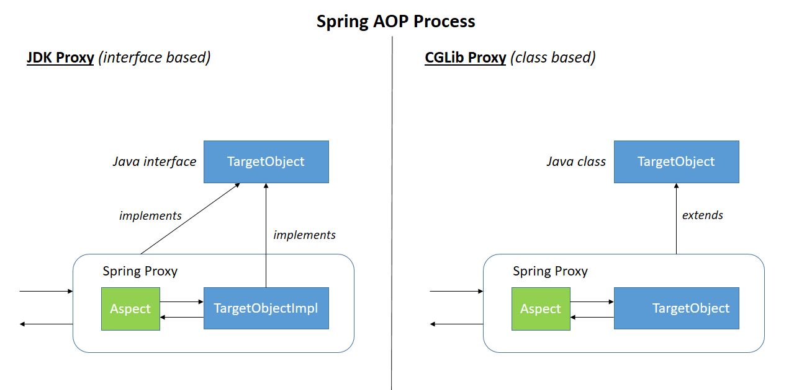

## Spring Framework

#### Q1. How filters are used in Spring Web?

- [x] Filters are called before a request hits the DispatcherServlet.They allow for interception-style, chained processing of web requests for security, timeouts, and other purposes.
- [ ] Filters are used with a checksum algorithm that will filter invalid bytes out of a byte stream request body and allow for processing of HTTP requests from the DispatcherRequestServlet.
- [ ] Filters are used with a checksum algorithm that will filter invalid bytes out of an octet stream a multipart upload and allow for chained processing of WebDispatcherServlet requests.
- [ ] Filters are used to validate request parameters out of the byte stream request body and allow for processing of requests from the DispatcherRequestServlet.

#### Explanation

A Filter is an object used to intercept the HTTP requests and responses of your application.
By using filter, we can perform two operations at two instances:
- Before sending the request to the controller;
- Before sending a response to the client.


Example of implementation of the `Filter interface`:

```java
@Component
public class SimpleFilter implements Filter {

   @Override
   public void destroy() {}

   @Override
   public void doFilter(ServletRequest request, ServletResponse response, FilterChain filterchain) throws IOException, ServletException {
      
      System.out.println("Remote Host:" + request.getRemoteHost());
      System.out.println("Remote Address:" + request.getRemoteAddr());
      filterchain.doFilter(request, response);
   }

   @Override
   public void init(FilterConfig filterconfig) throws ServletException {}
}
```
#### Q2. How is a resource defined in the context of a REST service?

- [ ] A resource is the actual String literal that composes a URI that is accessed on a RESTful web service.
- [x] It is an abstract concept that represents a typed object, data, relationships, and a set of methods that operate on it that is accessed via a URI.
- [ ] A REST service has a pool of resources composed of allocations of memory that allow a request to be processed.
- [ ] A resource for a REST service is an explicit allocation of a thread or CPU cycles to allow a request to be processed.

#### Explanation
A Resource is an object with a type, associated data, relationships to other resources, and a set of methods that operate on it.

It is similar to an object instance in an object-oriented programming language, with the important difference that only a few standard methods are defined for the resource, while an object instance typically has many methods.

#### Q3. Which of these is a valid Advice annotation?

- [ ] @AfterError
- [x] @AfterReturning
- [ ] @AfterException
- [ ] @AfterExecution

#### Explanation

Aspect-Oriented Programming complements Object-Oriented Programming by providing another way of thinking about program structure.

The key unit of modularity in OOP is the class, whereas in AOP the unit of modularity is the aspect.

**Aspect** is a modularization of a concern that cuts across multiple classes.
Transaction management is a good example of a crosscutting concern in enterprise Java applications.


Let's begin by defining some central AOP concepts and terminology:

- **Join Point** is a point during the execution of a program, such as the execution of a method or the handling of an exception (in Spring AOP, a join point always represents a method execution).
- **Advice** is action taken by an aspect at a particular join point. Different types of advice include "around," "before" and "after" advice. Many AOP frameworks, including Spring, model an advice as an interceptor, maintaining a chain of interceptors around the join point.

Types of advice:
- **Before advice**: Advice that executes before a join point, but which does not have the ability to prevent execution flow proceeding to the join point (unless it throws an exception).
- **After returning advice**: Advice to be executed after a join point completes normally:
for example, if a method returns without throwing an exception.
- **After throwing advice**: Advice to be executed if a method exits by throwing an exception.
- **After (finally) advice**: Advice to be executed regardless of the means by which a join point exits (normal or exceptional return).
- **Around advice**: Advice that surrounds a join point such as a method invocation. This is the most powerful kind of advice. Around advice can perform custom behavior before and after the method invocation. It is also responsible for choosing whether to proceed to the join point or to shortcut the advised method execution by returning its own return value or throwing an exception.

Example: 

```java
@Component
@Aspect
public class PublishingAspect {

    private ApplicationEventPublisher eventPublisher;

    @Autowired
    public void setEventPublisher(ApplicationEventPublisher eventPublisher) {
        this.eventPublisher = eventPublisher;
    }

    @Pointcut("@target(org.springframework.stereotype.Repository)")
    public void repositoryMethods() {}

    @Pointcut("execution(* *..create*(Long,..))")
    public void firstLongParamMethods() {}

    @Pointcut("repositoryMethods() && firstLongParamMethods()")
    public void entityCreationMethods() {}

    @AfterReturning(value = "entityCreationMethods()", returning = "entity")
    public void logMethodCall(JoinPoint jp, Object entity) throws Throwable {
        eventPublisher.publishEvent(new FooCreationEvent(entity));
    }
}
```

#### Q4. What does a ViewResolver do?

- [ ] It supports internationalization of web applications by detecting a user's locale.
- [x] It generates a view by mapping a logical view name returned by a controller method to a view technology.
- [ ] It creates a unique view determined by the uers's browser type,supporting cross-browser compatibility.
- [ ] It maps custom parameters to SQL views in the database, allowing for dynamic content to be created in the response.

#### Explanation

The `ViewResolver` is an interface to be implemented by objects that can resolve views by name.

The `View` interface addresses the preparation of the request and hands the request over to one of the view technologies.


```java
public interface ViewResolver {

	@Nullable
	View resolveViewName(String viewName, Locale locale) throws Exception;

}
```

```java
public interface View {

	String RESPONSE_STATUS_ATTRIBUTE = View.class.getName() + ".responseStatus";
	String PATH_VARIABLES = View.class.getName() + ".pathVariables";
	String SELECTED_CONTENT_TYPE = View.class.getName() + ".selectedContentType";

	@Nullable
	default String getContentType() {
		return null;
	}

	void render(@Nullable Map<String, ?> model, HttpServletRequest request, HttpServletResponse response) throws Exception;

}
```

#### Q5. How are Spring Data repositories implemented by Spring at runtime?

- [ ] Spring automatically generated code for you based on your YAML config that defined a MethodInterceptor chain that intercept calls to the instance and computed SQL on the fly.
- [x] A JDK proxy instance is created, which backs the repository interface, and a MethodInterceptor intercepts calls to the instance and routes as required.
- [ ] The Spring JDK proxy creates a separate runtime process that acts as an intermediary between the database and the Web server, and intercepts calls to the instance and handles requests.
- [ ] Spring automatically generated code for you based on your XML config files that define a SpringMethodAutoGeneration factory that intercepts calls to the instance and creates dynamic method that computer SQL on the fly.

#### Explanation

A JDK proxy instance is created programmatically using Spring's ProxyFactory🎓 API to back the interface.

☝🏼 **Note**: there's no code generation going on, which means there's no CGLib, no byte-code generation at all.



A `MethodInterceptor` intercepts all calls to the instance and routes the method into the appropriate places.

1. If the repository has been initialized with a custom implementation part, and the method invoked is implemented in that class, the call is routed there.
2. If the method is a query method, the store specific query execution mechanism kicks in and executes the query determined to be executed for that method at startup.
For that a resolution mechanism is in place that tries to identify explicitly declared queries in various places (using @Query on the method, JPA named queries) eventually falling back to query derivation from the method name.
3. If none of the above apply the method executed has to be one implemented by a store-specific repository base class (SimpleJpaRepository in case of JPA) and the call is routed into an instance of that.


The method interceptor implementing that routing logic is `QueryExecutorMethodInterceptor`.

The creation of those proxies is encapsulated into a standard Java based Factory pattern implementation. The high-level proxy creation can be found in `RepositoryFactorySupport`. The store-specific implementations then add the necessary infrastructure components so that for JPA you can go ahead and just write code like this:

```java
EntityManager em = ... // obtain an EntityManager
JpaRepositoryFactory factory = new JpaRepositoryFactory(em);
UserRepository repository = factory.getRepository(UserRepository.class);
```

#### Q6. What is SpEL and how is it used in Spring?

- [ ] SpEL(Spring Expression Language) runs in the JVM and can act as a drop-in replacement for Groovy or other languages.
- [x] SpEL(Spring Expression Language) supports boolean and relational operators and regular expressions, and is used for querying a graph of objects at runtime.
- [ ] SpEL(Spring Expression Language) allows you to build, configure,and execute tasks such as building artifacts and downloading object dependencies.
- [ ] SpEL(Spring Expression Language) natively transpiles one JVM language to another, allowing for greater flexibility.

#### Explanation

The Spring Expression Language is a powerful expression language that supports querying and manipulating an object graph at runtime. The language syntax is similar to Unified EL but offers additional features, most notably method invocation and basic string templating functionality.

For example, with the help of SpEL, we can access the contents of any Map or List in the context. We will create new bean workersHolder that will store information about some workers and their salaries in a List and a Map:

```java
@Component("workersHolder")
public class WorkersHolder {
    private List<String> workers = new LinkedList<>();
    private Map<String, Integer> salaryByWorkers = new HashMap<>();

    public WorkersHolder() {
        workers.add("John");
        workers.add("Susie");
        workers.add("George");

        salaryByWorkers.put("John", 35000);
        salaryByWorkers.put("Susie", 47000);
        salaryByWorkers.put("George", 14000);
    }

    //Getters and setters
}
```

Now we can access the values of the collections using SpEL:

```java
@Value("#{workersHolder.salaryByWorkers['John']}") // 35000
private Integer johnSalary;

@Value("#{workersHolder.salaryByWorkers['George']}") // 14000
private Integer georgeSalary;

@Value("#{workersHolder.salaryByWorkers['Susie']}") // 47000
private Integer susieSalary;

@Value("#{workersHolder.workers[0]}") // John
private String firstWorker;

@Value("#{workersHolder.workers[3]}") // George
private String lastWorker;

@Value("#{workersHolder.workers.size()}") // 4
private Integer numberOfWorkers;
```

#### Q7. The process of linking aspects with other objects to create an advised object is called

- [ ] dynamic chaining
- [ ] banding
- [x] weaving
- [ ] interleaving

#### Explanation

One of the key components of Spring Framework is the Aspect Oriented Programming framework.

Aspect-Oriented Programming entails breaking down program logic into distinct parts called so-called concerns.

The functions that span multiple points of an application are called cross-cutting concerns and these cross-cutting concerns are conceptually separate from the application's business logic.

There are various common good examples of aspects like… 
1. Logging;
2. Auditing;
3. Declarative transactions;
4. Security;
5. Caching,
etc.

**Weaving** is the process of linking Aspects with other application types or objects to create an Advised object.

This can be done at compile time (using the AspectJ compiler, for example), load time, or at runtime. Spring AOP, like other pure Java AOP frameworks, performs weaving at runtime.


An **Aspect** is a modularization of a concern that cuts across multiple classes. Unified logging can be an example of such cross-cutting concern.

Let's see how we define a simple Aspect:

```java
public class AdderAfterReturnAspect {
    private Logger logger = LoggerFactory.getLogger(this.getClass());
    public void afterReturn(Object returnValue) throws Throwable {
        logger.info("value return was {}",  returnValue);
    }
}
```

In the above example, we defined a simple Java class that has a method called afterReturn, which takes one argument of type Object and logs in that value.

An Advice is an action taken by an aspect at a particular Joinpoint. Different types of advice include “around,” “before,” and “after.”

In Spring, an Advice is modelled as an interceptor, maintaining a chain of interceptors around the Joinpoint.

#### Q8. How are JDK Dynamic proxies and CGLIB proxies used in Spring?

- [x] JDK Dynamic proxy can proxy only interface, so it is used if the target implements at least one interface. A CGLIB proxy can create a proxy by subclassing and is used if the target does not implement an interface.
- [ ] Only JDK Dynamic proxies are used in the Spring Bean Lifecycle. CGLIB proxies are used only for integrating with other frameworks.
- [ ] Only CGLIB proxies are used in the Spring Bean Lifecycle. JDK Dynamic proxies are used only for integrating with other frameworks.
- [ ] JDK Dynamic proxy can only using an abstract class extended by a target. A CGLIB proxy can create a proxy through bytecode interweaving and is used if the target does not extend an abstract class.

#### Explanation

Spring AOP is proxy based. Spring used two types of proxy strategy:

- JDK dynamic proxy;
- CGLIB proxy.



**JDK dynamic proxy** is available with the JDK. It can be only proxy by interface so the target class needs to implement the interface. If you are implementing one or more interfaces then spring will automatically use JDK dynamic proxies.

**CGLIB proxy** is a third party library which spring used for creating proxies. It can create a proxy by subclassing. Spring uses CGLIB for proxy if the class is not implementing an interface.

| Sr. No. | Key         | JDK dynamic proxy                                                              | CGLIB proxy                                                      |
|---------|-------------|--------------------------------------------------------------------------------|------------------------------------------------------------------|
| 1.      | Basic       | It can be only proxy by interface so target class needs to implement interface | It can create proxy by subclassing                               |
| 2.      | Package     | It is available with the Java                                                  | It is the third  library.                                        |
| 3.      | Performance | It is a bit slow than CGLIB proxy                                              | It is faster than JDK dynamic proxy                              |
| 4.      | Final       | Final class and Final method can not be proxy                                  | Final class and Final method can not be proxy                    |
| 5.      | Use case    | Spring uses JDK proxy when is class is implementing one or more interface      | Spring uses CGLib proxy when class in not implementing interface |

#### Q9. Which of these is not a valid method on the JoinPoint interface?

- [ ] getArgs()
- [x] getExceptions()
- [ ] getSignature()
- [ ] getTarget()

#### Explanation

`public interface JoinPoint` provides reflective access to both the state available at a join point and static information about it.

This information is available from the body of advice using the special form thisJoinPoint. The primary use of this reflective information is for tracing and logging applications.

```java
 aspect Logging {
     before(): within(com.bigboxco..*) && execution(public * *(..)) {
         System.err.println("entering: " + thisJoinPoint);
         System.err.println("  w/args: " + thisJoinPoint.getArgs());
         System.err.println("      at: " + thisJoinPoint.getSourceLocation());
     }
 }
 ```

| Method               | Return type          |                                                                          |
|----------------------|----------------------|--------------------------------------------------------------------------|
| getArgs()            | java.lang.Object[]   | Returns the arguments at this join point.                                |
| getKind()            | java.lang.String     | Returns a String representing the kind of join point.                    |
| getSignature()       | Signature            | Returns the signature at the join point.                                 |
| getSourceLocation()  | SourceLocation       | Returns the source location corresponding to the join point.             |
| getStaticPart()      | JoinPoint.StaticPart | Returns an object that encapsulates the static parts of this join point. |
| getTarget()          | java.lang.Object     | Returns the target object.                                               |
| getThis()            | java.lang.Object     | Returns the currently executing object.                                  |
| toLongString()       | java.lang.String     | Returns an extended string representation of the join point.             |
| toShortString()      | java.lang.String     | Returns an abbreviated string representation of the join point.          |
| toString()           | java.lang.String     |                                                                          |                                                                   |

#### Q10. In what order do the @PostConstruct annotated method, the init-method parameter method on beans and the afterPropertiesSet() method execute?

- [ ] 1. afterPropertiesSet() 2. init-method 3. @PostConstruct
- [x] 1. @PostConstruct 2. afterPropertiesSet() 3. init-method
- [ ] 1. init-method 2. afterPropertiesSet() 3. @PostConstruct
- [ ] You cannot use these methods together-you must choose only one.

#### Explanation

Running logic during Spring application's startup is a common scenario, but one that causes multiple problems.
In order to benefit from Inverse of Control, we naturally need to renounce partial control over the application's flow to the container – which is why instantiation, setup logic on startup, etc needs special attention.

We can't simply include our logic in the beans' constructors or call methods after instantiation of any object; we are simply not in control during those processes.

Let's look at the real-life example:

```java
@Component
public class InvalidInitExampleBean {

    @Autowired
    private Environment env;

    public InvalidInitExampleBean() {
        env.getActiveProfiles();
    }
}
```

Here, we're trying to access an autowired field in the constructor. When the constructor is called, the Spring bean is not yet fully initialized. This is problematic because calling not yet initialized fields will of course result in `NullPointerExceptions`.

Spring gives us a few ways of managing this situation.

##### 1. The @PostConstruct Annotation

Javax's `@PostConstruct` annotation can be used for annotating a method that should be run once immediately after the bean's initialization.

Keep in mind that the annotated method will be executed by Spring even if there is nothing to Inject.

Here's `@PostConstruct` in action:

```java
@Component
public class PostConstructExampleBean {

    private static final Logger LOG 
      = Logger.getLogger(PostConstructExampleBean.class);

    @Autowired
    private Environment environment;

    @PostConstruct
    public void init() {
        LOG.info(Arrays.asList(environment.getDefaultProfiles()));
    }
}
```

In the example above you can see that the Environment instance was safely Injected and then called in the `@PostConstruct` annotated method without throwing a `NullPointerException`.

##### 2. The InitializingBean Interface

The InitializingBean approach works pretty similarly to the previous one. Instead of annotating a method, you need to implement the `InitializingBean interface` and the `afterPropertiesSet()` method.

Here you can see the previous example implemented using the `InitializingBean interface`:

```java
@Component
public class InitializingBeanExampleBean implements InitializingBean {

    private static final Logger LOG 
      = Logger.getLogger(InitializingBeanExampleBean.class);

    @Autowired
    private Environment environment;

    @Override
    public void afterPropertiesSet() throws Exception {
        LOG.info(Arrays.asList(environment.getDefaultProfiles()));
    }
}
```

##### 3. The @Bean init-method Attribute

The `initMethod` property can be used to execute a method after a bean's initialization. Here's what a bean looks like:

```java
public class InitMethodExampleBean {

    private static final Logger LOG = Logger.getLogger(InitMethodExampleBean.class);

    @Autowired
    private Environment environment;

    public void init() {
        LOG.info(Arrays.asList(environment.getDefaultProfiles()));
    }
}
```

You can notice that there are no special interfaces implemented nor any special annotations used.

Then, we can define the bean using the `@Bean` annotation:

```java
@Bean(initMethod="init")
public InitMethodExampleBean initMethodExampleBean() {
    return new InitMethodExampleBean();
}
```

##### 4. Combining Mechanisms

In order to achieve full control over your beans, you might want to combine the above mechanisms together.

The order of execution is as follows:
1. The constructor
2. The `@PostConstruct` annotated methods
3. The InitializingBean's `afterPropertiesSet()` method
4. The initialization method specified as `init` method in XML

##### 6. Spring Bean LifeCycle

The Spring IoC (Inversion of Control) container manages Spring beans. 

The Spring IoC container is responsible for instantiating, initializing, and wiring beans. The container also manages the life cycle of beans.


#### Q11. What is the function of the `@Transactional` annotation at the class level?

- [ ] It's a transaction attribute configured by `spring.security.transactions.xml` config file that uses Spring's transaction implementation and validation code.
- [ ] It's a transaction that must actively validate by the bytecode of a transaction using Spring's `TransactionBytecodeValidator` class. Default Transaction behavior rolls back on validation exception but commits on proper validation
- [x] It creates a proxy that implements the same interface(s) as the annotated class, allowing Spring to inject behaviors before, after, or around method calls into the object being proxied.
- [ ] It's a transaction that must be actively validated by Spring's `TransactionValidator` class using Spring's transaction validation code. Default Transaction behavior rolls back on validation exception.

#### Explanation

Annotation `@Transactional` is used when you want the certain method/class(=all methods inside) to be executed in a transaction.

```java
@Target(value={TYPE,METHOD})
 @Retention(value=RUNTIME)
 @Inherited
 @Documented
public @interface Transactional
```

With transactions configured, we can now annotate a bean with 

```java
@Transactional either at the class or method level:
@Service
@Transactional
public class FooService {
… 
}
```

The annotation supports further configuration as well:
1. The Propagation Type of the transaction;
2. The Isolation Level of the transaction;
3. A Timeout for the operation wrapped by the transaction;
4. A readOnly flag – a hint for the persistence provider that the transaction should be read only;
5. The Rollback rules for the transaction.

At a high level, Spring creates proxies for all the classes annotated with `@Transactional`. The proxy allows the framework to Inject transactional logic before and after the running method, mainly for starting and committing the transaction.


#### Q12. Which is a valid example of the output from this code (ignoring logging statements) ?

```java
@SpringBootApplication
public class App {
     public static void main(String args[]) {
          SpringApplication.run(App.class, args);
          System.out.println("startup");
     }
}

public class Print implements InitializingBean {
     @Override
     public void afterPropertiesSet() throws Exception {
          System.out.println("init");
     }
}
```

- [ ] Nothing will print
- [ ] startup
      init
- [ ] init
- [x] startup

#### Explanation

```java
Output:
2021-10-04 10:54:47.953  INFO 12988 --- [main] com.example.demo.App : The following profiles are active: education
2021-10-04 10:54:48.586  INFO 12988 --- [main] com.example.demo.App : Started DemoApplication in 1.121 seconds (JVM running for 2.493)
startup
```

The 'init' will not be printed as there is no `@Bean`, `@Component`, `@Service`, etc. annotation above the `Print` class.

The `InitializingBean` interface to be implemented by beans that need to react once all their properties have been set by a BeanFactory: e.g. to perform custom initialization, or merely to check that all mandatory properties have been set.

The `InitializingBean` interface has only one `void afterPropertiesSet() throws Exception` method.

Invoked by the containing BeanFactory after it has set all bean properties and satisfied `BeanFactoryAware`, `ApplicationContextAware` etc.

This method allows the bean instance to perform validation of its overall configuration and final initialization when all bean properties have been set.

#### Q13. Which println statement would you remove to stop this code throwing a null pointer exception?

```java
@Component
public class Test implements InitializingBean {

     @Autowired
     ApplicationContext context;

     @Autowired
     static SimpleDateFormt formatter;

     @Override
     public void afterPropertiesSet() throws Exception {
          System.out.println(context.containsBean("formatter") + " ");
          System.out.println(context.getBean("formatter").getClass());
          System.out.println(formatter.getClass());
          System.out.println(context.getClass());
     }
}

@Configuration
class TestConfig {
     @Bean
     public SimpleDateFormat formatter() {
          return new SimpleDateFormat();
     }
}
```

- [x] formatter.getClass()
- [ ] context.getClass()
- [ ] context.getBean("formatter").getClass()
- [ ] context.containsBean("formatter")

#### Explanation

```java
2021-10-04 11:13:25.591  INFO 12860 --- [main] f.a.AutowiredAnnotationBeanPostProcessor: Autowired annotation is not supported on static fields: static java.text.SimpleDateFormat com.example.demo.Test.formatter
… 
org.springframework.beans.factory.BeanCreationException: Error creating bean with name 'test' defined in file [C:\Users\... \Test.class]: Invocation of init method failed; nested exception is java.lang.NullPointerException
```

It’s not possible `@Autowire` the static instance variable in the Spring Bean because when the class loader loads the static values, the Spring context is not yet necessarily loaded.

So the class loader won't properly Inject the static fields in the bean.
Static variable is not a property of Object, but it is a property of a Class. Spring `@Autowire` is done on objects and that makes the design clean.

You can deploy the `@Autowire` bean object as a Singleton, and achieve the same as defining it static.

#### Q14. What is the root interface for accessing a Spring bean container?

- [ ] SpringInitContainer
- [ ] ResourceLoader
- [ ] ApplicationEventPublisher
- [x] BeanFactory

#### Explanation

BeanFactory is the root interface for accessing a Spring bean container. Implementation of this interface provides objects that hold a number of bean definitions, each uniquely identified by a String name.

```java
public interface BeanFactory
```

Simply put, Beans are the java objects which form the backbone of a Spring application and are managed by Spring IoC Container. Other than being managed by the container, there is nothing special about a Bean (in all other respects it's one of many objects in the application).

The Spring container is responsible for instantiating, configuring, and assembling the beans. The container gets its information on what objects to instantiate, configure, and manage by reading configuration metadata we define for the application.


#### Q15. Which annotation can be used within Spring Security to apply method level security?

- [x] @Secured
- [ ] @RequiresRole
- [ ] @RestrictedTo
- [ ] @SecurePath

#### Explanation

Spring Security is a powerful and highly customizable authentication and access-control framework. It is the de-facto standard for securing Spring-based applications.

Spring Security supports authorization semantics at the method level.

The `@Secured` annotation is used to specify a list of roles on a method. So, a user only can access that method if she has at least one of the specified roles.

Let's define a getUsername method:

```java
@Secured("ROLE_VIEWER")
public String getUsername() {
    SecurityContext securityContext = SecurityContextHolder.getContext();
    return securityContext.getAuthentication().getName();
}
```

Here the `@Secured(“ROLE_VIEWER”)` annotation defines that only users who have the role `ROLE_VIEWER` are able to execute the `getUsername()` method.

Besides, we can define a list of roles in a `@Secured` annotation:

```java
@Secured({ "ROLE_VIEWER", "ROLE_EDITOR" })
public boolean isValidUsername(String username) {
    return userRoleRepository.isValidUsername(username);
}
```

In this case, the configuration states that if a user has either `ROLE_VIEWER` or `ROLE_EDITOR`, that user can invoke the isValidUsername method.

The `@Secured` annotation doesn't support Spring Expression Language.

#### Q16. What is the result of calling the map controller method using the HTTP request GET localhost:8080/map?foo=foo&bar=bar ?

```java
@RestController
public class SampleController {
     @RequestMapping("/map")
     public String map(@RequestParam("bar") String foo, @RequestParam("foo") String bar) {
          return bar + foo;
     }
}
```

- [ ] An InvalidParameterNameMappingException is thrown at runtime.
- [ ] barfoo
- [x] foobar
- [ ] A status code of 400 Bad Request is returned.

#### Explanation

Note that the values of the variables "bar" and "foo" are swapped.

The `@Controller` annotation is used to mark the class as the controller.

The `@RestController` annotation  is a specialized version of the controller. It includes:
- the `@Controller` annotation
- the `@ResponseBody` annotations
… so as a result, simplifies the controller implementation

The `@RequestMapping` annotation is used to map web requests to Spring Controller methods.

The `@RequestParam` annotation is used to extract query parameters, form parameters, and even files from the request.
